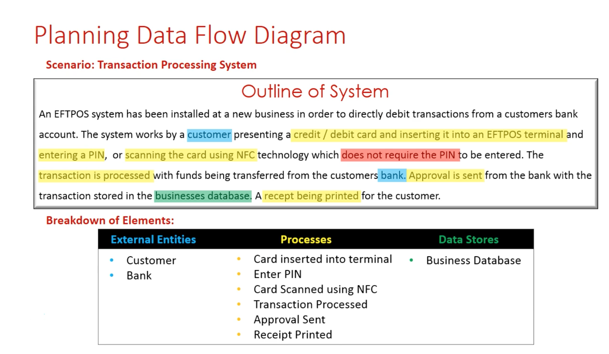
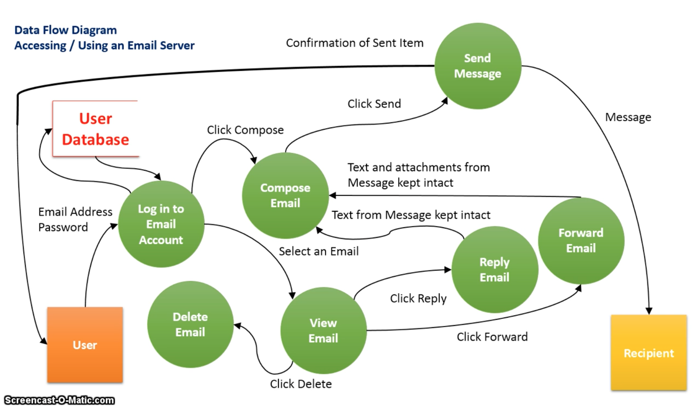
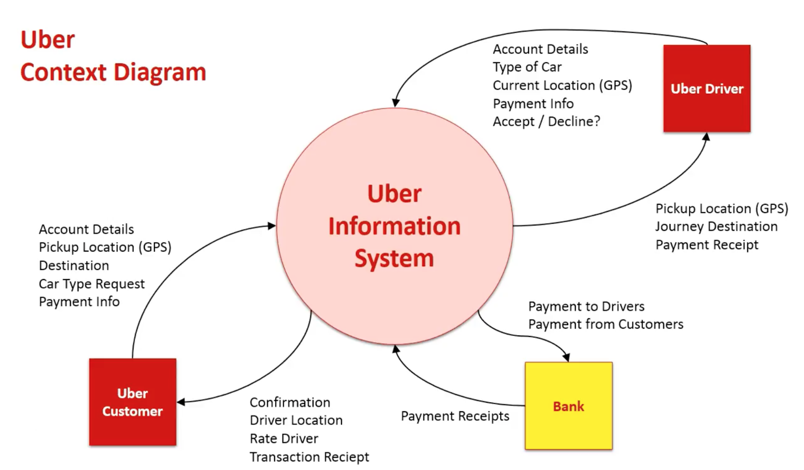

# Serverless Introduction

This list doesn't contain everything about serverless. Mainly this is my personal collection (I went down the rabbit hole). The courses I've done and stuff I've read about serverless. Stuff that I would recommend for everyone to read. It's not just a bunch of links form the web! There will be also many typos and grammar mistakes. Under /apps you can find also some code examples to play around. If you like it and would like to see more similar stuff, hit star ⭐️ and help to spread this collection among other GitHub geeks!

## Some Nice Guys

* Yan Cui - [All my posts on Serverless & AWS Lambda](https://medium.com/theburningmonk-com/all-my-posts-on-serverless-aws-lambda-43c17a147f91) - [Yan's Blog](https://theburningmonk.com/)
* Gojko Adzic - [Blog Articles Archive](https://gojko.net/posts.html)
* Paul Johnston - [My Serverless Blog Posts](https://medium.com/@PaulDJohnston/my-serverless-blog-posts-4f84ee5dced)
* Mike Roberts - [Serverless Architectures](https://martinfowler.com/articles/serverless.html)
* Alexander Simovic [Github Profile](https://github.com/simalexan)
* Martin Fowler - [Seems to be an important guy - Microservices](https://martinfowler.com/)
* Slobodan Stojanović [Founder of ClaudiaJS & motherfuckin' "scotty beam me up"](https://twitter.com/slobodan_)
* Danilo Poccia [Author of http://awslambdainaction.com  from Manning.] (https://twitter.com/danilop)

## Online Courses
* [Production-Ready Serverless](https://www.manning.com/livevideo/production-ready-serverless)
* [Using the Serverless Framework with Node.js on AWS](https://app.pluralsight.com/library/courses/aws-nodejs-serverless-framework-using/table-of-contents)
* [Serverless for Beginners](https://acloud.guru/learn/serverless-for-beginners)
* [AWS Serverless APIs & Apps - A Complete Introduction - No CLI](https://www.udemy.com/aws-serverless-a-complete-introduction/learn/v4/overview)
* [Automating AWS with CloudFormation](https://app.pluralsight.com/library/courses/aws-automating-cloudformation/table-of-contents)

## Presentations & Podcasts
* [GOTO 2017 • Designing for the Serverless Age • Gojko Adzic](https://www.youtube.com/watch?v=w7X4gAQTk2E)
* [GOTO 2017 • Serverless: the Future of Software Architecture • Peter Sbarski](https://www.youtube.com/watch?v=LAWjdZYrUgI&t=32s)
* [Serverless Startup with Yan Cui](https://softwareengineeringdaily.com/2017/08/04/serverless-startup-with-yan-cui/)
* [Cloud Insiders - Serverless](https://podtail.com/podcast/cloud-insiders/serverless/)
* [Serverless Design Patterns (London Dev Community)](https://www.slideshare.net/theburningmonk/serverless-design-patterns)
* [SE-Radio Episode 320: Nate Taggart on Serverless Paradigm](http://www.se-radio.net/2018/03/se-radio-episode-320-nate-taggart-on-serverless-paradigm/)

## Serverless Tutorials

* [Open Source Serverless Tutorial - Severless-Stack.com](https://serverless-stack.com/)
* [aws-serverless-workshops](https://github.com/awslabs/aws-serverless-workshops)
* [Serverless Architectures with AWS Lambda Overview and Best Practices](https://d1.awsstatic.com/whitepapers/serverless-architectures-with-aws-lambda.pdf)
* [500 Pages AWS Lambda Developer Guide](https://docs.aws.amazon.com/lambda/latest/dg/lambda-dg.pdf)
* [Best Practices for Working with AWS Lambda Functions](https://docs.aws.amazon.com/lambda/latest/dg/best-practices.html)
* [AWS Startup Kit Serverless Workload](https://github.com/aws-samples/startup-kit-serverless-workload)
* [Zombie Apocalypse Workshop](https://github.com/aws-samples/aws-lambda-zombie-workshop)
* [aws-serverless-samfarm](https://github.com/awslabs/aws-serverless-samfarm)
* [AWS Well-Architected Framework - General Information about Architecture](http://d0.awsstatic.com/whitepapers/architecture/AWS_Well-Architected_Framework.pdf)

## Serverless Examples
* [AWS Serverless Application Repository](https://aws.amazon.com/ru/blogs/compute/innovation-flywheels-and-the-aws-serverless-application-repository/)

## Tooling
* [AWS SAM Local](https://github.com/awslabs/aws-sam-local)
* [AWS Serverless Application Model (AWS SAM)](https://github.com/awslabs/serverless-application-model)
* [Serverless Framework](https://github.com/serverless/serverless)
* [Serverless Framework Plugins](https://github.com/serverless/serverless#v1-plugins)
* [Seed.run - Deploy, Manage, and Monitor Serverless Applications on AWS](https://seed.run/)
* [Lambda Monitoring](https://www.iopipe.com/)
* [ClaudiaJS - Deploy Node.js microservices to AWS easily](https://github.com/claudiajs)

## Books
* [Lambda in Action](https://www.manning.com/books/aws-lambda-in-action)
* [Serverless Architectures on AWS](https://www.manning.com/books/serverless-architectures-on-aws)
* [Serverless Apps with Node and Claudia.js](https://www.manning.com/books/serverless-apps-with-node-and-claudiajs)

## Medium & Blog Articles
* [Managing multi-environment serverless architecture using AWS — an investigation](https://medium.com/2pax/managing-multi-environment-serverless-architecture-using-aws-an-investigation-6cd6501d261e)
* [A Cloud Guru Medium Blog](https://read.acloud.guru/)

## Benchmarks
* [The right way to distribute messages effectively in serverless applications](https://medium.com/epsagon/the-right-way-to-distribute-messages-effectively-in-serverless-applications-f427e4229e67)

## Chats & Communication
* [ClaudiaJS Chat Gitter](https://gitter.im/claudiajs/claudia)

## My summaries from online courses, books and blog articles

* [Introduction to Lambda & AWS](https://github.com/mittyo/javascript-pocketguide/blob/master/serverless/001_introduction.md)
* [Introducton to Serverless](https://github.com/mittyo/javascript-pocketguide/blob/master/serverless/production-ready-serverless-course/001_introduction.md)
* [Introduction Step-by-Step into Serverless Framework](https://github.com/mittyo/javascript-pocketguide/blob/master/serverless/apps/001_introduction-step-by-step.md)
* [AWS Core Services](https://github.com/mittyo/javascript-pocketguide/blob/master/serverless/002_aws_core.md)
* [AWS API Gateway](https://github.com/mittyo/javascript-pocketguide/blob/master/serverless/004_api-gateway.md)
* [AWS Lambda Introduction](https://github.com/mittyo/javascript-pocketguide/blob/master/serverless/005_lambda.md)
* [AWS DynamoDB Overview](https://github.com/mittyo/javascript-pocketguide/blob/master/serverless/008_dynamoDB.md)
* [Serverless Architecture Best Practices](https://github.com/mittyo/javascript-pocketguide/blob/master/serverless/013_serverless-best-practices.md)
* [YAML Templates](https://github.com/mittyo/javascript-pocketguide/blob/master/serverless/014_yaml-templates.md)
* [Everything you need to know about CloudFormation](https://github.com/mittyo/javascript-pocketguide/blob/master/serverless/015_cloudformation.md)

---
## Topics covered/To cover:

* [x] JavaScript/NodeJS
* [x] Testing
* [x] Compute (Lambda)
* [x] Network communication (API Gateway + GraphQL)
* [x] Severless patterns
* [x] Authentication & Authorization
* [x] Cloudformation
* [x] Messaging Layer (SNS + SQS needs to be covered)
* [ ] Storage Layer
    * [x] Relational Databases
    * [ ] NoSQL Databases (document storage)
    * [ ] Migration from NoSQL to MySQL/Postgres
    * [ ] File storage (S3, AWS KMS)
* [x] Deployments
    * [x] CodeStar
    * [x] CodePipeline
    * [x] CodeDeploy
* [ ] Architecture (how do you start building a system - which topics come first)
    * [ ] Data flow diagram 
    * [ ] Structured analysis and design technique (SADT)
* [ ] Migration from Monolith to Serverless
* [ ] Computer Science 101
    * [ ] Data Structures
    * [ ] Algorithms
    * [ ] Network (Buffers/Streaming/TCP/UDP)
    * [ ] Engineering
* [ ] Design Patterns 
* [ ] Frontend (Vue/React)

---

## Todo 
* [ ] **Deployments & Going Live**
    + [Cloudformation (production deployment / partial deployment)](https://linuxacademy.com/amazon-web-services/training/course/name/aws-cloudformation-deep-dive)
    + [an AWS CodePipeline, AWS CodeBuild, AWS APIGateway & AWS Lambda CI](https://github.com/nicolai86/awesome-codepipeline-ci)
    + CodeDeploy, CodeBuild, CodePipeline
    + CI/CD (github push, automation etc.)
    + Here is an example how to CI/CD on AWS [Check this presentation](https://youtu.be/rPouVcJKWxM?t=2146)
* [ ] **Storage Layer - Databases**
    + [Storage Layer -Databases RDS, NoSQL, Warehousing (when to use aurora, dynamodb or redshift)](https://acloud.guru/learn/aws-dynamodb)
    + [Database Design and Relational Theory](https://www.amazon.com/Database-Design-Relational-Theory-Normal-ebook/dp/B007VRKQBS/ref=mt_kindle?_encoding=UTF8&me=)
    + [Database Design for Mere Mortals](https://www.amazon.com/Database-Design-Mere-Mortals-Hands/dp/0321884493/ref=sr_1_1?ie=UTF8&qid=1524835143&sr=8-1&keywords=database+for+mere+mortals)
    + [Six-Step Relational Database Design](https://www.amazon.com/Six-Step-Relational-Database-DesignTM-development/dp/1481942727)
    + [Domain Driven Design Patterns](https://www.amazon.de/Domain-Driven-Design-Reference-Definitions-Summaries/dp/1457501198/ref=sr_1_1?ie=UTF8&qid=1524835319&sr=8-1&keywords=eric+evans+domain+driven+design)
(https://medium.com/theburningmonk-com/all-my-posts-on-serverless-aws-lambda-43c17a147f91)

* [ ] **Migration from Monolith to Serverless
    + [ ] [How to Migrate Existing Monoliths to Serverless](https://blog.binaris.com/how-to-migrate-existing-monoliths-to-serverless/)
* [ ] **Computer Science Basics**
    + [Systems analysis and design](http://www.w3computing.com/systemsanalysis/)
        + [Data Flow Diagram Overview](https://www.youtube.com/channel/UCm0gX5V8-meiz_1CHtc24cA/search?query=data+flow)
    + [ Base CS - Exploring the basics of computer science, every Monday, for a year.](https://medium.com/basecs/archive/2017)
    + [Introduction to Computer Science and Programming](https://ocw.mit.edu/courses/electrical-engineering-and-computer-science/6-0001-introduction-to-computer-science-and-programming-in-python-fall-2016/index.htm)
    + [Computer Networks and the Internet](https://www.edx.org/course/computer-networks-internet-kironx-fhlcnx)
    + [Algorithms & Data Structure](https://www.coursera.org/learn/algorithms-part1)
* [ ] **Coding & Patterns**
    + Read code of open source projects such as React, Vue.js, Express - code quality of such a projects should be very good (many reviewers and clean code). Also Spectrum was recommended
    + [Design Patterns: Elements of Reusable Object-Oriented Software](https://www.amazon.com/Design-Patterns-Elements-Reusable-Object-Oriented/dp/0201633612)
    + SOLID need to find some good resources
    + [Hexagon](https://claudiajs.com/tutorials/designing-testable-lambdas.html)
    + [Writing portable serverless applications](https://medium.com/datreeio/writing-portable-serverless-applications-252fd8623bce)

* [ ]**Book Collection & Recommendations**
    + [ ] Why do I need to read this book? If I want to understand how to think in terms of underlying technology vs. abstractions (Cloudformation vs. AWS SAM)
    [Code Complete: A Practical Handbook of Software Construction](https://www.amazon.com/Code-Complete-Practical-Handbook-Construction/dp/0735619670)
    + [ ] Why do I need to read this book? I need to learn to think like a real programmer [Clean Code: A Handbook of Agile Software Craftsmanship](https://www.amazon.com/Clean-Code-Handbook-Software-Craftsmanship/dp/0132350882/ref=pd_bxgy_14_img_2?_encoding=UTF8&pd_rd_i=0132350882&pd_rd_r=8GDW312B6CFPXFG1C3NX&pd_rd_w=G2B0p&pd_rd_wg=bh747&psc=1&refRID=8GDW312B6CFPXFG1C3NX&dpID=515iEcDr1GL&preST=_SX218_BO1,204,203,200_QL40_&dpSrc=detail)
    + [ ] Why do I need to read this book? Get some basic understanding about OS [The Unix Programming Environment ](https://www.amazon.com/Unix-Programming-Environment-Prentice-Hall-Software/dp/013937681X)
    + [ ] Why do I need to read this book? see above [The Art of Unix Programming](http://www.catb.org/esr/writings/taoup/html/)

    ========
    Add to architecture examples
    [Context & Data Flow Diagrams Sample 1: YouTube](https://www.youtube.com/watch?v=hiMeEswjWuk&t=45s)

## Context Diagram Example

* Context diagram can be used as a planning tool to build much complex Data Flow Diagrams
* Processes are simply manipulation of data
* Data Flow Diagram can be either High Level (Context Diagram) or Low Level (Level I and Level II)
    
1. In a Context Diagram we always start with 1 circle in the midddle that represents the entire system (information system)
2. External entity: 
    + Youtube Partner: someone who puts content and earn from the content
    + Youtube Viewer: someone who is just watching the videos
    + Advertisers: the companies/people that pay youtube to put their ads on video
    + Bank: the payments and receipts are needed to go through the bank

## Data Flow Diagram

1. External entities:
    + Youtube Partners
    + Youtube Viewers
2. Account database: The external entities needs to log in and will be authenticated
3. The first step is to give access to view video via links, urls or search
    + if they want to upload a video they can go to upload a video, if they click a button the video is uploaded
    + when the video is uploaded we can edit the video
    + once the video has been edited it's ready to be viewed once its published
4. Once the video is online the social media aspect comes into play for both ways the users can comment, like, but they also receiving the feedback from their own videos when they have been uploaded. This feedback returns to these two users.
5. Now we have advertisers they have to pay youtube for advertising and that goes straight to the bank account of youtube. Once the payments made they have to apply the ads to the video, they need to submit advertisements to youtube, and those ads are attached to existing youtube partners movies. 
6. Because the ads are attached to youtube partners movies the bank has to pay those partners. And the payment receipt send to those partners based on the ads and the performance. 

# Planning Data Flow Diagram

[Planning a Data Flow Diagram](https://www.youtube.com/watch?v=VeLkVD0Q_6M)

---

---

## Data Flow Diagram Example - Accessign User Email via Email Server

[Source - Data Flow Diagram: Email](https://www.youtube.com/watch?v=ZFIynt3K3U0)

1. External Entity: User
2. Log in to Email Account (Server) with Login and Password
3. From there the Email Server will check it against User Database and create an entry if the details are correct
4. Here the users given two options: compose email or view email
    + If they choose to compose an email, they can compose it and click send to send the message
        5. And that will go to another external entity: Recepient
            + There will be also an confirmation that this email has been sent
    + If user will choose view email option
        5. He/she can delete an email
        6. Can also click reply and reply to an email that leads him to the compose email process
        7. Or he can forward an email using the message and the attachments are kept in tact

## Data Flow Diagram Rules

* Each process should have at least one input and an output.
* Each data store should have at least one data flow in and one data flow out.
* All processes in a DFD go to another process or a data store.
* Data stored in a system must go through a process. (never data store to data store communication)

[Source DFD](https://www.lucidchart.com/pages/data-flow-diagram)

1. All data flows must flow to or from a process

All flows of data must be either coming from or going to a process. External entities can not flow directly to each other. A data flow can not link a data store to an external entity. Data can not move between data stores without first being processed.

2. A Process must have at least one input flow and one output flow.

When a process has input flow but no output flow, it is called a “black hole”. When a process has output flows but no input flows, it is called a “miracle”.

3. The inputs to a process must be sufficient to produce output flows.

A “grey hole” is when the outputs of a process are greater then the sum of its inputs. For example, if a customers name and address is an input, their bank details can not be an output, as the process doesn’t have enough information to produce it.

4. Processes must transform data.

When naming data flows, adjectives should be used which show how processing has changed the data flow.

5. Data Flows can not cross each other

The flows of data can not cross each other. To overcome this problem, data stores and entities can be duplicated. However, processes can not be deplicated. Data flows must be unidirectional.

6. Entities must be labelled in lower case.

[Source - Data Flow Rules](https://eternalsunshineoftheismind.wordpress.com/2013/02/25/rules-for-creating-data-flow-diagrams/)

---

1. Naming conventions:
    * Processes: strong verbs
        - Process: any process that changes the data, producing an output. It might perform computations, or sort data based on logic, or direct the data flow based on business rules. A short label is used to describe the process, such as “Submit payment.”
    * dataflows: nouns
        - Data flow: the route that data takes between the external entities, processes and data stores. It portrays the interface between the other components and is shown with arrows, typically labeled with a short data name, like “Billing details.”
    * datastores: nouns
        - Data store: files or repositories that hold information for later use, such as a database table or a membership form. Each data store receives a simple label, such as “Orders.”
    * external entities: nouns
        - External entity: an outside system that sends or receives data, communicating with the system being diagrammed. They are the sources and destinations of information entering or leaving the system. They might be an outside organization or person, a computer system or a business system. They are also known as terminators, sources and sinks or actors. They are typically drawn on the edges of the diagram.

2. No more than 7 - 9 processes in each DFD.
3. Dataflows must begin, end, or both begin & end with a process.
4. Numbering: The system under study in the context diagram is given number `0'. The processes in the top level DFD are labelled consecutively by natural numbers beginning with 1. When a process is exploded in a lower level DFD, the processes in such lower level DFD are consecutively numbered following the label of such parent process ending with a period or full-stop (for example 1.2, 1.2.3, etc.).
5. External entities: Lower level DFDs can not introduce new external entities. The context diagram must therefore show all external entities with which the system under study interacts. In order not to clutter higher level DFDs, detailed interactions of processes with external entities are often shown in lower level DFDs but not in the higher level ones. In this case, there will be some dataflows at lower level DFDs that do not appear in the higher level DFDs.

[Guidelines for Drawing Dataflow Diagrams](https://www.albany.edu/acc/courses/acc681.fall00/681book/node31.html)

## DFD levels and layers

* DFD Level 0 is also called a Context Diagram. It’s a basic overview of the whole system or process being analyzed or modeled. It’s designed to be an at-a-glance view, showing the system as a single high-level process, with its relationship to external entities. It should be easily understood by a wide audience, including stakeholders, business analysts, data analysts and developers. 

* DFD Level 1 provides a more detailed breakout of pieces of the Context Level Diagram. You will highlight the main functions carried out by the system, as you break down the high-level process of the Context Diagram into its subprocesses. 

* DFD Level 2 then goes one step deeper into parts of Level 1. It may require more text to reach the necessary level of detail about the system’s functioning. 

**Note:** Progression to Levels 3, 4 and beyond is possible, but going beyond Level 3 is uncommon. Doing so can create complexity that makes it difficult to communicate, compare or model effectively.

## Context & Data Flow Diagram Uber Example

[Source - Context & Data Flow Diagrams Sample 2: Uber](https://www.youtube.com/watch?v=X-O6s5sah4o)

1. We always start with the big circle in the middle - The information system (Uber)
2. External Entity: Uber Customer
    + Data flow: Setup an account, Payment info, Destination, Pickup Location, Type Car (needs to go into the system first)
    + Data flow: Confirmation is sent to the customer from the system, Driver Location, Rate Driver (improves the system), Transaction Receipt
3. External Entity: Uber Driver
    + Data flow: Account details, Type of Car, Current Location, Payment, Accept / Descline
    + Data flow: They get the information from the customer form the system (Pickup location, Destination, Payment Receipt)
4. External Entity: Bank
    + Data flow: Payments to Drivers, Payments to Customers
    + Data flow: Payment receipts

---

