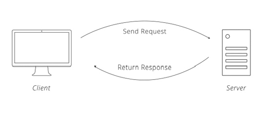
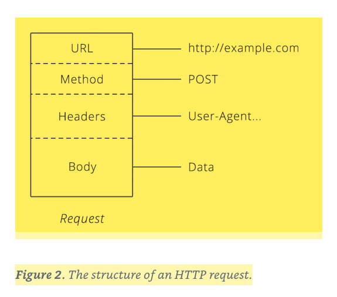
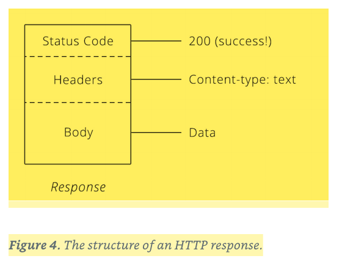
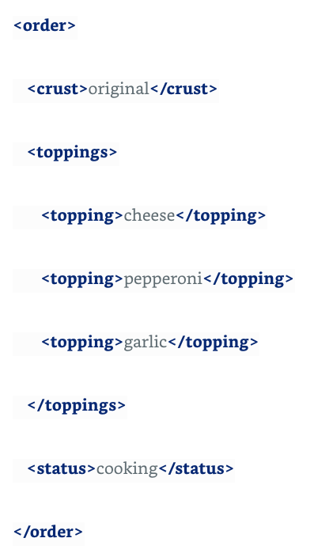

# An Introduction to APIs

[Source](https://www.amazon.com/Introduction-APIs-Brian-Cooksey-ebook/dp/B01MYOBVUA)

* An API is the tool that makes a website's data digestible for a computer. Through it, a computer can view and edit data, just like a person can by loading pages and submitting forms.

* When two systems (websites, desktops, smartphones) link up through an API, we say they are "integrated." In an integration, you have two sides, each with a special name. One side we have already talked about: the server.

* The other side is the "client." This is a separate program that knows what data is available through the API and can manipulate it, typically at the request of a user.

* Technically, an API is just a set of rules (interface) that the two sides agree to follow. The company publishing the API then implements their side by writing a program and putting it on a server. In practice, lumping the interface in with the implementation is an easier way to think about it.

* Computers have a similar etiquette, though it goes by the term "protocol." A computer protocol is an accepted set of rules that govern how two computers can speak to each other. Compared to our standards, however, a computer protocol is extremely rigid.

* For two computers to communicate effectively, the server has to know exactly how the client will arrange its messages.

* With the ubiquity of HTTP on the web, many companies choose to adopt it as the protocol underlying their APIs. One benefit of using a familiar protocol is that it lowers the learning curve for developers, which encourages usage of the API.

* Communication in HTTP centers around a concept called the Request-Response Cycle. The client sends the server a request to do something. The server, in turn, sends the client a response saying whether or not the server could do what the client asked.

* To make a valid request, the client needs to include four things: 1) URL (Uniform Resource Locator) 1 2) Method 3) List of Headers 4) Body

* APIs extend this idea a bit further to include nouns like customers, products, and tweets. In doing so, URLs become an easy way for the client to tell the server which thing it wants to interact with. Of course, APIs also do not call them "things", but give them the technical name "resources."

* The request method tells the server what kind of action the client wants the server to take.

* Headers provide meta-information about a request. They are a simple list of items like the time the client sent the request and the size of the request body.

* The request body contains the data the client wants to send the server.

* A unique trait about the body is that the client has complete control over this part of the request. Unlike the method, URL, or headers, where the HTTP protocol requires a rigid structure, the body allows the client to send anything it needs.

* Figure 2. The structure of an HTTP request.

* After the server receives a request from the client, it attempts to fulfill the request and send the client back a response. HTTP responses have a very similar structure to requests. The main difference is that instead of a method and a URL, the response includes a status code. Beyond that, the response headers and body follow the same format as requests.

* [Status codes](https://en.wikipedia.org/wiki/List_of_HTTP_status_codes) are three-digit numbers that each have a unique meaning. When used correctly in an API, this little number can communicate a lot of info to the client.

* After a response is delivered to the client, the Request-Response Cycle is completed and that round of communication over.

* The server will not send the client any more data until it receives a new request.

Figure 4. The structure of an HTTP response.

* Some APIs require a particular header, while others require specific information inside the request body.

* One computer has to put the data in a format that the other will understand. Generally, this means some kind of text format. The most common formats found in modern APIs are JSON (JavaScript Object Notation) and XML (Extensible Markup Language).

* JSON is a very simple format that has two pieces: keys and values. Keys represent an attribute about the object being described. A pizza order can be an object. It has attributes (keys), such as crust type, toppings, and order status. These attributes have corresponding values (thick crust, pepperoni, and out-for-delivery).

* XML always starts with a root node, which in our pizza example is "order." Inside the order are more "child" nodes. The name of each node tells us the attribute of the order (like they key in JSON) and the data inside is the actual detail (like the value in JSON)

Figure 2. XML node and value.

