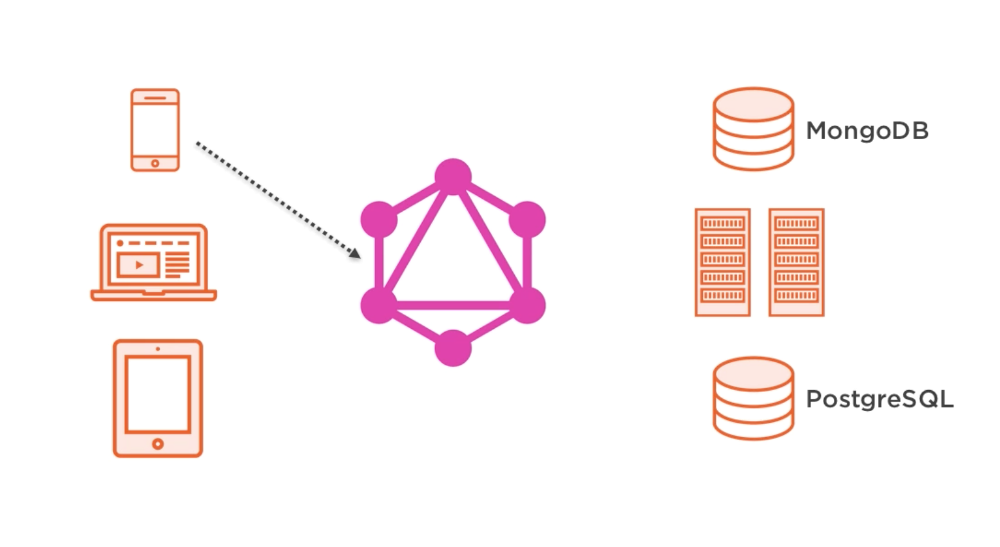
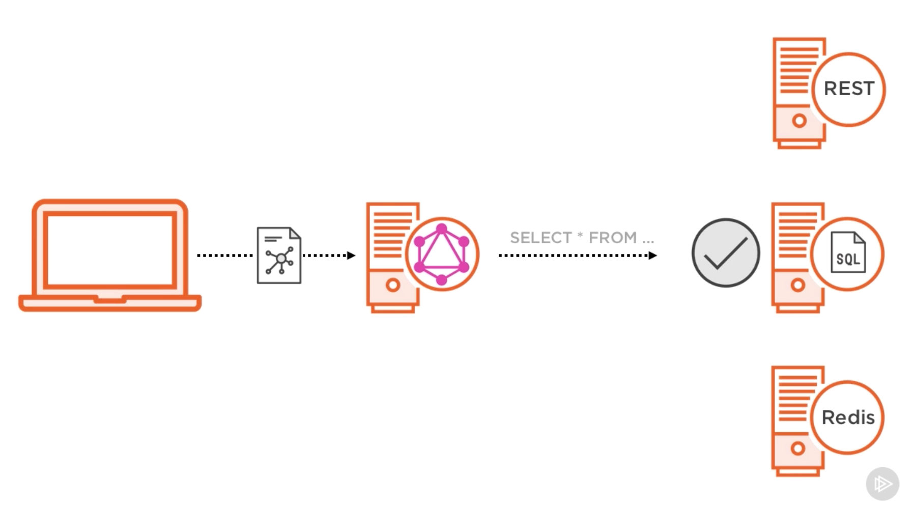
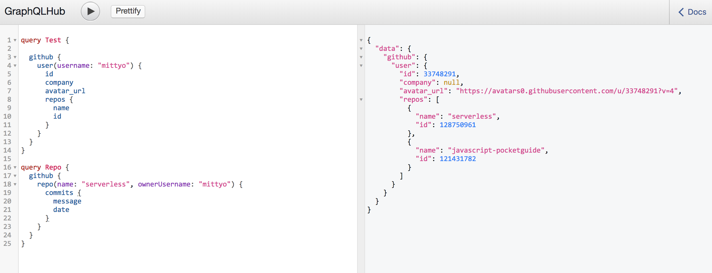

# Building Scalable APIs with GraphQL

[Online Course by Samer Buna](https://app.pluralsight.com/player?course=graphql-scalable-apis&author=samer-buna&name=graphql-scalable-apis-m1&clip=0&mode=live)

In this course we'll be using couple of technologies. But one is important: Dataloader. It gives the possiblity to cache the data. According to the author everyone should use it.

GraphQL acts as a single communicatiion medium (data agent) and is a layer that connects multiple services vie one single endpoint.




There are also other more important aspects of GraphQL:

1. Type system (check the types of incoming data - validation)
2. Graph-based structure (walk along different graphs and connect them together)
3. Declarative nature (is perhaps the most important aspect about it)


GraphQL consists of two parts:
1. Language:
    + Queries
    + Mutations
    + Subscriptions: real time data
    + Fragments: compositional style
2. Runtime:
    + Validation: any of the request
    + Type System
    + Introspection: ask about capabilities and supported operations
    + Execution

To describe both queries and mutations we can use the generic term `operation`. A GraphQL operation is just a simple string with optional variables

```js
// Query operation
query ReadComments {
    allComments {
        body
        timestamp
    }
}

// Mutation operation
mutation AddComment($body: String!) {
    addNewComment(body: $body) {
        id
    }
}

```
We use variables in a mutation operation if we want to make it usable with different inputs.

```js
// variables
varibales: { body: "Nice" }
variables: { body: "+1" }
```

We write GraphQL operations in documents on the client side, then if we use an interface to send these documents to GraphQL server. For that reason we can use HTTP as a transport to the GraphQL endpoint with a body data parameter like `query=...&variables=...`. The server can use HTTP to respond us back in JSON Format. But we can also use sockets, SSH protocol or CLI. GraphQL doesn't depend on HTTP statuses or verb as other protocols do. 

### GraphQL Document

A GraphQL document can contain one or more operations. If it does contain more than 1 operation we need to tell the server what to execute from the list of operations defined in the document.

```js
query ReadComment {...}
query ReadArticles {...}
query Usernames {...}
```

The request looks like this: `/graphql?query=...&operationName=...`

### GraphQL Runtime

As in other language the receiver will not understand the GraphQL language. This is why we need to build GraphQL runtime (GraphQL sever). It's the first layer of our server-side stack. The runtime's job is to understand GraphQL documents and translate them for the other services in ther serverside stack. 



**Note:** The runtime layer can be written in any language. See in the examples folder, there are some examples how to build a GraphQL server in NodeJS. Besides the logic we define there we also define a graph based schema to declare our API service capabilities to all clients

### GraphQL Schema

The GraphQL schema is the API of the GraphQL server. The clients can fetch the information according to the schema. GraphQL has its own type language that’s used the write GraphQL schemas: The Schema Definition Language (SDL). In its simplest form, GraphQL SDL can be used to define types, inputs, interfaces etc.


**Note:** This approach decouples clients from servers and allows both of them to evolve and scale independently. 

When a client sends a GraphQL to a server the following happens in the order:

1. Read input from interface (e.g. HTTP interface > query parameters and other optional)
2. The server parses the query into an abstract syntax tree (AST)
3. For every node in that three the server invokes the resolver function  (which potentially communicates with other data services)
4. Resolver function for children nodes
5. Ask data services partial questions about the data
6. Merge data returned from services (will be merged into a single object)
7. Server sends response to client in JSON format

### GraphQL Language Basics

The language has many similarities to JSON. You can find some playgrounds for GraphQL 

* [GraphQLHub](https://www.graphqlhub.com/)
* [Starwars API](https://github.com/graphql/swapi-graphql)

**Note:** Introspection simply means you can see the current context of your GraphQL API e.g. if you are starting to type something, you already see which fields, objects are avaialbe, or in Graphiql you can see the auto-generated documentation for your API. 

```js
query TestQuery {   // selection set
    graphQLHub      // root field 
    github {        // root field
        user(username: "mittyo") {
            id
            company         // {...} it's called sub-selection set
            avatar_url         
        }           
    }        
}
``` 
1. Avoid anonymous operations always add names like in the example above `TestQuery`. Always provide a name!!!

2. After the name we are writing a selection set {...}, one we are inside the selection set. We'll be in a new context and auto-complete will work in a differnt list. To pick into that list without typing you can press `alt + space` and you'll get a list of options you can write in the context where the cursor is.

**Note:** The names in the list are not being fetch from the server when we type. On starup Graphial chaces all the capabilities of the GraphQL server. 

3. We call the items in the selection set `fields`, since we are still on the root level of this GraphQL operation, these fields are knows an root fields. When we ask Graph for some data it represents, we need to start somewhere on the Graph. We start with one **Node** and aks it what it knows. The root fields we see here are all the **Nodes** we can start with in our Graph query.

4. To access the node e.g. `github` we need to add another sub-selection set. Inside that selection-set we see other fields we can access. We want to access `user` field or `user` object in that case. Therefore we need to add another subselection. Inside that we can now choose some scalar value that don't need any subselection anymore. 

**Here is an example from another test project**


**Note:** Error: Expected Name means type any field name inside the sub-selection or selection-set. 

**Note:** We didn't need a sub-selection for a `graphQLHub` field cause that's field value was a scalar one (just a string). The `user`string represents an object, not a scalar value. If we ask a server about an object we need to be explicit of what properties of that object we are interested in.

5. Just as in functions we need to provide arguments inside parenthesis. Also here you can use auto-complete with `alt + space` for the arguments. 

**Note:** Both the `github` field and `user` field represent objects. They are also sometimes refered to as complex fields. On the other hand fields like `id`or `company`are all fields that represent a scalar value. But there are often collections, you can see it on the [] e.g. repos > [GithubRepo] is a collection of Github Repo objects



**Diferent types of fields in GraphQL**
* Scalar fields - Int, String, Boolean (no selection sets needed) -> String (self-descriptive means there is no description in the schema available. Make sure to describe all fields with a short 1-sentence.)
* Complex fields - Objects (sub-selections needed) -> Name self-descriptive (no description evailable)
        + Collections - Arrays (no selection sets needed) -> [Name] self-descriptive (no description available)

### GraphQL Fields

1. We can give queries names

```js
query Name1 {
    ... // selection-set
}

query Name2 {
    ... // selection-set
}

``` 

2. We have different types of fields

```js
query QueryName {
	graphQLHub
  github {
    user(username: "mittyo") {
      id
      company
      avatar_url
     	repos {
        name
        id
      }
    }
  }
}

```
* We have scalar fields like `graphQLHub`, `id, company, avatar_url`. Are the basic type in a GraphQL schema. They represent primitive values like strings and integers
* We have complex fields like `github`, `user`, `repos`
    + The `repos` field represent a list of objects

GraphQL scalar and complex are modeled after functions, they accept arguments and they return something in the response. On the server we'll write JavaScript functions to determine the value to return by every field. We call this functions the resolver function. 

#### Scalar Fields
For example the resolver function for the `graphQLHub` field should respond with a string. The `user` field should respond with a user object. The `id` field determine that it should response with the `id` property of it's parent object which is `user` in this case. 

#### Complex Fields
The fields that represent objects, usually have a custom type e.g. the `user` field has a `GithubUser` type. This is a type that this particular service has defined in it's schema and it's a type that represents an object. And the object has this properties: `login, id, company, avatar_url, repos` and every property has it's own type. This type of implementation makes hierarchical quering in GraphQL possible. 


### GraphQL Variables

A variable needs it's scope. You can add e.g. to arguments a variable to make the fetching more flexible. Now instead of hardcoding a `username` we can use a varible for that. But like everything in GraphQL it also needs a type. We also  need to define the variable as an argument of the operation. To define a type for that operation we simply need to add following as an argument:

```js
query QueryName($userName: String!) {
	graphQLHub
  github {
    user(username: $userName) {
      id
      company
      avatar_url
     	repos {
        name
        id
      }
    }
  }
}
``` 

**Note:** The type of the variable needs to match a type for the field where we are using the variable. 

In order to provide a variable value, we use it in the variable query section in the Graphiql. Arguments can come from a query in the url or from the user input.


### Directives

A directive is used with a `@` sign, it has a name like `include` or `skip` that name has to be unique, the directive also accepts a list of arguments just like fields. The `@skip(if: $someTest)` accepts an if which is a boolean. A directive has also a list of locations where we can use it: `@skip`can be used on fields, fragments, spreads, and inline fragments. 

```js
query QueryName(
  $userName: String!
  $includeRepos: Boolean!
) {
  github {
    user(username: $userName) {
      id
      company
      avatar_url
     	repos @skip(if: $includeRepos) {
        name
        id
      }
    }
  }
}
``` 
**Variables**

```js
{
  "userName": "mittyo",
  "includeRepos": true
}
``` 

**Note:** In this case the response from the server will be without repos list. `@includes` works as opposite, if it's true it will include the repos list, if false it won't include the repos list. 

### GraphQL Aliases

Sometimes the data exposed from the server might have different property names from what the UI is using. 


```js
query QueryName(
  $userName1: String!
  $userName2: String!
) {
  github {
    user1: user(username: $userName1) {
      id
      company
      avatar_url
     	repos {
        name
        id
      }
    }
    user2: user(username: $userName2) {
      id
      company
      avatar_url
      repos {
        name
        id
      }
    }
  }
}
``` 

**Variables**

```js
{
  "userName1": "mittyo",
  "userName2": "mittyo"
}
``` 

**Response**

```json
{
  "data": {
    "github": {
      "user1": {
        "id": 33748291,
        "company": null,
        "avatar_url": "https://avatars0.githubusercontent.com/u/33748291?v=4",
        "repos": [
          {
            "name": "serverless",
            "id": 128750961
          },
          {
            "name": "javascript-pocketguide",
            "id": 121431782
          }
        ]
      },
      "user2": {
        "id": 33748291,
        "company": null,
        "avatar_url": "https://avatars0.githubusercontent.com/u/33748291?v=4",
        "repos": [
          {
            "name": "serverless",
            "id": 128750961
          },
          {
            "name": "javascript-pocketguide",
            "id": 121431782
          }
        ]
      }
    }
  }
}
```

### GraphQL Fragments

Fragments are what makes GraphQL composable. A fragment is just a partial operation, we can't use it on it's own, but we can use it and reuse inside a full operation. To use a fragment inside a full operation we prefix it's name with `...FragmentName`

```js
query QueryName($userName1: String!, $userName2: String!) {
  github {
    user1: user(username: $userName1) {
      ...UserInfo
      repos {
        name
        id
      }
    }
    user2: user(username: $userName2) {
      ...UserInfo
      repos {
        name
        id
      }
    }
  }
}

fragment UserInfo on GithubUser {
  id
  avatar_url
}
```

**Note:** The three dots operator is knows as a spread operator. When a GraphQL server sees three dots followed by a name in a GraphQL query it will look for a fragment defined using the same name and it will spread the content of the fragment and place it instead of three dot name in the query. The content of the fragment has to fit in the place where it's used, that's why our our fragment can be used within the selection set that expands a Github user object. 

**But the real benefit of fragments is in composition** 

Inside fragments we call all the features we have covered so far: variables, aliases and directives. We can also use fragments inline. 

```js
query QueryName($userName1: String!, $userName2: String!) {
  github {
    user1: user(username: $userName1) {
      ...UserInfo
      repos {
        name
        id
      }
    }
    user2: user(username: $userName2) {
      ... on GithubUser {
        id
        avatar_url
      }
      repos {
        name
        id
      }
    }
  }
}

fragment UserInfo on GithubUser {
  id
  avatar_url
}
``` 

### GraphQL Mutations

with Mutations you can add, delete, update data. A GraphQL `mutation` is just another function that does another things on the server. It will send data to write and send back the response object we can show to the client back. 

```js
mutation {
  createUser(
    email: "david@atheros.ai",
    firstName: "David",
    lastName: "Mráz",
    phone: "123456789",
    username: "a7v8x"
  ) {
    id
    username
    firstName
    lastName
    email
    phone
  }
}
``` 

## GraphQL Runtime (GraphQL Server)

This part starts with some examples. We are writing GraphQL server with NodeJS. 

In the example we have created a `MeType``

```js
const {
    GraphQLObjectType,
    GraphQLID,
    GraphQLNonNull,
    GraphQLString
} = require('graphql')

module.exports = new GraphQLObjectType({
    name: 'MeType',
    fields: {
        id: {type: new GraphQLNonNull(GraphQLID)},
        firstName: {type: GraphQLString},
        lastName: {type: GraphQLString},
        fullName: {type: GraphQLString, 
            resolve: (obj, args, ctx, { fieldName }) => {
                // console.log('what we are getting back', obj)
                // console.log('the args we are getting back', args)
                // console.log('context we are getting back', ctx)
                // console.log('something else as a 4th argument', fieldName)
                return `${obj.firstName} ${obj.lastName}`
        }
    },
        email: {type: new GraphQLNonNull(GraphQLString)},
        createdAt: {type: GraphQLString}
        
    }
})
```   

We are using this `MeType` as a starting point in our data graph. 