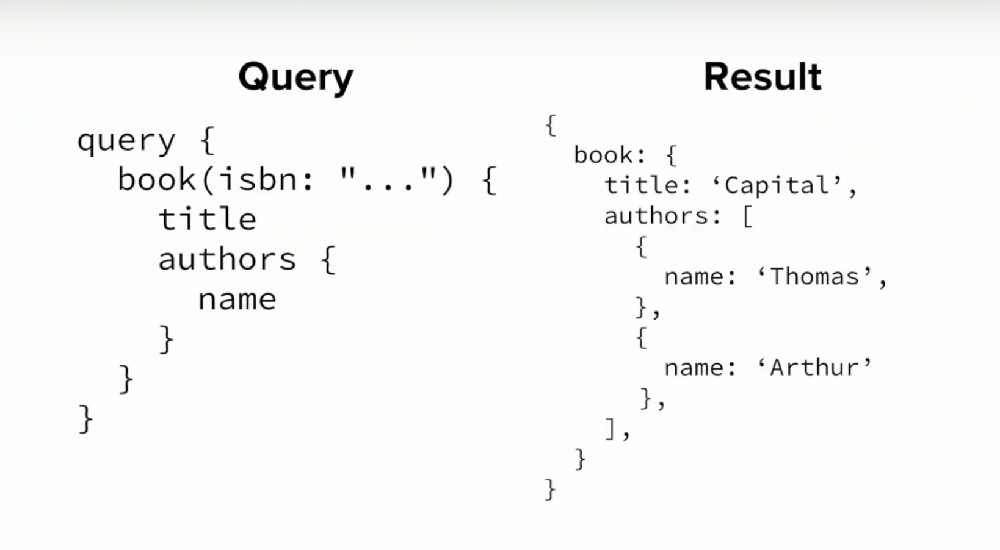
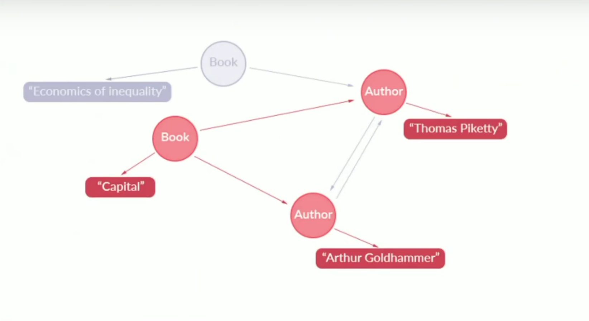
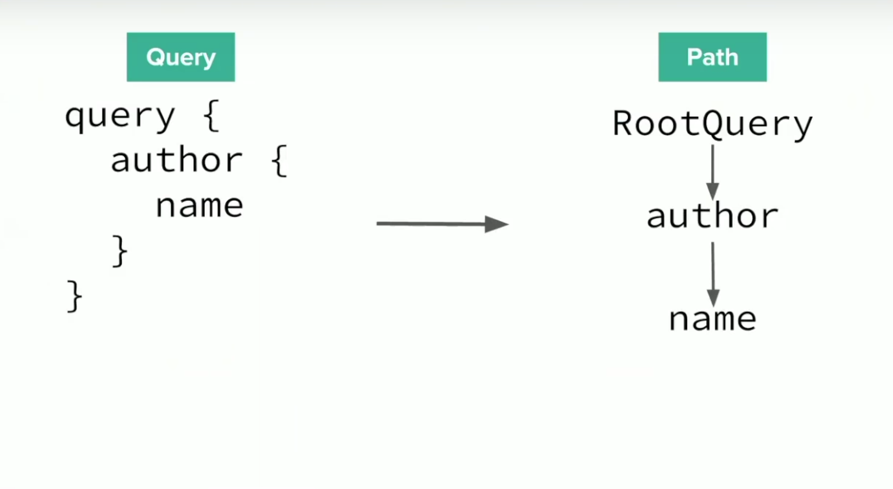

# GraphQL Mental Model

[Source: The Concepts of GraphQL](https://dev-blog.apollodata.com/the-concepts-of-graphql-bc68bd819be3)

The GraphQL client sends request that are represented as Abstract Syntax Trees. And GraphQL server figures it out how to resolve the data. 

* An abstract syntax tree (AST) is a way of representing the syntax of a programming language as a hierarchical tree-like structure. This structure is used for generating symbol tables for compilers and later code generation. The tree represents all of the constructs in the language and their subsequent rules. [Source](https://www.techopedia.com/definition/22431/abstract-syntax-tree-ast)

* Good explanation with Javascript [A tour of Abstract Syntax Trees](https://blog.buildo.io/a-tour-of-abstract-syntax-trees-906c0574a067)


This is called a schema description. And we see here a schema description of a User. And clients can fire queries against these schemas. 

**Query**
```js
type User {
    firstname: String
    lastname: String
}
``` 

**Result**
```json
{
    "data": {
        "user": {
            "firstname": "John",
            "lastname": "Doe"
        }
    }
}

``` 

The result and queries are almost the same. They are both trees of the selection sets and fields. 

## Why it's called GraphQL?

The graph on the GraphQL operating on is the `Application Data Graph`. When you write mobile or web applications, you generally operating on set of objects and these objects are connected in various capacities. These objects and the relationships form the `Application Data Graph`. 

### Example of a Library Application

In this application we only care about books and authors and the relationships between these e.g. authors write books, books have titles and authors have names. The basic unit is a `Book`. This thing is a node within our application data graph, this `Book` also happens to have a `Title`, we can add that as another `Node` within our `Application Data Graph`. Similarly our `Authors` have `Names`.  So we have another set of nodes that are `Authors` and they are associated with another nodes that are `Names`. If we are going to put it piece by piece our `Applicaiton Data Graph` would look like this:


You have a collection of books and a collection of authors and the edges represent relationships between this things. Our application ends up doing operating on this graph. We may add Nodes to this Graph or extract specific things from this Graph and then display them to our user. 

**GraphQL lets us pick trees out of this graph.**

Here is the representation of the code from the Data Graph above. What we are doing here, basically we are taking a `book(id...)` which is a node here. We want to get a `title` which is another node and this node is related to the `author` an author has a `name`


**Query**
```js
query BookInfo {
    book(isbn: "...") {
        title 
        authors {
            name
        }
    }
}
``` 

**Result**
```json
{
    "data": {
        "book": {
            "title": "Capital",
            "authors": [
                {
                    "name": "Thomas"
                },
                {
                    "name": "Arthur"
                }
            ]
        }
    }
}

``` 

We can see the query visualized in the figure below. It still doesn't look like a tree



But now we can reaarange it that it does look like a tree. We started at the `Book` node (root field), that we added a selection set that asks for `title`. We follow all the adges from a `Book` node that leads to `title`. Then we had another selection set that asks for `authors`. We follow all those nodes and then we aks for the names of those nodes. Basically GraphQL allows us traverse our application data graph and pool stuff out of it and specifically pull trees out of it. 


## How does Traversal work?

GraphQL has something that is called a `RootQuery` and the `RootQuery` is where you start traversing your application data graph. In your schema you can define your `RootQuery` so it can leads to specific nodes in your application data graph. If we would have just that query see above example it would start on the `RootQuery`. 

```js
query Name { // this is called a RootQuery

}
``` 


**What is traversing?**
The "DOM" stands for the Document Object Model, which is the standard structure that represents nested HTML elements on a page. To "traverse the DOM" means to explore the different nodes in an HTML page. [Source](https://www.quora.com/What-does-it-mean-to-traverse-the-DOM)

Traversing is important becuase each GraphQL query tells the clients what is being fetched. The advantage of doing this is **caching** of GraphQL queries. Because client knows what information will be fetched and can make very careful assumption what things it will need in the future. 

Queries are associated with view componenets. For example if you have an email application, you may have following queries:

* fetches the list of emails within your inbox
* fetches only new emails within your inbox

So you can apply GraphQL result caching. There are different approaches for that. In Apollo Client you can take these trees that gets resolved by firing these GraphQL queries and cache those trees. 

In the figure below you can see the query and the **traversal path**. If someone fires the query the data will be returned and cached by the server. If you fire the query twice the second query will be actually be able to resolve from the cache instead of having to hit the server. 



Assumption #1: If you have the same traversal path it will lead you to the same object
Assumption #2: If you have two objects with the same id, they represent the same object