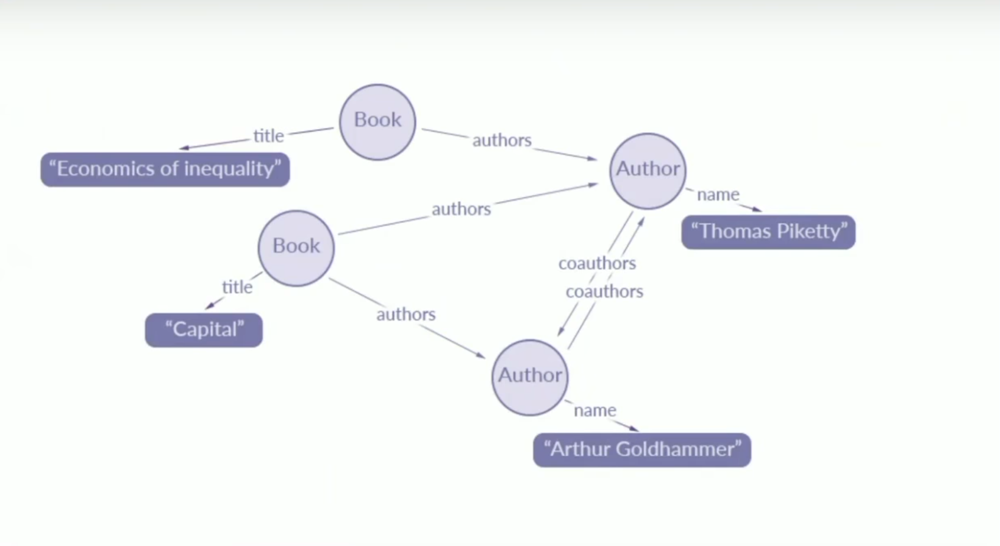

# GraphQL Mental Model

[Source: The Concepts of GraphQL](https://dev-blog.apollodata.com/the-concepts-of-graphql-bc68bd819be3)

The GraphQL client sends request that are represented as Abstract Syntax Trees. And GraphQL server figures it out how to resolve the data. 

* An abstract syntax tree (AST) is a way of representing the syntax of a programming language as a hierarchical tree-like structure. This structure is used for generating symbol tables for compilers and later code generation. The tree represents all of the constructs in the language and their subsequent rules. [Source](https://www.techopedia.com/definition/22431/abstract-syntax-tree-ast)

* Good explanation with Javascript [A tour of Abstract Syntax Trees](https://blog.buildo.io/a-tour-of-abstract-syntax-trees-906c0574a067)


This is called a schema description. And we see here a schema description of a User. And clients can fire queries against these schemas. 

**Query**
```js
type User {
    firstname: String
    lastname: String
}
``` 

**Result**
```json
{
    "data": {
        "user": {
            "firstname": "John",
            "lastname": "Doe"
        }
    }
}

``` 

The result and queries are almost the same. They are both trees of the selection sets and fields. 

## Why it's called GraphQL?

The graph on the GraphQL operating on is the `Application Data Graph`. When you write mobile or web applications, you generally operating on set of objects and these objects are connected in various capacities. These objects and the relationships form the `Application Data Graph`. 

### Example of a Library Application

In this application we only care about books and authors and the relationships between these e.g. authors write books, books have titles and authors have names. The basic unit is a `Book`. This thing is a node within our application data graph, this `Book` also happens to have a `Title`, we can add that as another `Node` within our `Application Data Graph`. Similarly our `Authors` have `Names`.  So we have another set of nodes that are `Authors` and they are associated with another nodes that are `Names`. If we are going to put it piece by piece our `Applicaiton Data Graph` would look like this:



You have a collection of books and a collection of authors and the edges represent relationships between this things. Our application ends up doing operating on this graph. We may add Nodes to this Graph or extract specific things from this Graph and then display them to our user. 

**GraphQL lets us pick trees out of this graph.**

Here is the representation of the code from the Data Graph above. What we are doing here, basically we are taking a `book(id...)` which is a node here. We want to get a `title` which is another node and this node is related to the `author` an author has a `name`
