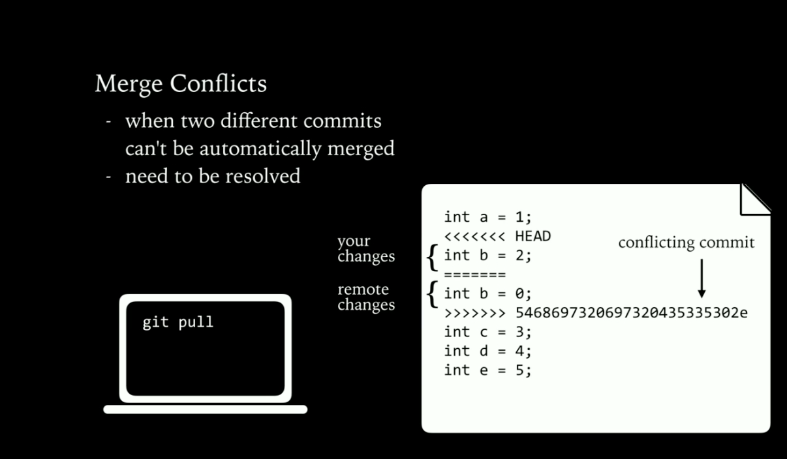

# Github Introduction

[Source - An Introduction to Git and GitHub by Brian Yu](https://www.youtube.com/watch?v=MJUJ4wbFm_A)

## Basic Git Commands

* `git clone <url>` - makes a copy of a repository, stores it on your computer, a fork creates your own copy of someone else repository
* `git add <filename>` - adds a file to the staging area, tells git to include the file in the next revision to the repository, git add * adds all changed files

**Note:** Staging is a step before the commit process in git. That is, a commit in git is performed in two steps: staging and actual commit. As long as a changeset is in the staging area, git allows you to edit it as you like (replace staged files with other versions of staged files, remove changes from staging, etc.).

* `git diff` - shows all the changed that are not added to the staging area
* `git commit -m "message"` - once I have added all the files I want to save, now I need to save the files
    + saves changes to **local repository** as a new version (a 'commit')
    + records a message
    + `git commit -am "message"` adds and commits in same step
    + it saves the new version but also remembers the old version, such as if I want go back to the old version
* `git status` - to gain some insights what's happening to the current repository
    + current status of my repository
* `git push`- sends commited changes to **remote repository**, more explicitly could write `git push origin master`
* `git pull` - retrieves changes from remote repository

## Merge Conflicts
* When two different commits can't be automatically merged
* need to be resolved

* To resolve the conflict you can delete all the unecessary stuff and commit the new version as in example below

## Rollback Your Changes
* `git log` - shows the history of commits and messages
* `git reset` - I made a change, but want to go back to the previous version of the code
    + `git reset --hard <commit hash>` reverts back to the previous commit
    + `git reset --hard origin/master` reverts code back to remote repository version

## Branching

Branching allows you in a single repository to have different versions of code that are going on simultaneously. You can develop stuff in parallel and do all the things that you can do on the master branch. And only if you are ready you can merge it back into the master branch, so you have 1 working version.

* Branch is a version of the repository
* Each branch has its own history and current version of the code

* `git branch` is the command you would use to create a new branch
    + shows all branches of code
    + create a branch with `git branch <branch_name>` (it will be the copy of master)
    + switch to (checkout) a new branch with `git checkout <branch_name>`

* `git merge` is the command we would use to merge two different branches together
    + `git merge <branch_name>` merges the branch <branch_name> with current branch.

* `git branch -D <branch_name>` you can delete the branch if you don't need it anymore
    + `git push origin --delete {the_remote_branch}` - To remove a remote branch from the server:

## Pull Requests

If you made a change to repository in a separate branch or in a fork (your version of someone else's repository). Sometimes you want to do a request to merge it into the original version. This is where you would submit a `pull request`