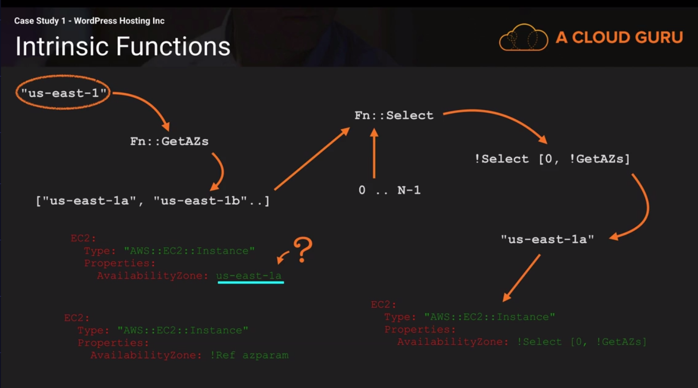
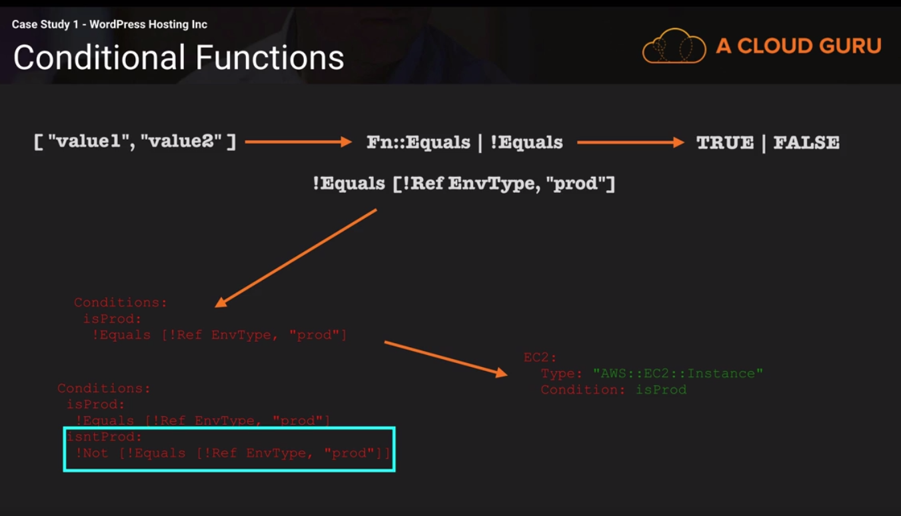
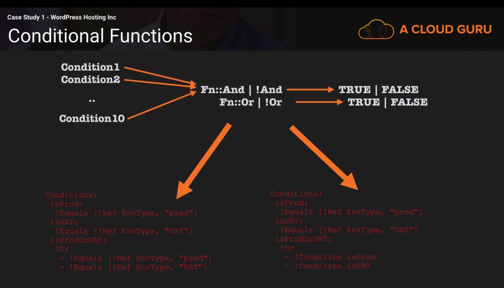
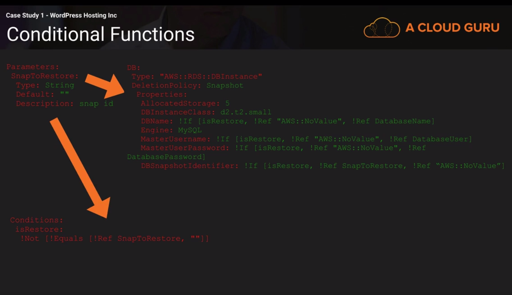
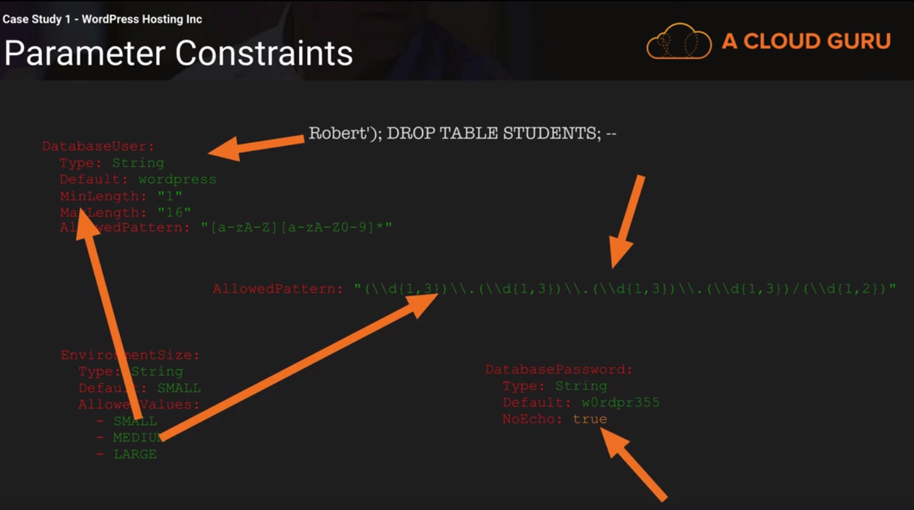
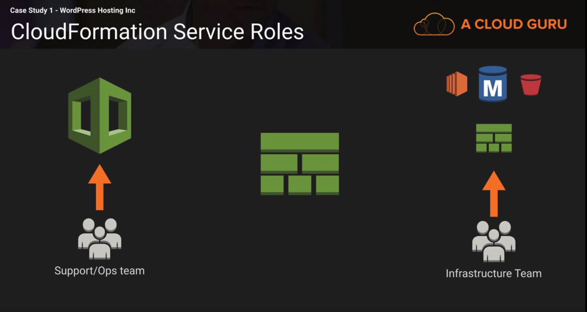
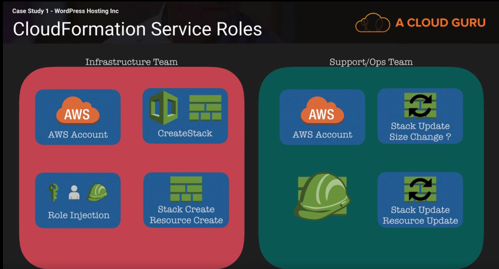
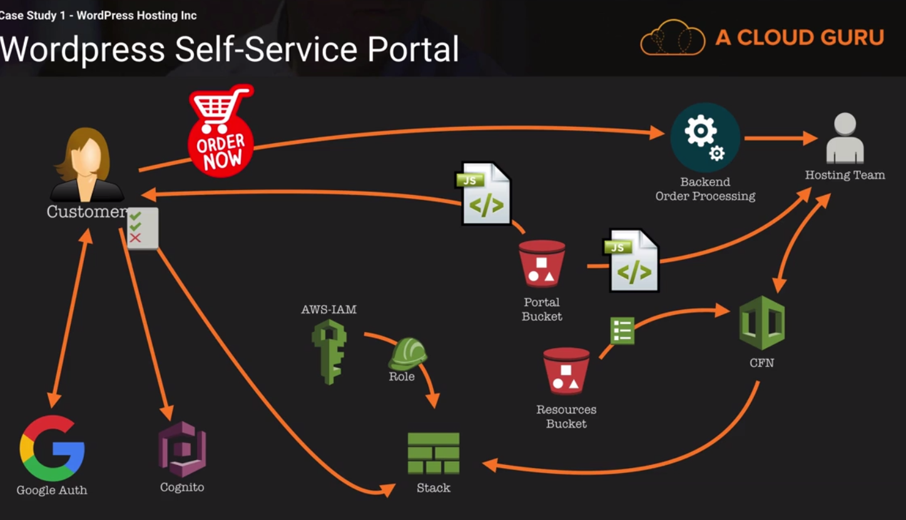

# Advanced CloudFormation Course

## Introduction

* You can use CloudFormation to deploy pre-sales environment (automating provisioning) in minutes for your product e.g. demo environments for pre-sales or environment for testing etc. 

* You can also use CloudFormaiton to create services such as wordpress hosting, where a customer can self-deploy a new version of wordpress just by clicking a button

* If you push your code to a central repo you can run some simple automated tests such as linting, base syntax checking and other automated processes

* CloudFormation templates fo the production system should be stored in the central repo (infrastructure as Code) and as part of every major code change the cloudformation template is used to automatically spinup an entire test environment based on the latest code comitted to repository. **Automated testing runs within this temporary environment, after which the whole infrastructure set is deleted and cleaned up...**

* Every commit into the repository is tested, integrated with another changes and tested again. And finally it's deployed in fully working environment for user acceptance testing without running base level infrastructure. 

* A stack is a concept in Cloudformation that represents AWS resources and the lifecycle of these resources. A stack always have at least one resource. A Stack has three main operations:
    + Create: is run only once per stack, we give CF a template and we populate the parameters of this template. CF processes the template and creates a stack.
    + Update: Is the only operation that can be run many times during the lifecycle of the stack. It's also different the inputs that accespts:
        1. It accepts the existing or new version of the template
        2. It accepts the existing or new parameters
        3. It takes the existing stack and associated resources
    + Delete: We provide cloudformation with the stack, instructing the system to delete the stack. The stack contains the template, CF accesses that information and deletes all the resources. Only run once and has the policy
        + retain: retain the resources
        + delete: will be deleted
        + snapshop: arranges the snapshot

**Note:** The resources can be updated without changing the physical id and without any interrruptions or a resource can be updated with some interrruption (in form of restart or connectivity). The resource change may require replacement, old will be removed and a new one will be created with a new physical id (create a new one and remove the old one)

* Template is a JSON/YAML document:
    + Parameters (optional): a template can get some input and be referenced from other areas from the template. If you have default make sure that you will only use this template once e.g. with s3 bucket (default name).
    + Outputs (optional): They provide the ability to reference resource parameters, additionaly you can use functions to join stuff etc.
    + Mappings (optional): Lookup table, you can get the values e.g. for multiple regions
    + Conditions (optional): allows to define if or how the resources are created based on this conditions. Are defined once and can be used multiple times across the template
    + Metadata (optional): data that ca provide some useful information for the UI
    + Resources (required): Definition of resources that CF can create.

## YAML 101

* YAML is the superset of JSON and is designed to be human readable
* YAML is designed for storing data and the structure
* Identation converys structure - rather than {} [] * 
* YAML allows in-line comments - Begin with # -> EOL
* Syntax maps to modern programming languages
* Lists (Arrays)
* Associate Array (HASH)
    + ...and scalars (simple data types)
* Lines and Whitespaces are delimeters - they have significance
* Avoid tabs - assume they don't work (use spaces for identation)

* No double quotes needed in YAML, but you can use "" and it's still valid, it becomes mandatory if you want to enter special characters.

```yaml
name: value
name: 20
anothername: false
name: [value1, value2]  # inline array
name:                   #yaml specific array
 - value1
 - value2
name:                   # associative array
 - obj1key1: objvalue
 - obj2key1: objvalue
name:
 - obj1key1: objvalue
   obj1key2: objvalue
 - obj2key1: objevalue
   obj2key2: objvalue
```

Here is the JSON example for the last yaml example

```json
{
    "name": [
        {
            "obj1key1": "objvalue",
            "obj1key2": "objvalue"
        },
        {
            "obj2key1": "objvalue",
            "obj2key2": "objvalue"
        }
    ]
}
``` 

Here is another example where people get often confused about

```yaml
fruitlist: [apple, organge, pear] # inline array

fruitlist:
 - apple
 - organge
 - pear

 person: {name: Adrian, age: 37} # but we can also create an object like this here
 
 person:    # this is the best way
  name: Adrian
  age: 37

name:       # here is an example for lists
 - obj1key1: objvalue
   obj1key2: objvalue
 - obj2key1: objevalue
   obj2key2: objvalue
```

**Note:** Hyphens represent a list and identation on another line represent an subobject. If we want to create a list with many subobject, we need to combine both. 

* **Whenever you see hyphens you know that they represent individual elements of a list.** 

* **Whenever you you see things on the same level of identation you know they belong to the same object**

## Case Study: Wordpress

* Wordpress is built on a LAMP stack (Apache, PHP, Linux, MySQL)
    + MySQL + Linux is the infrastructure level
* On an architectural level:
    + We start with a users
    + In order to access the website for the user, some things needs to be there
        1. VPC needs to have an Internet Gateway 
        2. Public IP address
        3. At least we need 1 subnet
        4. This subnet will have Internet Gateway
    + We need MySQL Database (we'll use managed MySQL by AWS)
        1. RDS Instance

**Note:** If you want to validate your cloudformation template you can use `aws cloudformation validate-template --template-body file://file-name.json` in order to validate your current template.

In this case study we are building the so-called LAMP stack. Which means we are starting from the architectural level, which system components are needed and based on the needs we create a template that gets translated into a stack.


---


**Note:** Database instance will take from 5 to 20 minutes when you create new resources.

**Important:** If you have any resources e.g. such as S3, where the BucketName needs to be unique everytime, you cannot redeploy your template unless you have deleted all the resources (stack), created before.

```yaml
S3:
    Type: AWS::S3::Bucket
    Properties:
      BucketName: test-wp-cloudguru-cf-course
```

**Important:** Since we have hardcoded the `imageId`we canot recrate the same stack in another region, since the `imageId` is assigned to the specific region. To make the template portable use `mapping`. 

```yaml
EC2: # logical id name / we need it to run linux
    Type: AWS::EC2::Instance
    Properties:
      ImageId: ami-c481fad3 #north-verginia region
      InstanceType: t2.micro
```

### Template Portability & Reuse

* Critical concept to understand!
* Nothing should be hard-coded (like s3 bucket name)
* Template needs to applied multiple times
* Template should be used across all AWS regions

* To make templates reusable we can use parameters, the least elegant solution from the authors perspective. We can define paramters in the template. We need to create a Key, Type and Default and a list of AllowedValues, Desription.

```yaml
Parameters:
 Instancesize:
  Type: String
  Default: t2.micro
  AllowedValues:
   - t2.micro
   - t2.small
   - t2.medium
  Description: Instance size
  EnvironmentSize:
   Type: String
   Defaul: SMALL
   AllowedValues:
    - SMALL
    - MEDIUM
    - LARGE
   Description: Choose you proper environment size to assign the right value

###############

InstanceType: !Ref Instancesize # use the parameter 
```

* Mapping is a data structure that you define in your template and it's similar to a hash array or an associative array. Whithin this mapping (EnvSize) are 3 keys: SMALL, MEDIUM, LARGE, each key maps to a corresponding set to name/value pairs. 

```yaml
Mappings:
 EvnSize:
  SMALL:
   "EC2": "t2.micro"
   "DB": "db.t2.micro"
  MEDIUM:
   "EC2": "t2.small"
   "DB": "db.t2.small"
  LARGE:
   "EC2": "t2.medium"
   "DB": "db.t2.medium"
```

* Intrinsic CF function `!FindInMap` consists of `[MAP, KEY, NAME]`


* When we create a new template we don't need to assign a bucket name, since it's an optional element, so we can simply remove `BucketName`and AWS is going to assign a random bucket name, but we can reference it within our CF template.

**Note:** Don't explicitly specify resource names if you want to reuse the tample over and over again. Rely on the ability of CF to generate a random name, based on the logical id and the stack-name, it improves protabity!!!

* Pseudo-parameters are like normal parameters with one key difference, they are provided by AWS via CloudFormation such as `AWS::Region` it contains the region where the stack was created. We have `AWS::AccountId`. You can reference pseudo paramters with `!Ref` or `!Sub` should work too. You can get the full list of [Pseudo Parameters here](https://docs.aws.amazon.com/AWSCloudFormation/latest/UserGuide/pseudo-parameter-reference.html)


* If we want to update the stack we can see if the resource is going to be replaced or not. Also under aws documentation under each property of a resource we can see `Update requires: No interruption`. That means in case of update there will be no interruptions.


## User Data Method - EC2

Is procedural method of providing direct instruction to EC2. You can tell the instance what to do after the instace finishing being created. 

We need to add to our stack additional components

* Install PHP 5.X - Required for WP
* Install MySQL to talk to RDS
* Install Apache 2.X (http server)
* Install Wordpress & configure
* Update System

* User Data has to be 64 encoded (we need a function to encode it to base64) and it expects that everything is passed to be one string. 

**Note:** `#!/bin/bash` this is called a Hashbang, by writing it we say to shell to execute following commands on the next lines.

**Note:** Instead of using `!GetAtt LogicalId.Key` you can also use `!Sub ${LogicalId.Key.Name}`. With `!Sub` you can perform a substitution of pripary or secondary attributes.

```sh
sed -i 's/database_name_here/${DatabaseName}/g' wp-config.php sed -i 's/localhost/${DB.Endpoint.Address}/g' wp-config.php
sed -i 's/username_here/${DatabaseUser}/g' wp-config.php
sed -i 's/password_here/${DatabasePassword}/g' wp-config.php
``` 

**Note:** (|) in YAML means that takes everything that follows and interpret it as a one line STRING (type)

* You can use `DependsOn: ResourceLogicalID` in order to wait for the resource that needs to be created before the current resource gets created. But if you use `Sub! or !REf` you don't need to define `DependsOn` because CloudFormation understands it and will wait. In case you would add something manually, there is no way to know it for CFN.

## CloudFormation Init

* Userdata - procedural steps A -> B -> C (you design a script and it runs under root user) -> not easy to manage

* CloudFormationInit - pass directives to cfn-init process
    + Critical that you understand between CFN init vs. Cloud Init -> CFNINI is OS independent over Cloud Init (Userdata)

* CFinit is a desired state enginge - not procedural (you just design the state and not giving the instructions)

* CFNinit is flexible and support sets of configuration

* CFNinit supports order and allows control of timing (in some cases)

* CFNinit allows authentication files/folders can be created from ZIPS, S3, or HTTP/S or GITHUB (download protected resources)

* CFNinit is idempotent.. if its already done, it won't try to do it again

```yaml
Resources:
 EC2:
  Type: "AWS::EC2::Instance"
  Properties:
   :
   :
   :
  Metadata:
   AWS::CloudFormation::Init
   config:
``` 
You can config sets which contain multiple config key, if you don't have config sets or you don't call a config set, it will call a specific config key and a specific config key is the default. Inside the config key you have sections, these sections are processed in order it's defined

```yaml
Resources:
 EC2:
  Type: "AWS::EC2::Instance"
  Properties:
   :
   :
   :
  Metadata:
   AWS::CloudFormation::Init
   config:
    package:
        :
    groups:
        :
    users:
        :
    sources:
        :
    files:
        :
    commands:
        :
    services:
        :

``` 


* `packages` allow you to provide a directive to CFNinit that the packages you indicate are installed. If the packages are installed, nothing will happen, if they are not installed they will be installed to meet the desired state directive.

* `groups` they direct the system to create or to confirm the system to create one or more groups. You can specify the group name or group id mapping. Only supported on Linux/Unix

* `users` directs the CFN process that the desired state is that one or more users exists or one or more configs for those users also exists

* `sources`it allows you to specify zip, tar etc. located on a remoted endpoint and have instracted into a folder into a resource. If you are using s3 you need to use different auth

* `files` you can specify a file and specify a source, it's similar to sources but it only operates on files. You can specify a remote files and move it into local directory. But additionally you can specify user, permission etc.

* `commands` allow you to run command in a structure way. You can run commands and they will be executed in the alphabetical order

* `services` have dependencies that you have satisfied with the previous keys.

* You can specify a config set and you can tell CFNinit to run the optional config set. The config set can have different config keys. You can have one set that create and another set that deletes stacks.


* The `cfn-hup` helper is a daemon that detects changes in resource metadata and runs user-specified actions when a change is detected. This allows you to make configuration updates on your running Amazon EC2 instances through the UpdateStack API action.

### Creation Policies

To understand the creation policies, you need to understand the lifecycle:

1. We start with the template (cloudformation)

2. We feed the template into CloudFormation

3. Begins the process of stack creation

4. The stack moves into the create in progress state and CFN begins the resource orchestration:
    1. It reads the template
    2. It calculates any dependencies
    3. Communicates with other AWS services to create the resources

5. When the resources are completed the stack changes to complete state.

* Creation Policies allow us to influence CFN, we can wait for some operation or an user event to occur before signaling the stack that the creation has been completed successfully.

* CFNinit und UserData rely on exit codes to determine if the bootstrapping has completed. 

* Creation Policies are a way in which it allows template creators to influence the success or failure of stack creation via actions e.g. we have an automated testing framework that is supplied to the instance after wordpress is installed and configured and this framework may run some advanced functionality and performance tests on our infrastructure and signal CFN that this process has passed or failed. CFN can use it to move the stack into complete or a failure state. 

* Creation Policy consitst of 2 components:
    1. Definition within CFN template
    2. A way of communicating of success or failure to CFN itself. We need to send a signal back to CloudFormation!
        + CFNsignal is used to signal to the stack
        + CreationPolicy has a count (the amount of signals) and timeout


## Resource Deletion Policies

Very useful, they allow you to define on a per resource basis what happens to the resource when a stack is deleted 

* Deletion Policies are defined per resource (every resource has different deletion policies)
	+ **Delete:** if you don't specify anything it will delete it anyway all the resources one by one in reverse dependency order
	+ Retain: supported by all AWS resource type. Leaves the resource as-is after stack deletion. Stack will be deleted but the resources will be there e.g. for s3. The resources will live outside of CFN and will be billed etc. be aware that it will lead to chaos
	+ Snapshot: only supported by a few resource type: AWS::EC2::Volume & AWS::RDS::DBInstances. When it comes to stack deletion time, CFN still orchestrates of the deletion of resources but before it doing so it creates an RDS snapshot. It allows any environment that are deleted to be back-up. 

You can define a deletion policy within your CFN template:

```yaml
DB:
 Type: "AWS::RDS::DBInstance"
 Properties:
  AllocatedStorage: 5
  DBInstanceClass: !FindInMap [InstanceSize, !Ref EnvironmentSize, DB]
  DBName: !Ref DatabaseName
  Engine: MySQL
  MasterUsername: !Ref DatabaseUser
  MasterPassword: !Ref DatabasePassword
 DeletionPolicy: Snapshot # if you don't define it will be deleted by the deletion policy
``` 

## Intrinsic Functions 

There two concepts: 

1. Template definition time: static values that are set at the template definition. The properties and associated values are set in the template that means they are defined in the template. This template is used by CFN to create a stack and this stack orchestrates the creates of the resources. This approach is often used for resources that don't change, but it is fairly inflexible. Template reuse and portability is the design preference, by using this method you cannot guarantee reuse and portability. In many of the cases you need to create new templates for small changes. THE ATTRIBUTES ARE DEFINED WHEN YOU DEFINE A TEMPLATE, THE ATTRIBUTES VALUES ARE STATICALLY SET IN THE TEMPLATE WHEN YOU DEFINE THE TEMPLATE.


* CFN functions are intrinsic function allow for run-time processing. So what is run-time processing?
We start with a template and this template is used to create a stack. At this point the resource processing can change and this is where run-time processing comes in. 

2. Template run-time: **Run-time processing is where some logic or some data is injected into the stack creation process at run-time during the creation of the stack**. We can use e.g. template parameters to inject some logic during the creation process of the stack. Rather then specifying attributes statically, you can add parameter references to link inputs to attribute values and this is done in YAMl  by using a `!Ref` function `!Ref DatabaseName`. Another possibility to inject some logic is by using the `!FindInMap` function, by using this function we can define lookups for names and keys. But there are also some other ways to do it. Intrinsic Function! CFN intrinsic function perform altering processes at run-time, they are executed optionally with an input and they produce an output which is used by CFN to adjust it's processing. `!Ref` is a function and `!FindInMap` is also a function but they provide only limited functionality. There are other functions that provide simple run-time processing it's not just lookup or referencing we can actually add some processing to our templates, processing which is performed at run-time and it's used to adjust the resources or configuration of resources created by CFN based on data which is injected at run-time.  


* `Fn::GetAZs` this is a function that outputs an array or list and this array or list contains the availability zones in a region. You can also use a pseudo paramter to use a region in which the stack has been implemented. We can provide a region or pseudo parameter. This function outputs an array of the zones `["use-est-1a, "us-east-1b", "..."]`

* `Fn::Select`is the function accepts two inputs, one of those is the list of things, it could be a static string or a parameter such as comma delimited list of subnets. Or it could be an output of another function. We can use `!Select [0, !GetAZs]`by doing so we can take the first string from the array. This will return the first element of the string, it will return the output to the resource
    + `0` is the first element 
    + `N-1` is the last element (N is the amount of elements, so if we have 7 elements in the array we needs to do 7 - 1,and 6 is the last element in the array)



* `Fn:Join` is commonly used where you need to construct values within your template. It accepts two inputs, the first input is the delimiter, this is a string will be used to join the string. If we pass `""` an empty string our things will join together with no delimeter. Logically the next input is a list of the things we want to join together `["a", "1", fn, "..."]`. This list can be statically set (pass list of things), it can be a list which references parameter value, or you can pass a mixture of things, such as strings, parameters, output of other functions. The output of the join command is a single string.

**Note:** The `!Ref` function is usually used to reference the primary attribute of the resource. But `!GetAtt` can access extended data from resources.


### Intrinsic Conditional Functions

* `Fn::Equals or !Equals` is one of the lower level conditional functions. Often used as a foundation for other conditional blocks and for the condition block. It accepts two value: `{"value1", "value2"}` if value1 === value1 the function returns `true` else it returns `false`. This are binary `true and false` representation.
    + `!Equals [!Ref EnvType, "prod"]` then it will return true or false.
    + Along with `!Equals` we have the `!Not` function, we can wrap it to revert the result.

* The condition element of the CFN allows you to define conditions, this of this as variables in your template which have true or false boolean values. They are defined by using `!Equals` function. Why it is powerful, it allows you conditional resource creation.



* `!And` takes a list  of conditions to evaluate a minimum of 2 and maximum of 10. And `!AND` evalues to true or false. It evaluates to true if all of the inputs are by themselves true and false if one or more of its input are false. You can use it within the condition section within the cloudformation template. These can be used else where in the template to use the conditional logic.

* `!Or` are similar to `!And`...



* `!If` accepts three inputs
    + ConditionName: it references a condition defined in the section, in this case you don't have to use `!` use just specify the conditon name.
    + value_if_true: you provide a value to use if the condition is true
    + value_if_false: you provide a value if the codition is false.


#### Use Case of AWS::NoValue

You have a CFN template that makes an RDS instance, you want to use conditional logic and parameters to control how this resource is created, you need to offer two options to the resource creator:

1. The resource is created fresh, a brand new RDS instance

2. The resource is created from a DB snapshot that you have created before from an existing database, maybe one that was created by a deletion policy of the previous stack resource

* `AWS::NoValue` it says to CFN to remove the property/attribute entirely, what you are essentially doing is you are deleting the property/attribute



### Some Code Examples

```yaml
Outputs:
  wproot:
    Description: Access URL for wordpress
    Value: !Join ["", ["http://", !GetAtt EC2.PublicIp, "/wordpress"]]
  wpadmin:
    Description: Admin Login URL - if restoring from snap, always go to this URL first
    Value: !Join ["", ["http://", !GetAtt EC2.PublicIp, "/wordpress/wp-login.php"]]
``` 
---

```yaml
Parameters:
  SnapToRestore:
    Type: String
    Default: ""
    Description: snap id to restore
  EnvironmentSize:
    Type: String
    Default: SMALL
    AllowedValues:
      - SMALL
      - MEDIUM
      - LARGE
    Description: Select Environment Size (S,M,L)
  DatabaseName:
    Type: String
    Default: wordpress
  DatabaseUser:
    Type: String
    Default: wordpress
  DatabasePassword:
    Type: String
    Default: w0rdpr355
    NoEcho: true
Conditions:
  isLarge:
    !Equals [!Ref EnvironmentSize, "LARGE"]
  isntLarge:
    !Not [!Equals [!Ref EnvironmentSize, "LARGE"]]
  isRestore:
    !Not [!Equals [!Ref SnapToRestore, ""]]
Mappings:
  RegionMap:
    us-east-1:
      "AMALINUX" : "ami-c481fad3" # AMALINUX SEP 2016
    us-east-2:
      "AMALINUX" : "ami-71ca9114" # AMALINUX SEP 2016
    us-west-1:
      "AMALINUX" : "ami-de347abe" # AMALINUX SEP 2016
    us-west-2:
      "AMALINUX" : "ami-b04e92d0" # AMALINUX SEP 2016
    ca-central-1:
      "AMALINUX" : "ami-eb20928f" # AMALINUX SEP 2016 v01
    eu-west-1:
      "AMALINUX" : "ami-d41d58a7" # AMALINUX SEP 2016
    eu-central-1:
      "AMALINUX" : "ami-0044b96f" # AMALINUX SEP 2016
    eu-west-2:
      "AMALINUX" : "ami-bfe0eadb" # AMALINUX SEP 2016 v01
    ap-southeast-1:
      "AMALINUX" : "ami-7243e611" # AMALINUX SEP 2016
    ap-southeast-2:
      "AMALINUX" : "ami-55d4e436" # AMALINUX SEP 2016
    ap-northeast-2:
      "AMALINUX" : "ami-a04297ce" # AMALINUX SEP 2016
    ap-northeast-1:
      "AMALINUX" : "ami-1a15c77b" # AMALINUX SEP 2016
    ap-south-1:
      "AMALINUX" : "ami-cacbbea5" # AMALINUX SEP 2016
    sa-east-1:
      "AMALINUX" : "ami-b777e4db" # AMALINUX SEP 2016
  InstanceSize:
    SMALL:
      "EC2" : "t2.micro"
      "DB" : "db.t2.micro"
    MEDIUM:
      "EC2" : "t2.small"
      "DB" : "db.t2.small"
    LARGE:
      "EC2" : "t2.medium"
      "DB" : "db.r3.xlarge"
Resources:
  DB:
    Type: "AWS::RDS::DBInstance"
    Condition: isntLarge # added - only create the MySQL DB if its small/med
    DeletionPolicy: Snapshot
    Properties:
      AllocatedStorage: 5
      StorageType: gp2
      DBInstanceClass: !FindInMap [InstanceSize, !Ref EnvironmentSize, DB] # Dynamic mapping + Pseudo Parameter
      DBName: !If [isRestore, !Ref "AWS::NoValue", !Ref DatabaseName]
      Engine: MySQL
      StorageType: gp2
      MasterUsername: !If [isRestore, !Ref "AWS::NoValue", !Ref DatabaseUser]
      MasterUserPassword: !If [isRestore, !Ref "AWS::NoValue", !Ref DatabasePassword]
      DBSnapshotIdentifier: !If [isRestore, !Ref SnapToRestore, !Ref "AWS::NoValue"]
  DBAuroraCluster:
    Type: "AWS::RDS::DBCluster"
    DeletionPolicy: Snapshot
    Condition: isLarge # only create if its a large EnvironmentSize
    Properties:
      DatabaseName: !If [isRestore, !Ref "AWS::NoValue", !Ref DatabaseName]
      Engine: aurora
      MasterUsername: !If [isRestore, !Ref "AWS::NoValue", !Ref DatabaseUser]
      MasterUserPassword: !If [isRestore, !Ref "AWS::NoValue", !Ref DatabasePassword]
      SnapshotIdentifier: !If [isRestore, !Ref SnapToRestore, !Ref "AWS::NoValue"]
  DBAurora:
    Type : "AWS::RDS::DBInstance"
    Condition: isLarge # only create if its a large EnvironmentSize
    Properties:
      DBClusterIdentifier: !Ref DBAuroraCluster
      Engine: aurora
      DBInstanceClass: !FindInMap [InstanceSize, !Ref EnvironmentSize, DB]
``` 

---

```yaml
EC2:
    Type: "AWS::EC2::Instance"
    DeletionPolicy: Delete
    Properties:
      ImageId: !FindInMap [RegionMap, !Ref "AWS::Region", AMALINUX] # Dynamic mapping + Pseudo Parameter
      InstanceType: !FindInMap [InstanceSize, !Ref EnvironmentSize, EC2]
      KeyName: AdvancedCFN
``` 

### Parameter Constraints

Without specific contrains it leaves our system wide open for attacks. What should we do?

1. The first step is to restrict what could be added into a parameter. We can start this process by using minlength/maxlength directives. These directives are used for string types. If a type is a number you can also use minvalue/maxvalue directives.

2. The next step is to use the AllowedPattern directive, uses a regex syntax to restrict what patterns of strings are valid for entry, in this case `AllowedPattern: "[a-zA-Z[a-zA-Z0-9]]"`we say the the first character should be upper or lower letter, by any number of uppercase or lowercase. There could be much complicated patterns that e.g. allow to check the ip address. You can also explicitly to allow defined values `AllowedValues: [SMALL, MEDIUM, LARGE]`

3. For password fields use `NoEcho: true` it will mask the password with asteriks. 



**Note:** Always check the naming constrains, there could be many problems with creation of CFN template. Each resource/product has his own naming constraings such as example with AppSync and resolver namings.

**Important:** You can use `AllowedPattern` directive e.g. to force users to use strong passwords, by checking e.g. if they are using special symbols, specific length. You as engineer needs to think about the security, so work on constraints for configuration.


## CloudFormation Service Roles

The permissions you require that you need to create a CloudFormation stack.

1. You login to your AWS account (you need a root or IAM account)

2. CFN console you need:
    + list stacks
    + describe stacks
    + list stack resources
    + create stack
    + select template to use and upload to s3
    + s3 bucket create
    + s3 bucket putItems
    + template summary from CFN
    + s3 bucket getObjects
    + parameters & notification setting

**Note:** When CFN is creating resources is doing so with the permissions you have or the security rise you currently using to create stack/api call. If you don't have a permission across the entire AWS account, you could run into problems when creating resources within that account. If the stack attempts to create an EC2 instance and you don't have permissions to create EC2 instance the stack creatin will fail.

* CFN actually uses your permissions to create the stack it gets temporary session roles/permissions to do so on your behalf (on behalf of your account)

* You need always to think about the range of permissions you need to create a stack, and it can be fairly complicated. 

* You also have stack update and delete, for these commands you also need to have the right permissions to do so. 


**Note:** Within IT we have best practise approach called role separation, you may have multiple teams. You may have dedicated support or operations team, this team is responsible for some simple infra architecture you want to give them a responsibility to update/delete stack, they can perform modifications set of guidelines defined by infrastructure team. The infra team is responsible to setting up base resources and creating new templates and setting up the resources (new stacks) for the support/ops team.

* Whoever updates, deletes or creates a stack is the user that provides CFN with permissions to perform  these actions, if the users doesn't have these permissions, then the operation will fail. The problem here is that you can't separate roles, all users need all permissions that they operate on. 

* If the user wants to update the stack needs all access to all resources controled by the stack. And this is not the right appraoch. 

> We need a different way that is called AWS service roles and this security architecture uses the stack to the center of the authorization process. The stack holds the permissions which are added when a stack is created. Once done anyone who has update or delete stack permissions, can use the permissions that the stack has to change or delete resources managed by the stack. A stack becomes the holder of permissions not the user.

**Note:** The example above is important to understand how the service roles work. So in general e.g. a Lambda function gets service role to CRUD database, the user only needs to have a permission to invoke the Lambda function, there is no need to give this user all the permissions. Or if e.g. there is CodePipeline setup that does automatically deploy stuff to prod, the user just only needs to have permissions to `git push` into the repository and CodePipeline manages all the process behind.



**Note:** Infrastructure team has all the rights to create to CreateStack. The infrastructure team makes an IAM role. An IAM role is a collection of permissions which other things in AWS can assume to gain those permissions. A role contains the permissions that it's grants and it staits who can use those permissions or who can assume that role and gain those permissions. 

* The infra team create a CFN role, a role that allows CFN to assume that role and they set the stack to use that role, conceptually they inject that role and the permissions which it grants into the stack object at this point the stack creation begins and the system orchestrates the creation of resources behind the scenes. 

* The support/ops team member logs-in into the AWS account  or CLI or API, that could be even the customer that can access the custom design. At some point the customer or support team runs stack update to change the size of their wordpress instance. Historically CFN will create temprorary credentials based on AMI account that is making the change our customer or support team it will either fail because these entities don't have enough security access or we would need to provide them with additional security (which is bad). 

* But now our stack has the associated role, the role is put there but the infrastructure team or automated software deployment system and this role is used during delete and update operations, it is used by CF to perform update or deletion, so the stack uses that role to make the changes not the users own access rights. If the role has all required permissions, CF assumes that role and does update the stack and the resources. 

**Note:** It's all done without having actual account permissions to modify or delte the resources!!!



```yaml
LambdaRole:
    Type: AWS::IAM::Role
    Properties:
      RoleName: !Sub ${APIName}-appsync-lambda-role-${APIStage}
      ManagedPolicyArns:
        - Ref: AppSyncLambdaPolicy
      AssumeRolePolicyDocument:
        Version: "2012-10-17"
        Statement:
          - Effect: Allow
            Action:
              - sts:AssumeRole
            Principal:
              Service:
                - appsync.amazonaws.com
    DependsOn:
      - AppSyncLambdaPolicy
  
  AppSyncLambdaPolicy:
    Type: AWS::IAM::ManagedPolicy
    Properties:
      Description: Managed policy to allow AppSync to access tables in DynamoDb and do some manipulations
      Path: /appsync/
      PolicyDocument:
        Version: "2012-10-17"
        Statement:
          - Effect: Allow
            Action: 
              - lambda:InvokeFunction
            Resource: 
              - !GetAtt GetLeadFunction.Arn
              - !GetAtt SaveLeadFunction.Arn
              - !GetAtt UpdateLeadFunction.Arn
              - !GetAtt DeleteLeadFunction.Arn 
``` 


**Note:** IAM policy only supports the use of JSON.

* The way a role in AWS works is that an object or principal in AWS (might be a user or service) can assume the role. When they assume the role STS (secure token service) provides them with temporary access credentials based on the permissions that the role has. The temporary security credentials consists of an access and secure key.

* A role consists of two parts:
    1. Access policy (what the role can do: which resources it can use.
    2. Trust policy (who can use the role): it actually says that a principal e.g. `cloudformation` is allowed to assume the role. 

**Note:** In the example here we can give `CloudFormation` the full admin rights by creating a role that has a trust policy that CFN can assume the role and the role has AdminAccess rights. Once the role is assigned to the stack, anyone who is updating or deleting the stack will the role created rather than users permissions.


Here is an example of bare minimum policies to interact with CFN, assume the CFN has the role assumed with AccessAdmin


```json
"Action": [
                "cloudformation:CreateUploadBucket",
                "cloudformation:GetTemplateSummary",
                "cloudformation:CreateStack",
                "cloudformation:DeleteStack",
                "cloudformation:DescribeStacks",
                "cloudformation:UpdateStack",
                "cloudformation:ListStacks",
                "cloudformation:ListStackResources",
                "cloudformation:DescribeStackEvents",
                "cloudformation:CreateChangeSet",
                "cloudformation:GetTemplate",
                "cloudformation:GetStackPolicy",
                "cloudformation:ListChangeSets",
                "cloudformation:DescribeChangeSet",
                "s3:PutObject",
                "s3:GetObject",
                "s3:CreateBucket",
                "iam:ListRoles"
            ],
``` 

**Note:** We can also use Stack Policy to narrow down the scope of permissions to make changes to the stack and the resources.


### Serverless Wordpress Self-Service Portal




