# AWS Certified DevOps Engineer: Continuous Delivery and Automation

[Source](https://app.pluralsight.com/library/courses/continuous-delivery-automation-aws-certified-devops-engineer/table-of-contents)

## Implementing CI / CD

### DevOps Definition

* Automation of software development process it goes from a developer who is writing code to all the way into production. 
    + Cultural change, paradigm shift, collaboration
    + Improvement in software delivery
    + Eliminating silos between devs and IT Ops (set up virtual machines for testing code, running the servers and doing all the stuff that dev usually don't care about)

* Increases the speed of development

* Agile + CI could be implemented via DevOps. The goals is automate everything and in case of bugs to rollout quickly

* One big part is the infrastructure as a code, like writing an application you create your infrastructure instead of manually managing it. 
    + It get stored in the repository
    + You can run automated tests agains infrastructure as code
    + You have versions for your infrastructure

### Continious Integration (CI)

You have a team of developers that write code and they commit that code to a central version control repositry and from there the new changes are integrated into a working codebase for the application. 

**Note:** Everytime a developer makes a change, the code goes through a build process, perhaps some unit tests will run through that code and the developer gets immediate feedback about that change. By getting this fast feedback the developer can fix any mistakes that were made during the development process. 

* If developer commits a code to the master, we want to start a build phase (a system can verfy that a code runs successfully) and on top of that we want to run some unit tests to make sure that the application works right. 


* Using the platform like AWS allows other people like IT Ops, DBAs and other people involved in running infrastructure to use the same techniques that the developers are using. In case if we want to use CloudFormation to build and launch our infrastructure:
    1. IT Ops writes all the infrastructure as code in a json/yaml template 
    2. All the code written can be versioned an commited to VCR (version control repositry)
    3. CI Server runs a build and runs different tests. Now when it comes to infrastructure as code we don't have anything that compiles, but we can build some custom Amazon Machine Images (AMIs) that are preconfigured for our servers it can increase the launch time of servers
        + When it comes to testing you can use json templates that get's validated by Cloudformation
        + You can run infrastructure tests after you launched the instances to make sure your application listening and running on expected ports and returns the right http responses


### Continious Delivery (CD)

It builds on top of the process of CI and is intended to automate the entire release of the application all the way up to production.


1. Code goes into version control
2. CI server runs bulds and tests (unit tests)
3. Deploy the application to a new or existing environment (these workflows are called production lines or pipelines - CI/CD pipeline)

**Note:** You can have as many stages as you need in this pipeline, if you want some stages after test run of code that runs load tests on the infrastructure. **The key is that at each stage everything must work before it moves to the next stage**

#### Here is the difference between Delivery / Deployment

The main difference lies in a human intervention. In continious delivery a person needs to approve the change before code goes into production. In continious deployment everything goes automatically.

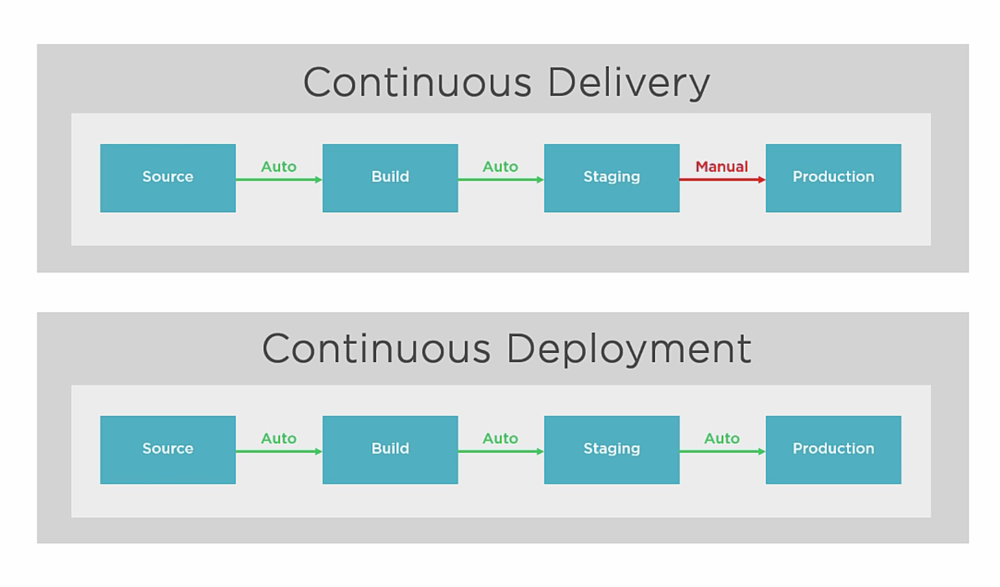

### CI / CD Summary

* Automate everything
* Define infrastructure as code (no manual provisioning of infra)
* Store application and infrastructure code in version control
* Unify the application and infrastructure (treaded as 1 thing)
* Perform end-to-end automated testing for infrastructure and configurations

## Infrastructure as Code

Is the key element for IT and Operation stuff. The benefits of IAC (infrastructure as code)

* Repeatability (produces always the same resources) to avoid human mistakes
    + You can use this code to build your entire environment
    + You can use this code for disaster recoveries
    + You can use this code for building stages etc. 

* Agility roll forward and roll back easily
    + If deployment fails you can see all the logs and what has been changed, who changed etc. 
    + It allows teams to iterate and make changes daily. We reducing the time of provisioning the infrastructure from days or weeks to hours or minutes

* Auditing & Security paper trail and permissions
    + It's easy to see what's happening on the platform level, who is calling the API etc.
    + Here you can be explicit which team member e.g. has the ability to provision infrastructure, this gives the organisation that everything will stay stable

### Automation and Configuration Management

* Provisioning infrastructure:
    + Cloudformation (primary tool)
    + OpsWork
    + Beanstalk

* Declarative approach to automation: the desired state of your servers is part of your projects and version control, along with infrastructure code and application templates
    + More flexible since it's loosely coupled to the implementation details
    + It simply declares the state of the system (human readable)

**Note:** In computer science, declarative programming is a programming paradigm—a style of building the structure and elements of computer programs—that expresses the logic of a computation without describing its control flow.

* Configuration management tools:
    + These tools support this declarative approach to automation:
        + Chef
        + Puppet
        + SaltStack
        + Ansible
        + DSC
    
**Note:** When you want to automate your cloudenvironment you can create cloudformation templates and on the operation system you can apply declarative configuration to your servers that configure the settings.

## Understanding Application Lifecycle Management

0. CodePipeline
1. CodeCommit
2. CodeBuild
3. CodeDeploy
    * Go to github repo: https://github.com/mikepfeiffer/aws-codedeploy-linux
    * `appspec.yaml`gives CodeDeploy the information to deploy the application
    * Instead of writing the scripts to manage the servers, you can use apps such as Chef, Puppet to do it for you

### CodePipeline

1. Commit (fetch resource): commit to Git repo
2. Build (jenkins or CodeBuild): compile files + unit test
3. Pre-alpha (deploy to pre-alpha): create a cloudformation stack
4. Test (run integration testing - acceptance tests): run testing with real endpoints 
5. Alpha (deploy to master): create a cloudformation stack
6. Create Release Branch (from master): once in a week or 2 weeks
7. Beta (from release branch deploy to beta stage): wider testing with beta customers (dog food)
6. Production (deploy from release branch to production): deployment to real customers

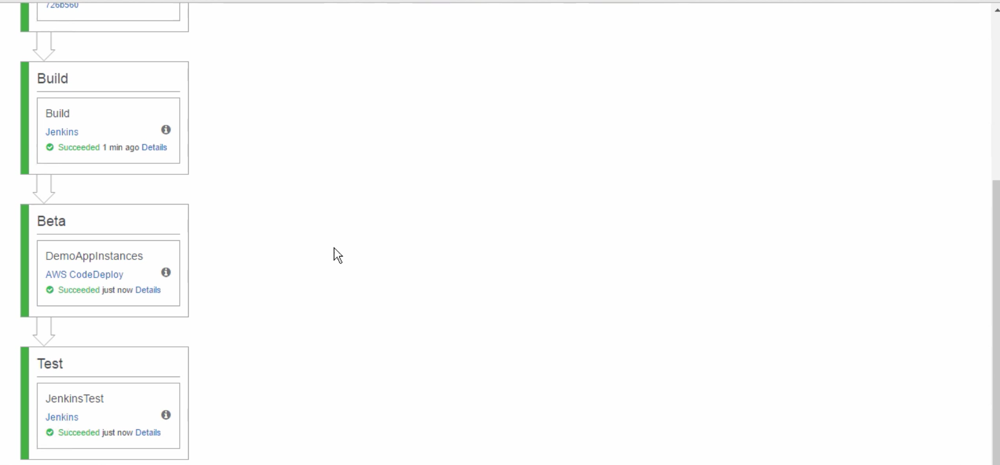

## Bootstrapping and Building Images

When you do your deployment you want the online instaces to come as quick as possible. This is especially true when you are using auto-scaling groups. 


In order to increase the bootstrap / startup time we can use different options:

1. We can use AMI that we can use with a O/S
2. We can use fully configured AMI
3. You can create partially configured AMI, but you can use some leightweight bootstrapping when the instance comes online

## Blue-Green Deployment

When it comes time to deploy your application you create an identical copy of your production environment and you can flip the switch to route all of your traffic to the new environment. If it doesn't work you just go back to your working deployment.

* Blue: is the production environment running our code
* Green: is the completely new environment running a copy of our new code

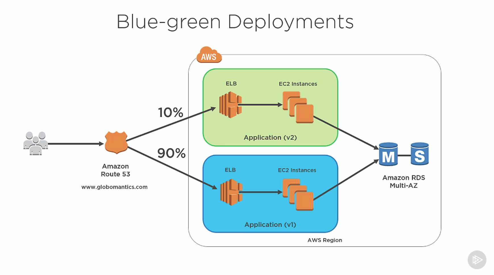

**Note:** If there is problem with the new environment, we just simply need to update the DNS configuration and send all 100% of the traffic to the blue environment. But if everything works well we send more traffic to the green environment (canary deployments). Since we are using auto-scale instances on ec2 in the example above, the ec2 instances gets scaled based on the demand. If everything works well, we send 100% of the traffic to the green environment and since blue is no longer is being used we can simply delete these resources out of our AWS account.


* DNS record TTL: set a low time to live on DNS record to prevent client cache issues
* Database schema: ensure that DB schema or code changes are backward compatible (e.g. a new version of the app might need to change db schema)

## Automating Infrastructure with CloudFormation

You write declarative templates that take care of provisioning resources that you need on AWS. Useful when you deploying environments with multiple instances / resources. CloudFormation treats every template as a single stack. The service knows the correct order in which to provision the resources, so you simply need declare the resources that you need. 

* CloudFormation templates are written in JSON/YAML

* You can version your templates in your source control, so you can compare the changes between templates and easily understand the changes from one commit to another

* Resource relationships: if you need the order in which the resources should be provisioned you can do it within the template on the resource level

* CloudFormation gives you feedback on the status of your stack

* Reusability is one of the biggest benefits of CloudFormation. You can easily model your entire production environment with the CloudFormation template and you can repeatably build that environment with a single click or an API call. This is perfect for CD because you can spin up dev or qa environments that are identical to your production environment. It's also great for Blue-Green Deployments because you can rollout all of your infrastructure for your application in a matter of minutes. 

* Interactive templates: you can provide launch URLs to other people in your organisation so they can click a link it takes them straing into CloudFormation console and you can include input parameters that will be rendered on the screen, when a user is launching the template. 

* Automated: you can fully automate the stack creating process. Since the templates are written in JSON there are ways to do unit testing agains CloudFormation templates, also you can use the validation API to make sure that a JSON is correctly formatted before you even launch the stack. 

## Understanding JSON

[JSON Viewer, Editor, Formatter](https://www.cleancss.com/json-editor/)

* JSON objects are made up of:
    + key/value pairs
    + lists
    + arrays

## Creating CloudFormation Basic Template

* Cloudformation offers the so called `native parameter type` such as `"Type": "AWS::EC2::KeyPair::KeyName"`. By using them you will get all available parameters during the setup process of the stack in the AWS console. [Read more](https://aws.amazon.com/blogs/devops/using-the-new-cloudformation-parameter-types/)
    + You can also use a key/value pair e.g. `"Default": "virginia",` under parameters and you'll get this key/value pair set as default

* Cloudformation has the ability to limit the parameters by `"AllowedValues": []`, so you have already predefined allowed values for settings you want to provide in the template

* You can also set `"Default": "t2.micro"` so the user don't need to pick any value and can keep going

### Mappings

For example we have regions all over the globe and every region has the same images `"ImageId": "ami-08111162"`but they have different image ID's. So the image ID in nothern virginia for the Amazon Linux Machine, is going to be different what it is in the oregon region. A common approach to address this problem is to use mappings.

**Note:** If you want to have multiple lines in JSON you need to use `\n`after each command line.

* If you want to bootstrap a server with LAMP stack, you can use this template [here](https://github.com/mikepfeiffer/lamp-stack-templates)

### Waiting on Instances

It's an important concept for the examp. 

Using the AWS::CloudFormation::WaitCondition resource and CreationPolicy attribute, you can do the following:

* Coordinate stack resource creation with other configuration actions that are external to the stack creation * Track the status of a configuration process 

For example, you can start the creation of another resource after an application configuration is partially complete, or you can send signals during an installation and configuration process to track its progress.

**Note:** You can pause the execution of the stack creation process to let your bootstraping finished before moving on to another step. 

* Instead of using `WaitCondition` we can use `CreationPolicy` which is the new type and is much easier to use. It's just a property of the instance, it's much easier to write, but still need to send the signal if you are done `cfn-signal`. 

**Note:** If we want to use password in parameters we need to setup `"NoEcho": true` as a property the parameter. This allows u to mask the password in the field. 

### DependsOn and Conditional Resources

* `DependsOn` attribute you can specify the creation of a specific resource following another one. In the example below you can see there is `"DependsOn": "MyDb"` and if you go down you see that it's a database instance. Without setting the `"DependsOn"` both of the resources will be created in parallel. But if EC2 instance is a web server and needs to be able to connect to the database to do it's work, you may want to have database instance provisioned first that's why we are using here the `"DependsOn"` attribute here.

**Note:** It's an optional attribute, you can connect to any resource and it lets you organise the order in which the resources are created.  


#### Conditional Resources

Using conditions in cloudformation template is a great way that provides some customization abilities for the users templates. If the user e.g. provides as a parameter `"EnvType": "prod"` we can setup a rule that will do something specific with the resources that are having the conditions.

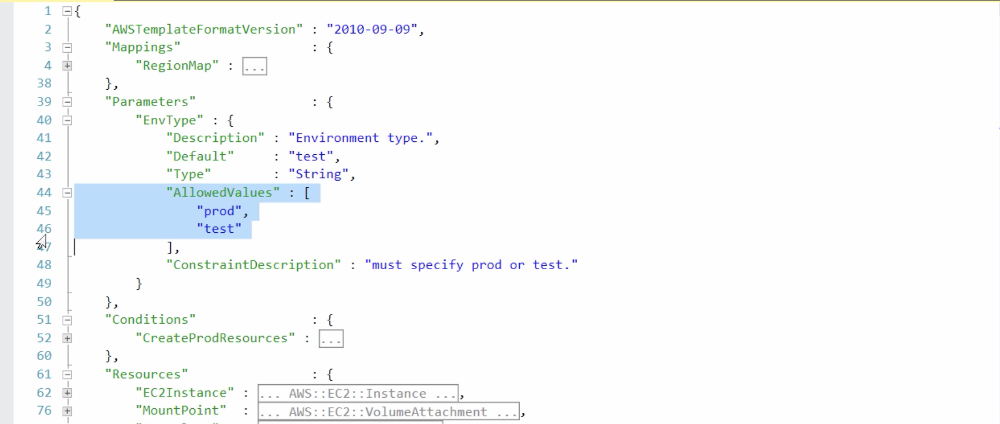

In order to setup conditions we need to add an additional block, that is optional to our CloudFormation Template. In the example below we see that the condition checks example if `"EnvType": "prod"` and it will either be true/false. If the condition evalues to true, it will go and create those additional resources, that are based on that specific condition. 

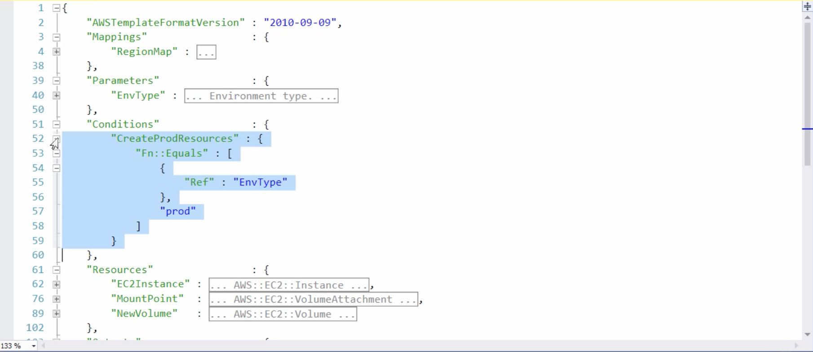

In the example below, all resources will be created but when it comes to `"NewVolume"` it will evaluate. The idea is, we are going to create this new volume only if the condition is true. In our case only if the the parameter will be evaluated to true. You just add this attribute `"Condition": "CreateProdResource"`based on that parameter input. 

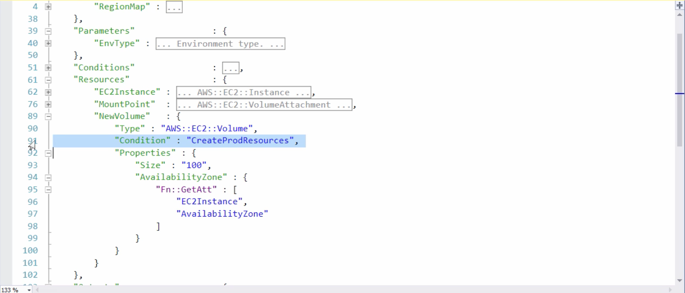


You can use the following intrinsic functions to define conditions:

* Fn::And
* Fn::Equals
* Fn::If
* Fn::Not
* Fn::Or

More detailed informaiton about conditions you can get on the [official AWS site](https://docs.aws.amazon.com/AWSCloudFormation/latest/UserGuide/conditions-section-structure.html)

### Troubleshooting Failed Stacks

If any of the resource fails to create successfully the whole stack will rollback. If you want to check if the bootstrapping process wasn't working properly, you can deactivate the option to rollback on failure, so you can check what was wrong with the bootstrapping process e.g. your script etc.


* For Linux bases AMI you can go and review the logs in the  `/var/log` folder. 
* For Windows review log files in c:\cfn\log

### Creating Nested Templates

If your templates get very long and hard to work with for these very large cloudformation templates one of the best practices to breakup your template into descrete parts e.g. you have one template that creates all the networking infrastructure that you need, then you can have a separate template that builds up the data infrastucture that you need, and finally you may have a template that does your webfrontends. 

You can start with one templates that creates `VPC` does set all the important parts including parameters, but once the resources are creates it outputs another information that other templates may going to need. In the example below to deploy other resources we need the `VpcId` or `SubnetId` so we can provide those as outputs and send those as inputs into another template. 

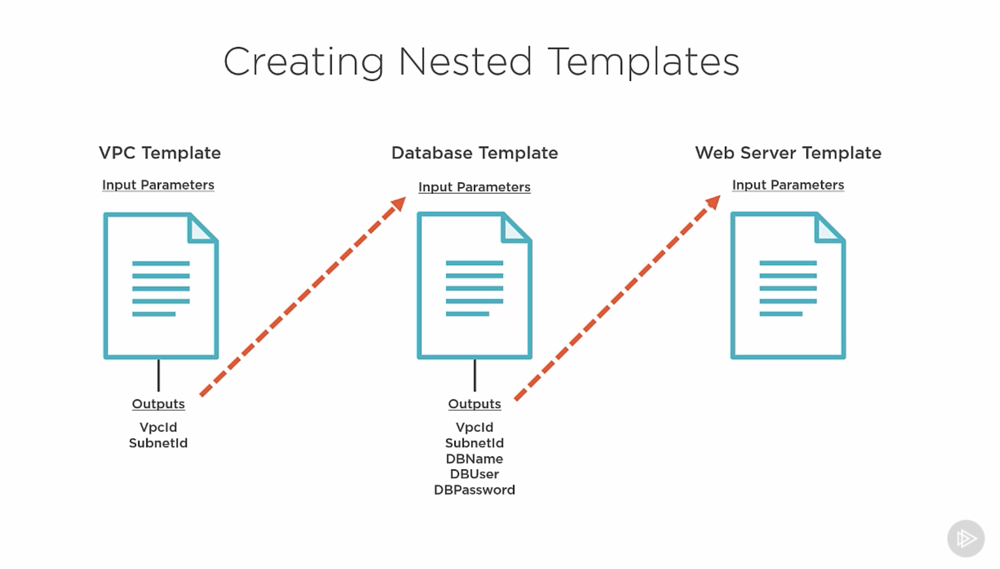

You start with the master template that has all the `Parameters` and all other things see example below, but under `Resources` we don't have 3 resources we have separate cloudformation stacks. The stacks will be created in the order they are listed there.


`AWS::CloudFormation::Stack` is the type for this resource and the properties you can see in the figure below.

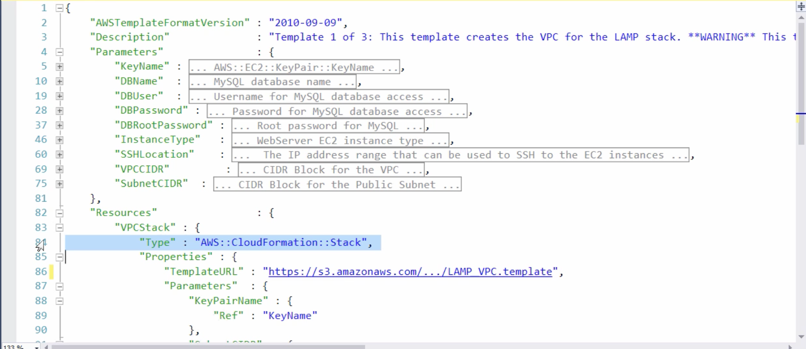

The 1st stack will take the `Parameters` from the master template. The `VPCStack` template will have set of outputs, so once the stack is created, we can kick off the database stack using another template. 


But there are few differences here in the second stack in a way we are using the parameters. In order to take the outputs from the first stack and pass it into the second stack we need to use `GetAtt` intrinsic function, that goes and takes the output from the first stack and assigns it to the second one. 

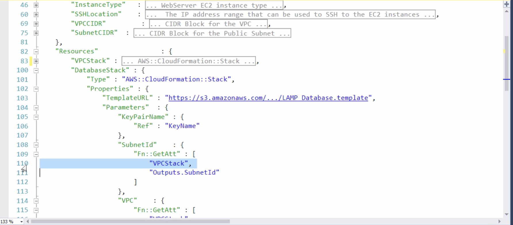

### Customer Resources

In CloudFormation you are not limited with working with specific resources. CloudFormation is extensible and has a plugin system you can use called customer resources. You can use those as customer resources that are not yet supported as cloudformation service and you can provision resources that exists outside of the AWS platform. 

* Suppose you want to build a website that support 3rd party authentication system that supports social media accounts. So if you build a stack for your application you also need to provison a new subscription for this 3rd party tool. You can model that in CF template using that custom resource. 

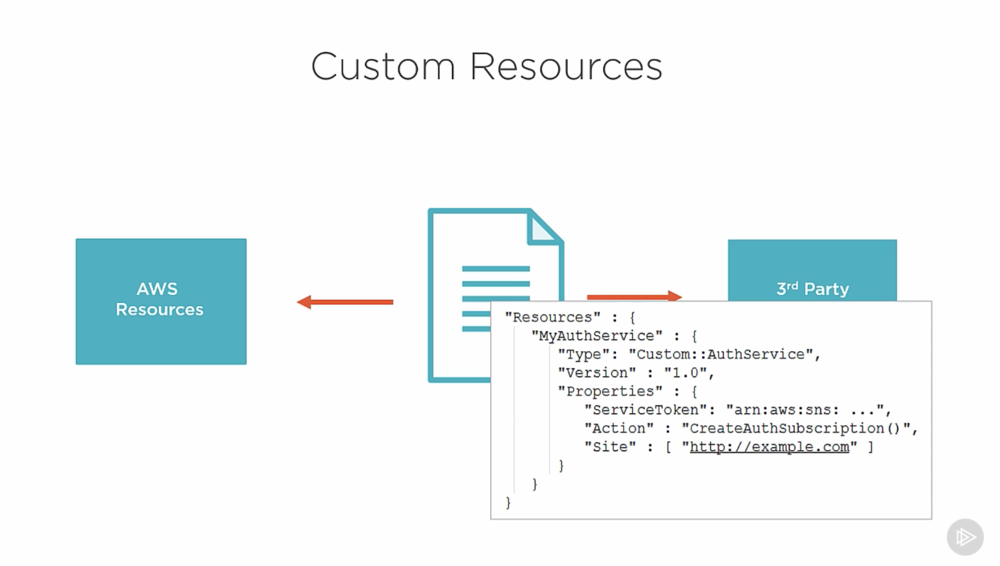

When CloudFormation processes this template, it will see the custom resource and whenever custom code you have will get executed and will return success or failure message to the CloudFormation service and that way CloudFormation will know if it should continue building the rest of the stack or rollback. 

* You can use Lambda Functions as CloudFormation custom resources, you can define a Lambda function that will execute the code you want to. And then you can create a custom resource that calls that Lambda function. This is refered to `Lambda backed custom resource`.

* You can use SNS-backed custome resource, you have the custom resource provider and this provider will execute your code when custom resource provider receives an SNS notification to it. It could be e.g. an EC2 instance that is waiting for the notification. 

Common use cases for custom resources:
* Custom programming logic
* Lookup AMI id's (code in the lambda function)
* Lookup resource id's for VPC's etc.  

**Note:** If you need to provision a resource that is not supported by Cloudformation natively, you can easily implement a Lambda or SNS backed custom resource. 

### CloudFormation Best Practices

* Don't embed credentials into your CloudFormation templates. If your templates require username or password for some reason the best scenario is to use input parameters to define that or parameter store. 

* Validate your templates with plugins. If you do use CI/CD you can do a special test that validates the JSON template. 

* Manage everything from CloudFormation, don't change the setting by hand, do change the settings in the template and use the `Update Stack` method to manage the lifecycle of those resources. 

* Use constraints & AWS specific parameter types e.g. dropdown list, default, native parameter types. 

* Use nested stacks to reduce code duplication and break up the giant templates. You can re-use different stack templates for other applications. 

* Use code reviews within your team, let other people give feedback about your templates, store templates in version control. 

## Deploying Applications with Elastic Beanstalk

Elastic Beanstalk simplifies management of infrastructure. For people who don't want to deal with EC2, auto-scaling, load-balancing and other infra provided by AWS. The idea is to abstract most of the infrastructure away so you can simply work, deploy and focus on web application. Beanstalk will deploy all your infrastructure without having you to know how to do all the heavy-lifting work. 

* PaaS (platform as a service): provide a platform for running cloud applications without the need to configure and manage the infrastructure. 

* Service for deploying and scaling web apps and services. Beanstalk is actually a wrapper around your services are needed to deploy an application. You can ssh into your infra, you have the ultimate control. Keep instances stateless and loosly couples, you can store your data in RDS or DynamoDb. 

* Autoscaling, load balancing & health monitoring: you can have different environments associated with it. It gives you an easy way to monitor your infra.

* Platform management and code deployment: nodejs, docker, java etc. (either single instance or auto-scaling). You can upload a zip file (source bundle of your app). Beanstalk integrates with CodePipeline. 


**Note:** If you want to validate your cloudformation template you can use `aws cloudformation validate-template --template-body file://file-name.json` in order to validate your current template.

In this case study we are building the so-called LAMP stack. Which means we are starting from the architectural level, which system components are needed and based on the needs we create a template that gets translated into a stack.

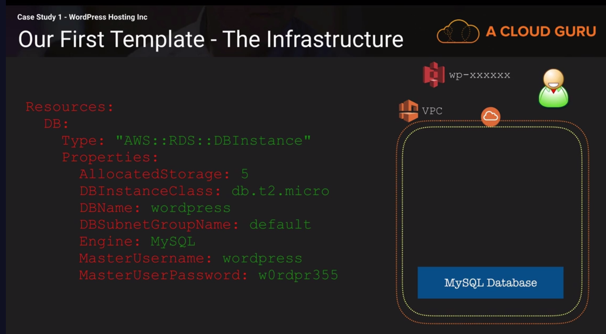
---


**Note:** Database instance will take from 5 to 20 minutes when you create new resources.

**Important:** If you have any resources e.g. such as S3, where the BucketName needs to be unique everytime, you cannot redeploy your template unless you have deleted all the resources (stack), created before.

```yaml
S3:
    Type: AWS::S3::Bucket
    Properties:
      BucketName: test-wp-cloudguru-cf-course
```

**Important:** Since we have hardcoded the `imageId`we canot recrate the same stack in another region, since the `imageId` is assigned to the specific region. To make the template portable use `mapping`. 

```yaml
EC2: # logical id name / we need it to run linux
    Type: AWS::EC2::Instance
    Properties:
      ImageId: ami-c481fad3 #north-verginia region
      InstanceType: t2.micro
```

### Template Portability & Reuse

* Critical concept to understand!
* Nothing should be hard-coded (like s3 bucket name)
* Template needs to applied multiple times
* Template should be used across all AWS regions

* To make templates reusable we can use parameters, the least elegant solution from the authors perspective. We can define paramters in the template. We need to create a Key, Type and Default and a list of AllowedValues, Desription.

```yaml
Parameters:
 Instancesize:
  Type: String
  Default: t2.micro
  AllowedValues:
   - t2.micro
   - t2.small
   - t2.medium
  Description: Instance size
  EnvironmentSize:
   Type: String
   Defaul: SMALL
   AllowedValues:
    - SMALL
    - MEDIUM
    - LARGE
   Description: Choose you proper environment size to assign the right value

###############

InstanceType: !Ref Instancesize # use the parameter 
```

* Mapping is a data structure that you define in your template and it's similar to a hash array or an associative array. Whithin this mapping (EnvSize) are 3 keys: SMALL, MEDIUM, LARGE, each key maps to a corresponding set to name/value pairs. 

```yaml
Mappings:
 EvnSize:
  SMALL:
   "EC2": "t2.micro"
   "DB": "db.t2.micro"
  MEDIUM:
   "EC2": "t2.small"
   "DB": "db.t2.small"
  LARGE:
   "EC2": "t2.medium"
   "DB": "db.t2.medium"
```

* Intrinsic CF function `!FindInMap` consists of `[MAP, KEY, NAME]`


* When we create a new template we don't need to assign a bucket name, since it's an optional element, so we can simply remove `BucketName`and AWS is going to assign a random bucket name, but we can reference it within our CF template.

**Note:** Don't explicitly specify resource names if you want to reuse the tample over and over again. Rely on the ability of CF to generate a random name, based on the logical id and the stack-name, it improves protabity!!!

* Pseudo-parameters are like normal parameters with one key difference, they are provided by AWS via CloudFormation such as `AWS::Region` it contains the region where the stack was created. We have `AWS::AccountId`. You can reference pseudo paramters with `!Ref` or `!Sub` should work too. You can get the full list of [Pseudo Parameters here](https://docs.aws.amazon.com/AWSCloudFormation/latest/UserGuide/pseudo-parameter-reference.html)

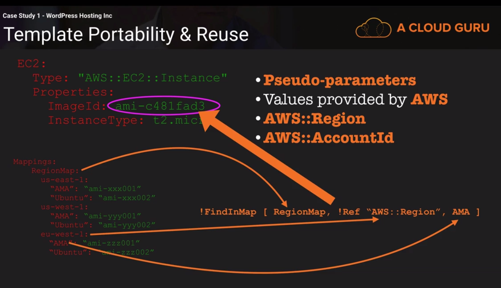

* If we want to update the stack we can see if the resource is going to be replaced or not. Also under aws documentation under each property of a resource we can see `Update requires: No interruption`. That means in case of update there will be no interruptions.


## User Data Method - EC2

Is procedural method of providing direct instruction to EC2. You can tell the instance what to do after the instace finishing being created. 

We need to add to our stack additional components

* Install PHP 5.X - Required for WP
* Install MySQL to talk to RDS
* Install Apache 2.X (http server)
* Install Wordpress & configure
* Update System

* User Data has to be 64 encoded (we need a function to encode it to base64) and it expects that everything is passed to be one string. 

**Note:** `#!/bin/bash` this is called a Hashbang, by writing it we say to shell to execute following commands on the next lines.

**Note:** Instead of using `!GetAtt LogicalId.Key` you can also use `!Sub ${LogicalId.Key.Name}`. With `!Sub` you can perform a substitution of pripary or secondary attributes.

```sh
sed -i 's/database_name_here/${DatabaseName}/g' wp-config.php sed -i 's/localhost/${DB.Endpoint.Address}/g' wp-config.php
sed -i 's/username_here/${DatabaseUser}/g' wp-config.php
sed -i 's/password_here/${DatabasePassword}/g' wp-config.php
``` 

**Note:** (|) in YAML means that takes everything that follows and interpret it as a one line STRING (type)

* You can use `DependsOn: ResourceLogicalID` in order to wait for the resource that needs to be created before the current resource gets created. But if you use `Sub! or !REf` you don't need to define `DependsOn` because CloudFormation understands it and will wait. In case you would add something manually, there is no way to know it for CFN.

## CloudFormation Init

* Userdata - procedural steps A -> B -> C (you design a script and it runs under root user) -> not easy to manage

* CloudFormationInit - pass directives to cfn-init process
    + Critical that you understand between CFN init vs. Cloud Init -> CFNINI is OS independent over Cloud Init (Userdata)

* CFinit is a desired state enginge - not procedural (you just design the state and not giving the instructions)

* CFNinit is flexible and support sets of configuration

* CFNinit supports order and allows control of timing (in some cases)

* CFNinit allows authentication files/folders can be created from ZIPS, S3, or HTTP/S or GITHUB (download protected resources)

* CFNinit is idempotent.. if its already done, it won't try to do it again

```yaml
Resources:
 EC2:
  Type: "AWS::EC2::Instance"
  Properties:
   :
   :
   :
  Metadata:
   AWS::CloudFormation::Init
   config:
``` 
You can config sets which contain multiple config key, if you don't have config sets or you don't call a config set, it will call a specific config key and a specific config key is the default. Inside the config key you have sections, these sections are processed in order it's defined

```yaml
Resources:
 EC2:
  Type: "AWS::EC2::Instance"
  Properties:
   :
   :
   :
  Metadata:
   AWS::CloudFormation::Init
   config:
    package:
        :
    groups:
        :
    users:
        :
    sources:
        :
    files:
        :
    commands:
        :
    services:
        :

``` 


* `packages` allow you to provide a directive to CFNinit that the packages you indicate are installed. If the packages are installed, nothing will happen, if they are not installed they will be installed to meet the desired state directive.

* `groups` they direct the system to create or to confirm the system to create one or more groups. You can specify the group name or group id mapping. Only supported on Linux/Unix

* `users` directs the CFN process that the desired state is that one or more users exists or one or more configs for those users also exists

* `sources`it allows you to specify zip, tar etc. located on a remoted endpoint and have instracted into a folder into a resource. If you are using s3 you need to use different auth

* `files` you can specify a file and specify a source, it's similar to sources but it only operates on files. You can specify a remote files and move it into local directory. But additionally you can specify user, permission etc.

* `commands` allow you to run command in a structure way. You can run commands and they will be executed in the alphabetical order

* `services` have dependencies that you have satisfied with the previous keys.

* You can specify a config set and you can tell CFNinit to run the optional config set. The config set can have different config keys. You can have one set that create and another set that deletes stacks.


* The `cfn-hup` helper is a daemon that detects changes in resource metadata and runs user-specified actions when a change is detected. This allows you to make configuration updates on your running Amazon EC2 instances through the UpdateStack API action.

### Creation Policies

To understand the creation policies, you need to understand the lifecycle:

1. We start with the template (cloudformation)

2. We feed the template into CloudFormation

3. Begins the process of stack creation

4. The stack moves into the create in progress state and CFN begins the resource orchestration:
    1. It reads the template
    2. It calculates any dependencies
    3. Communicates with other AWS services to create the resources

5. When the resources are completed the stack changes to complete state.

* Creation Policies allow us to influence CFN, we can wait for some operation or an user event to occur before signaling the stack that the creation has been completed successfully.

* CFNinit und UserData rely on exit codes to determine if the bootstrapping has completed. 

* Creation Policies are a way in which it allows template creators to influence the success or failure of stack creation via actions e.g. we have an automated testing framework that is supplied to the instance after wordpress is installed and configured and this framework may run some advanced functionality and performance tests on our infrastructure and signal CFN that this process has passed or failed. CFN can use it to move the stack into complete or a failure state. 

* Creation Policy consitst of 2 components:
    1. Definition within CFN template
    2. A way of communicating of success or failure to CFN itself. We need to send a signal back to CloudFormation!
        + CFNsignal is used to signal to the stack
        + CreationPolicy has a count (the amount of signals) and timeout


