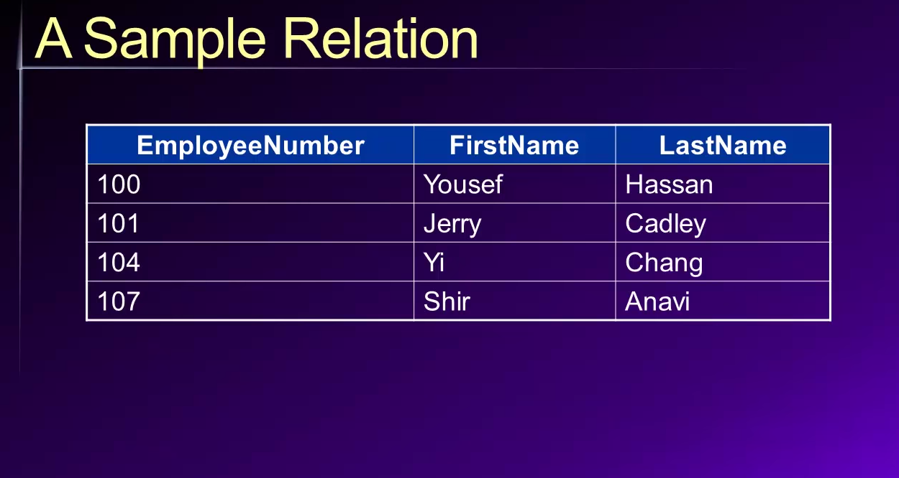
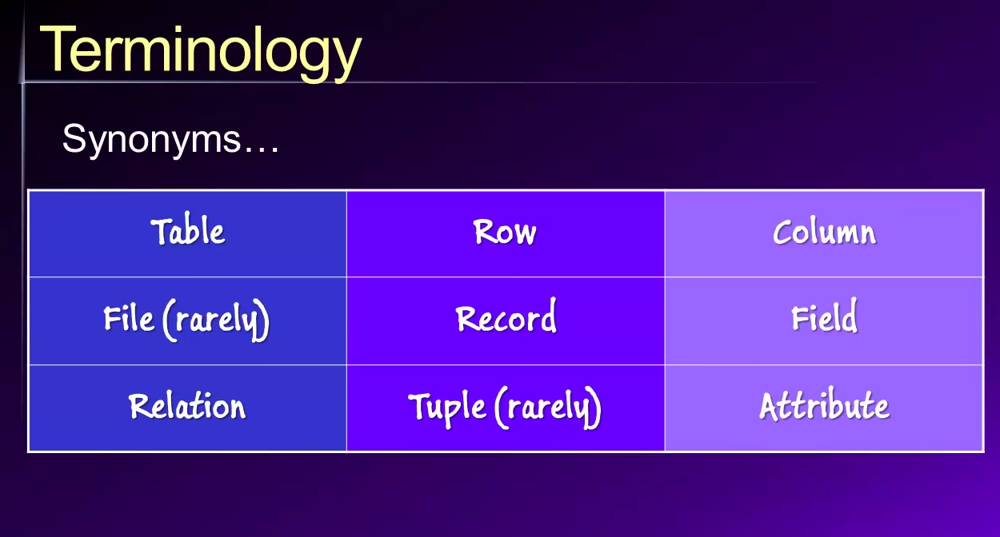
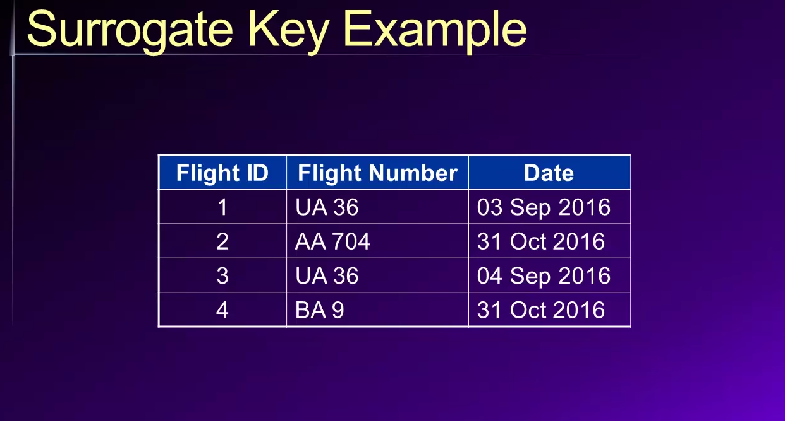

# Getting Started with Databases

[Source - 8 Lectures](https://www.youtube.com/watch?v=4Z9KEBexzcM&list=PL1LIXLIF50uXWJ9alDSXClzNCMynac38g)

## Purpose of a Database

* The purpose of a database is:
    - to store data (repository for storing data)
    - to provide an organized structure where this data can be placed
    - to provide a mechanism for querying, creating, modifying and deleting data (machanism for interacting with data - CRUD)
    - STORE, ORGANIZE, CRUD

* Database can store information and relationships that are more complicated than a simple list (e.g. customers and orders, employees and departments). A relational database allows us to represent these relations.

* Database solves a problem with a redundancy (to much waste of space), data anomalies (deletion problems (we may loose some important knowledge through deleting some rows), update problems (if you have to update all fields and not just one attribute, insertion problems (we insert one attribute and all the data across attributes is missing)), data integrity (to have all data be correct across the whole database)

* Relational databases are designed to address many of the information complexity issues that arise in business e.g. a product can be assembled from many different components. There are these natural complexities arise in the business. 

### Relational Database

* A relational database stores information in tables. Each informatial theme (business concept) is stored in its own table.
* **In essense, a relational database will break-up a LIST into several parts.**
    - One part for each theme in the list. For example, a project light might be divided into a CUSTOMER table, a PROJECT table, and a PROJECT MANAGER table.
* In our relational database examples (see above), we broke apart our list into serveral tables. Somehow the table must be joined back together.
* In a relational database, tables are `joined`(we join the tables together) together using mathed pairs of data values
    - If a PROJECT has a CUSTOMER, the Customer_ID can be sotred as a column in the PROJECT table. Whenever we need information about a customer, we can use the Customer_ID to look up the customer information in the CUSTOMER TABLE
* A relational database minimizes data redundancy, allows to model complex relationships among topics, and allows for partial data (null values)

**Note:** SQL (structured query language) is the primary tool for CRUD operations. SQL was designed simple to use and simple to understand. **With SQL we can restore a LIST view of the data again, since database simply breaks the LIST into different tables and assigns relationships**

### Database System

It's important to remember that database system is not just a database itself. The four componenets of a database system are:

1. Users (people or other apps)
    - Use a database apps to keep track of information
    - Use different user interface forms to enter, read, delete, and query data
    - Producte reports

2. Database Applications (website, client, mobile app, desktop)
    - A database application is a set of one or more commputer programs or websites that server as an intermediary between the user and the DBMS
    - These application are not allowed to talk to database directly, they must go to DBMS to talk to the database.

3. Database Management System (Gatekeeper - all the information that flow in/out from a database must travel through DBMS - is a critical mechanism to mantain the quality of our data in the database, we don't allo our users or applications to directly access the data in the database)

4. Database (store data in separate tables)
    - A database is a self-describing collection of related records. A database doesn't only contain it's own data but it has also a defintion of it's own structure.
        - Self-describing:
            + The database itself contains the defintions of its structure
            + Metadata: are data which describe other data e.g. en employee table conaints attribute called `employeeId`is an integer and that is knows as metadata. So the information that    `employeeId`is an integer
            + Indexes and other overhead data (tables to improve performance)
            + Application metadata (user preferences)
            + User data

    - **Tables within a relational database are related to each other in some way**
    

### Database Management System (DBMS)

Is a special kind of software program not only to create databases but also process and manage these databases. DBMS itself is not the database!!!

* A database management system (DBMS) servers as an **intermediary** between database applications and the database
* The DBMS manages and controls database activities
* The DBMS creates, processes and administers the database it controls

#### Functions of a DBMS
* Create a new database
* Crate a new tables (and establish relationships between tables)
* Create supporting structures
* Read database data
* Modify database data (insert, update, delete)
* Maintain database structures
* Enfore rules
* Control concurrency
* Provide security
* Perform data backup and recovery

* Referntial Integrity Constraints
    + A DBMS can enforce many constraints (Einschränkungen)..
    + **Referntiel integrity constraints** ensure that the values of a column in one table are valid based on the values in another table
        - For example, if a 5 was entered as a CustomerID in the PROJECTS table, a Customer having a CustomerID value of 5 MUST exist in the CUSTOMER TABLE. If the CustomeriD 5 doesn't exist it won't allows u to enter it as CustomerId in the PROJECTS table. This is how we maintain DATA INTEGRITY.

## Types of Database Systems

* Personal database systems typically (not support big businesses - MS ACCESS):
    + Support one application
    + Have only a few tables
    + Are simple in design
    + Invovle only one computer
    * Support one user at a time

* Enterprise-Level database systems typically (Oracle, SQL Server, MySQL):
    + Support several users simultaneously
    + Support more than one application
    + Involve multiple computers
    + Are complex in design
    + Have many tables
    + Have many databases (database for website, but also for a dashboard)
    + Support thousands of users 
    + Spread across many physical servers, geographically distributed
    + **Support more than 1 database: within the same DBMS we can have operational database, and we also can create datawarehouse. They can all be managed by the same DBMS.**

# The Relational Model

### Entity

* Entity is something of importance to user or organization that needs to be represented in a database
    + An employee, a department, a project can be an employee (single business concept)

### Relation

* A relation is a two-dimensional table that has specific characteristics
* The table dimensions, like a matrix, sonsist of rows and columns

**Note:** A relation is a specific type of table that is in order for a table to qualify as a relation, the table must have certain characteristics. Certain Characteristics must be met in order for a table to qualify a relation.

#### Characteristics of a Relation

* Rows contain data about instances of an entity (e.g. a single employee)
* Columns contain data about attributes the entity (e.g. employee name, id)
* Cells of the table hold a single value
* All values in a column are of the same kind (data type)
* Each column has a unique name
* The order of the columns is unimportant
* Te order of the rows is uneimportant
* No two rows can be identical (if we take all rows together entirely, they cannot be identical with other rows in the table - that's why we need a primary key or composite key, they make the specific row unique) - When all values of row a considered together, there must be something unique about the row, not two rows can be identical to each other!!!

> an RDBMS is called a relational database system because the data is stored in tables. [Source](https://www.xaprb.com/blog/2012/03/13/what-makes-relational-databases-relational/)

There are two problem here. In the first row the cell doesn't hold a single value. And there are two rows that are identical.

**Important:** All relations are tables, but not all tables are relations

### Keys
* A key is one (or more) columns of a relation (table) whose values are used to identify a row
    + Unique Key
        - Data value is unique for each row (e.g. within an id column)
        - Consequently, they key will uniquely identify a row
    + Nonunique Key
        - Data value may be shared among several rows
        - Consequently, the key will identify a set of rows

---

#### A Composite Key
* A composite key is a key that is composed of two or more attributes/columns (in order to get uniques)
* For a key to be unique, it must often become a composite key

#### A Candidate Key
* A candidate key is called "candidate" because it has the potential to become the primary key
* A candidate key is a unique 

**Note:** Like in a presedential election where a candiate can become a president.

#### A Primary Key
* A primary key (the main identifier for a relation and is a unique key) is a candiate key chosen to be the main key for the relation
* If you know the value of the primary key, you will be able to uniquely identify a single row within the table.

#### A Surrogate Key
* Surrogate key is a unique, numeric value that is added to a relation to server as the primary key. 
* Surrogate key values have no meaning to users and are usually hidden on forms, queries, and reports
* A surrogate key is often used in place of composite primary key

**Note:** Surrogate Key is intentially added as a database designer for a purpose of serving of serving as primary key. Often used when we don't have a column within a table that naturally server as a unique identifier as a primary key

---

#### A Foreign Key - Relationships Between Tables
* A table may be related to other tables

