# AWS Developer: Getting Started with DynamoDB

[Source](https://app.pluralsight.com/library/courses/aws-dynamodb-getting-started/table-of-contents)

**Note:** Before you start working with DynamoDb don't forget to setup credentials or to change them. You can do it from [AWS CLI](https://docs.aws.amazon.com/cli/latest/userguide/cli-chap-getting-started.html)

## What is DynamoDb

... some marketing bullshit. 

* Fully managed: you don't need to manage architecture, but you still need to manage
    + Access
    + Encryption
    + Backups
    + Disaster recovery
* NoSQL dataservice: key-value store with document DB attributes
* Fast: designed to have < 10ms response time
* Predictable Performance: the service runs on SSD (solid state drives) 
* Seamless Scalability: the system can be scaled on a table basis

### DynamoDb Terminology

The highest level structure at DynamoDb is a table, data is stored within tables. A table is made up of rows, which are called items in DynamoDb. Each item contains attributes (typically these are columns in a relational model). DynamoDb is schemaless, which means each item can have different set of attributes. 

* The single primary key is known as a partition key (HASH): The attribute on which the data can be partioned. This is a mandatory key which needs to be defined at table creation time (cannot change later). If a table is designed with a composite partion key a table made with two attributes, you also have a sort key (RANGE).

* A sort key is the attribute which defines the way the data is sorted within the partition. If you have a sort key, the unique identifier are both keys. 


### SQL vs. DynamoDb Terminology

Table = Table 
Row = Item
Column = Attribute
Primary Key = Partition Key (single primary key) OR Partition and Sort Key (composite primary key)

### Tables

* DynamoDb  service is a set of tables
* Tables are the top level structure
* Performance is managed at the table level
* Table are schema-less (doesn't need to be predefined, apart from the primary key)
* Tables are scoped within a region

### Data Types in DynamoDB

* Scalar: can represent exactly one value
    + String: simple text
    + Numbers: positive, negative or zero
    + Binary: can store any binary data such as compressed encrypted data or images
    + Boolean: true or false
    + Null: unkown or undefined state
* Set: can represent multiple scalar values
    + String Set: ["White", "Black", "Yellow"]
    + Number Set: [124, 134, -19, 7.5]
    + Binary Set: ["V34ssdfi=", "sfEEskd=", "0sdfk="]
    + Rules: 
        * Sets can be used on one scalar type, all values within a set must be strings, numbers or binaries, they cannot be mixed together.
        * Empty sets cannot be supported by DynamoDb
        * Ordering within a set is not preserved (the application must not rely on ordering within a set)
        * Each value must be unique within a set
* Document: can represent a complex structure
    + List: can stored an ordered collection of values ["Cookies", "Coffee", 3.144354] = is similar to JSON array
    + Map: an unordered collection of name/value pairs {Day: "Monday", Emails: 42} = is similar to JSON object

**Note:** A document database, also called document store or document-oriented database, is a subset of a type of NoSQL database. Some document stores may also be key-value databases. The term "document" refer to a block of XML or JSON data. Instead of columns with names and data types that are used in relational database, a document contains a description of the data type and the value for that description. Each document can have the same or different structure. To add additional types of data to a document database, there is no need to modify the entire database schema as there is a with relational database. Data can simply added as objects to the database. [Source](http://basho.com/resources/document-databases/)

**Note:** The primary key uniquely identifies each item in the table, so that no two items can have the same key. In a table that has only a partition key, no two items can have the same partition key value. But if there is a sort key, the primary key doesn't need to be unique. The partition key of an item is also known as its hash attribute. The term hash attribute derives from the use of an internal hash function in DynamoDB that evenly distributes data items across partitions, based on their partition key values. [Source](https://docs.aws.amazon.com/amazondynamodb/latest/developerguide/HowItWorks.CoreComponents.html)

### Capacity Units

Predefined the throughput at table level for reads and writes separately. Behind the scenes DynamoDb will use this information to reserver sufficient hardware resources to ensure it will make your requirements. Trorughput in DynamoDb is broken down into two controls:

* Read Capacity Units (RCUs)
* Write Capacity Units (WCUs)

**Note:** RCUs and WCUs can be updated anytime.

### What is a partition?

Partitions are the underlying storage mechanism in DynamoDb. It's critical to understand how data is partioned and stored. Partition is where the table is divided into multple smaller parts. By splitting a large table into smaller individual partitions, queries that access only a fraction of the data can run faster, cause there is less data to work with. It also makes it easier to manage smaller sets of data. 

![Partitions])(./images/dynamodb-partitions.png)

There are 3 drivers for database partitioning.

1. Manageability:
2. Performance:
3. Availability:

Partitioning can assist with one or more of these attrbiutes. There are couple of different types of database partitioning methods. 

* Vertical partitioning (by attributes): is where a table is split by columns. In this case the first 3 columns are in partition 1. And columns 4 and 5 are in partition 2. 

* Horizontal partitioning (by items): is where a table is split by rows. DynamoDb leverages this horizontal partitioning method. This is handled entirely by AWS. 

**Note:** DynamoDb doesn't partition until it needs to scale for performance or storage. 

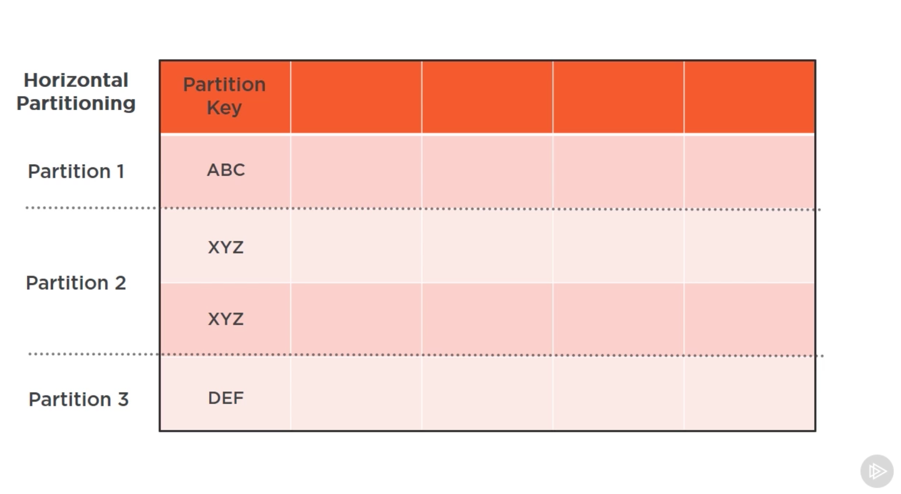

We see here an example how the items can be stored in different partitions. ABC in partition 1, XYZ, XYZ in partition 2, DEF in partition 3. These partitioning impacts quering on the database.

#### There are 2 types of queries DynamoDb can perform

* Queries where we have a known partition key: DynamoDb knows which partition to access.
    + When the partition key is knows the request goes to Dynamodb and DynamoDb knows which partition to access to perform a read. This significantly optimizes the performnace on queries as it only needs to work on a subset of data.

* Queries where we have a unkonwn partition key: DynamoDb doesn't know which partition to access. 
    + When a partition key is unkonwn the request cannot target a specific partition and must scan all partions which is the entire table. This means performing a lot more work and consuming a lot more capacity units. 

#### Consistency Models

**Note:** A very important part of quering of DynamoDb is understanding the consistency model it provides. It can significantly impact your application and also costs. There are two models available when performing read operations on DynamoDb. This can be specified in the API call when performing the query. 

**Important:** For distributed databases such as DynamoDb (eventually consistent - reads may not return the latest results) to be highly available data needs to be replicated to multiple locations, this is done asynchronously and hence may take up to 1 second to reach all replicas. If the read operation is performed before the data is copied to all replicas, it may receive stale data. 


### Capacity Units

Capacity units are predefined throughput requirements for a Table. In the background DynamoDb will provision the required hardware to support our throughput. Throughput is specified in two ways:

* Read capacity units (RCUs): Two models of reads we can perform and each read is rounded of the closes 4kb
    + Strongly consistent (needs to be activated during the API call): 1 RCU = 4kb / second. Formula: item size / 4kb = round up. To read 20kb we need 5 RCUs. Another example 2kb / 4kb = 1 RCU (round up to 4kb)
    + Eventuelly consistent (default): 0.5 RCU = 4kb / second. Formula: (item size / 4kb) / 2 = round up. To read 20kb we need 2.5 RCUs. Another example (2kb / 4kb) / 2 = 0.5 RCU

* Write capacity units (WCUs): 1 WCU = up to 1kb of data / second (each write opertion is rounded up to closes 1kb). Formula: item size / 1 kb. This will gives us the amount of WCUs required to complete the operation. Example: 5kb of data 5kb / 1kb = 5 WCUs. To write 5kb of data we need to write 5 WCUs. If we want to write 500 bytes of data it means 0.5kb / 1kb = 1 WCU (round up). 


## Creation our Tables

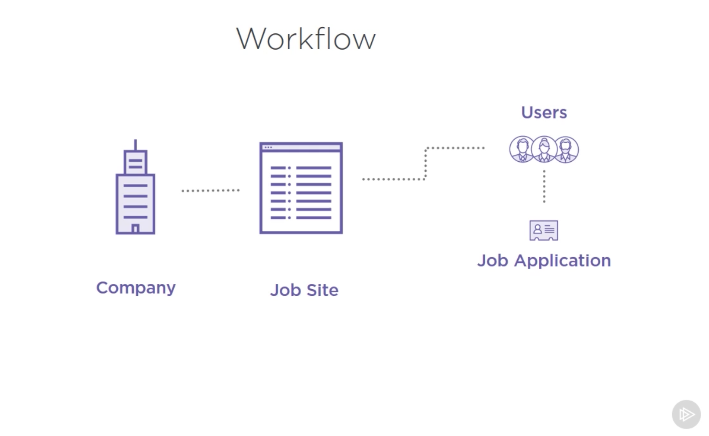

We can simplify our logic and enhance our entities into 3 types:

1. Job: A vacant position that needs to be filled within a company. 
    + Job id: String (UUID) (DynamoDb doesn't support incremental unique identifier such as in RDB)
    + Country id: String
    + Job Title: String
    + Job Desc: String
    + Closing time: Number (epoch time)

**Important:** We are going to setup as a partition key the `Country Id`. Typically in relational databases we'll setup `Job Id` as a primary key as it is also an unique key. For DynamoDb the partition key is how the data will be partitioned. This is very important as we typically don't want to query across partition. A good separation for our data would be a separation by `Country Id` as we do not expect users to query jobs across countries at this stage. To ensure the uniques, we'll use `Job Id` as a sort key.

2. User: a person who can apply to fill a job - User cannot submit a job application before he hasn't created an account
    + User id: String (UUID)
    + Firstname: String
    + Lastname: String

**Important:** For users we'll use the `User Id`as a primary key which is the universal unique identifier. 

3. Jobs application: the application that represents the application for the job. Is a set of information the user can submit for open job vacancy. 
    + Job Id: String (UUID) - the application if for
    + User Id: String (UUID) - the user that's applying for the job
    + Job Title: String
    + Time Applied: Number (epoch time)
    + Applicaiton Form: String - set of questions the user must answer to apply for the job itself - typically in json format
    + Resume: String - simplify into a json format

**Important:** For job application we'll use as a partition key the `Job Id` and as a sort key the `User Id`. A typical case for querying will be seeing all job applications within a job, hence the `Job Id` as a partition makes sense.

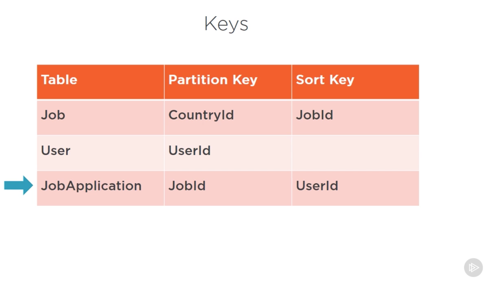

**Note:** When we provision a new DynamoDb table we need to define the RANGE + SORT key, but also we need to define the data types. Under KeySchema you can define the keys and under AttributeDefinitions you can define the data types. Keep in mind that DynamoDb is schema-less and the AttributeDefenition section is only for key attributes.

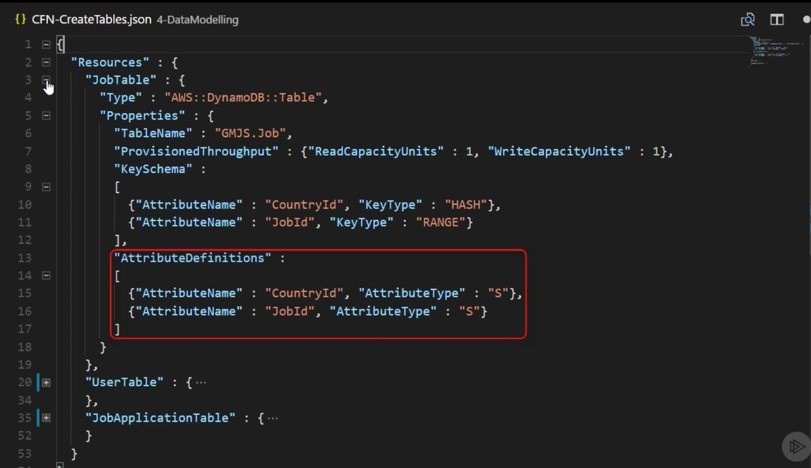


### Administrative APIs

* ListTables: allows us to return available tables within account and a region
* DescribeTables: gives us information about specified table > key schema, RCUs/WCUs, data types for keys, items counts etc.
* UpdateTable: allows you to update the settings on a table. It allows to perform operations such as:
    + Updating the RCUs/WCUs
    + Enable/Disable Streams
    + Create/Remove Global Secondary Indexes

```js
console.log('Increasing RCUs/WCUs to 2: ')

const params = {
    ProvisionedThroughput: {
        ReadCapacityUnits: 2,
        WriteCapacityUnits: 2
    },
    TableName: 'PL.Job'
}

dynamoDb.updateTable(params).promise()
    .then(() => {
        const params = { TableName: 'PL.Job'}
        console.log('Waiting for update to finish...')
        return dynamoDb.waitFor('tableExists', params).promise()
    })
    .then(res => console.dir(res, {depth: null, colors: true}))
    .catch(err => console.error(err))
``` 
You can see here above an example how to update a table. We know that increasing RCUs/WCUs is an async function, which means it may take up to 30 seconds. In the example above we can see `dynamoDb.waitFor('talbeExists', params)` which enables us to encode wait until the table is in the final state. Once it is we simply print the output. 

**Note:** Conditional requests allows you perform a put operation based on certain conditions. 

### AWS SDK

**Note:** AWS SDK is an abstraction over low-level DynamoDb APIs. Which takes a lot of tidious work away, such a serializing requests, basic retry logic and generating signatures for each request. [Link to AWS SDK](https://docs.aws.amazon.com/AWSJavaScriptSDK/latest/AWS/DynamoDB.html)

Whithin SDK you can can have different level of interaction with the APIs. We'll focus on Low-level interface model rather than High-level or Document interface. The main reason for this is to make sure we learn how DynamoDb works. 

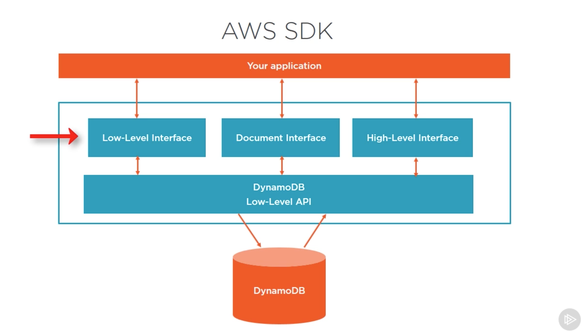

[Programmatic Interfaces](https://docs.aws.amazon.com/amazondynamodb/latest/developerguide/Programming.SDKs.Interfaces.html)

**Low-Level Interfaces:** Every language-specific AWS SDK provides a low-level interface for DynamoDB, with methods that closely resemble low-level DynamoDB API requests. In some cases, you will need to identify the data types of the attributes using Data Type Descriptors, such as S for string or N for number.

**Document Interfaces:** Many AWS SDKs provide a document interface, allowing you to perform data plane operations (create, read, update, delete) on tables and indexes. With a document interface, you do not need to specify Data Type Descriptors; the data types are implied by the semantics of the data itself. These AWS SDKs also provide methods to easily convert JSON documents to and from native DynamoDB data types.

**Object Persistence Interface:** Some AWS SDKs provide an object persistence interface where you do not directly perform data plane operations. Instead, you create objects that represent items in DynamoDB tables and indexes, and interact only with those objects. This allows you to write object-centric code, rather than database-centric code.

### DynamoDb JSON Item Schema

Typically when interacting with items we need to specify value of keys or attributes. This is done through a standard DynamoDb JSON format. Which follows the scheme:

```json
{
    "<AttributeName>": {
        "<DataType>": "<AttributeValue" }
}
``` 

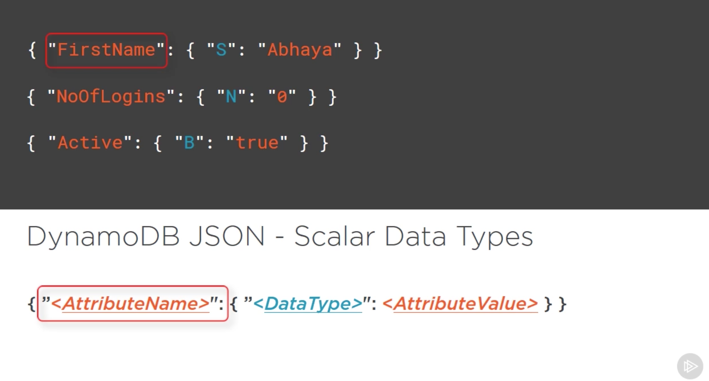

**Note:** Numbers have also "" (double-quotes) similar to the strings. Also see the value of true in "" (double-quores). This is the standard JSON definition format.

**Lists Data Types**
```json
{
    "SampleList": {
        "L": ["Your Name", 5 ]
    }
}
``` 

Note: Lists can store any type of data in comparison to String set it's an unordered set of unique strings. 

**String Set Data Types**
```json
{
    "StringSetExample": {
        "SS": ["First Name", "Second Name" ]
    }
}
``` 
{"AttributeName": {"DataType": AttributeValue}}

**Map Data Types**
```json
{
    "MapExample": {
        "M": {
            "FirstName": "Name",
            "NoOfLogins": 0
        }
    }
}
```

**Note:** Elements in the map don't have to be of the same type. There are no restrictions how the elements are stored on a map

### Main API Methods

* PutItem: Creates a new item, or replaces an old item with a new item otherweise the item will be created. If you are trying to use the same partition key and just change some key/values, the old key/values will be replaced with the new ones.

* UpdateItem: Edit an existing item's attributes or add a new item to the table if it doesn't already exist.

```js
const params = {
    "TableName": "PL.User",
    "Key": {
        "UserId": {"S": "001"}
    },
    "ReturnConsumedCapacity": "TOTAL",
    "UpdateExpression": "SET #LN = :t, #NOL = :n",
    "ExpressionAttributeNames": {
        "#LN": "LastName",
        "#NOL": "NoOfLogins"

    },
    "ExpressionAttributeValues": {
        ":t": {"S": "Tyrson"},
        ":n": {"N": "1"}
    }
}
```

`UpdateExpression` is the expression which drives which attributes will be updated. It looks unsual simply because it's made up of keywords and tokens. In this case we use the keyword `SET` which allows us to create or update attributes. `ExpressionAttributeNames` and `ExpressionAttributeValues` are substitued for the tokens in the `UpdtaeExpression`. For example `#LN` will be replaced with `LastName` and `#NOL` will be replaced with number of `NoOfLogins`. The same will be happening with `:t and :n`. 

**Note:** An expression in a programming language is a combination of one or more explicit values, constants, variables, operators, and functions that the programming language interprets (according to its particular rules of precedence and of association) and computes to produce ("to return", in a stateful environment) another value. This process, as for mathematical expressions, is called evaluation. [Source](https://en.wikipedia.org/wiki/Expression_(computer_science))

**Important:** The following keywords are reserved for use by DynamoDB. Do not use any of these words as attribute names in expressions. [Source](https://docs.aws.amazon.com/amazondynamodb/latest/developerguide/ReservedWords.html)

Another keyword we can us in `UpdateExpression`is `ADD` which allows us to increment a number datatype by the number specified. We have here also a `ConditionExpression` which allows us to specify a condition that must be specified in order to perform an update. 

```js
const params = {
    "TableName": "PL.User",
    "Key": {
        "UserId": {"S": "001"}
    },
    "ReturnConsumedCapacity": "TOTAL",
    "UpdateExpression": "ADD #NOL :n",
    "ExpressionAttributeNames": {
        "#NOL": "NoOfLogins"

    },
    "ExpressionAttributeValues": {
        ":n": {"N": "1"},
        ":max": {"N": "5"}
    },
    "ConditionExpression": "#NOL < :max"
}
``` 

* DeletItem: Deletes a single item in a table by providing a primary key. The parameters for the API, are table name and primary key. This operation will not inform you if the item has not been found. If you want to be notified if the item has been found, please use conditional expression to check if the item exists. 

**Note:** More information [Working with Items can be found here](https://docs.aws.amazon.com/amazondynamodb/latest/developerguide/WorkingWithItems.html)

### Expressions

Expressions are strings that use DynamoDB's domain-specific expression logic to check for the validity of a described statement. With expressions, you can use comparator symbols, such as "=" (equals), ">" (greater than), or ">=" (greater than or equal to).

For example, a comparator symbol could be used as follows: `"Age >= 21"` to ensure that the Item being manipulated has an Age greater than or equal to 21.


* **Condition expressions** are used when manipulating individual items to only change an item when certain conditions are true.
* **Projection expressions** are used to specify a subset of attributes you want to receive when reading Items. 
* **Update expressions** are used to update a particular attribute in an existing Item.
* **Key condition expressions** are used when querying a table with a composite primary key to limit the items selected.
* **Filter expressions** allow you to filter the results of queries and scans to allow for more efficient responses.

[Source](https://www.dynamodbguide.com/expression-basics)

* GetItem: Enables you to retrieve a single item given the Primary Key. This enables us to solve use cases such as getting a specific job a specific user or a job application. The primary key would be the partition key and the sort key depending on the tables key schema. If you've got a sort key, you need to specify a sort key as well. 

* GetQuery: It's much more powerful API than the `GetItem` API, it allows you to retrieve items based on a primary key values. It allows you to query within a partition key, it allows you to scope down by filtering on a sort key. The filter on the sort key is very powerful. Range of comparison operators available on the Sort key. 

* Scan API: Allows you to return one or more items by accessing every item in the table. It scans every item. It's the least favorable way to access data in DynamoDb due to that expensive behaviour. It's typically used when your keys and indexes not allow you to use `getItem` or the `query` API's. This is why designing your keys and indexes is so important. 

Here is a good example why `Scan` operation is very bad and costly:

```js
   "Count": 5,
    "ScannedCount": 100,
    "ConsumedCapacity": {
        "TableName": "PL.Job",
        "CapacityUnits": 89
    }
}
"Size of data: 36.0 KB"
``` 
This small operation has consumed 89 Read Capacity Units and just found 5 items that we were looking for. The size of the data was only 36kb / 4kb /2 = 4,5 Read Capacity Units. So by using `scan` we literally overpaying by 20 times. If we would use `query` we would only consume 4,5 RCUs, but by using `scan` we have used `89` RCUs.

## DynamoDb Batch Operations

* BatchGetItem: Enables you to perform one or more GetItem calls in one request. The API returns the attributes of 1 or more items from 1 or more tables based on the primary key. Each operation can retrieve up to 16mb of data or 100 items. The batch call is not atomic: you may receive unprocessed keys in the response which indicates partial success. The batch operation works in parallel and hence results are not ordered. 

* BatchWriteItem: Enables you to perform multiple puts or deletes in one request. A single call can write up to 16mb, or up to 25 PUTs and DELETE requests. Cannot not update items (partial attribute operation). Batch call is not atomic each PUT or DELETE operation within the batch is atomic, it can return unprocessed items in the response, which means those needs to be resend. Works in parallel and only saves time (in terms of latency and roundtrips) but not WCUs. 

**Note:** Entire Batch API calls are not atomic

## Working with DynamoDb Streams & Triggers

* DynamoDb streams is a feature avialable at a table level and it allows us to track changes. It allows us to access the database transaction log for 24h period. Every successful put, delete or update request on the table is available. DynamoDb streams is a strem of ordered events which capture all data changes.

* DynamoDb triggers is code that is executed automatically when certain events occur. Communly these triggers are on insert, update or delete events on a table. It's used for auditing data changes. DynamoDb triggers are pieces of code that respond to events in DynamoDb Streams.

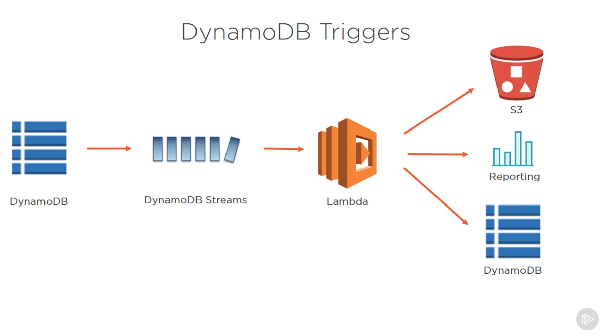

Some use cases for streams & triggers:

* Real-time analytics
* Build and update caches
* Run business processes on table based events
* Replication & Backups
* ETL for data warehousing
* Publishing events to a messsage bus

### Local Secondary Index (LSI)

* Is an index you can create on a table
* It allows you to create another sort key with the same partition key as the base table
* Maximum of 5 LSI on each table
* LSI can be only created at table creation time. You cannot add LSI after the table has been created.
* WCU & RCU are shared with the base table


### Global Secondary Index (GSI)

* An index you can create on a table
* Enables you to create different key schemas for your table (partition + sort keys)
* Maximum of 5 Global Secondary Indexes
* GSI can be created at any time and they are not bound to the table creation (dynamodb will dupliate the data using they new key structure)
* GSI's have their own dedicated WCU's and RCU's
* GSI is only eventually consistent, when an item is written to the base table the global secondary index is written async in the background
* Partition key and the sort key don't need to be unique (unline in the LSI)

**Note:** The sort key is used to store all the items of the same partition key value physically close together and sorted in ascending order by default (i.e. important point is data is not sorted across the partition key). In other words, the data is sorted in ascending order by default for the same partition key. [Source](https://stackoverflow.com/questions/43595126/dynamodb-sorting-data-with-sort-key-not-working)

### Capabilities in DynamoDb - Time to Live

* Time to Live also known as TTL
* Allows us to define when an item wille expire
* Expiry time is stored as an attribute of the item
* The attribute value must be in epoch time 
* TTL is enbaled on a per table basis, by defining attribute name of TTL
* The item removal is done by a background service of DynamoDb
* Removal occurs typically within of 48 hours of the expiration (depending on the load and the size of the table)

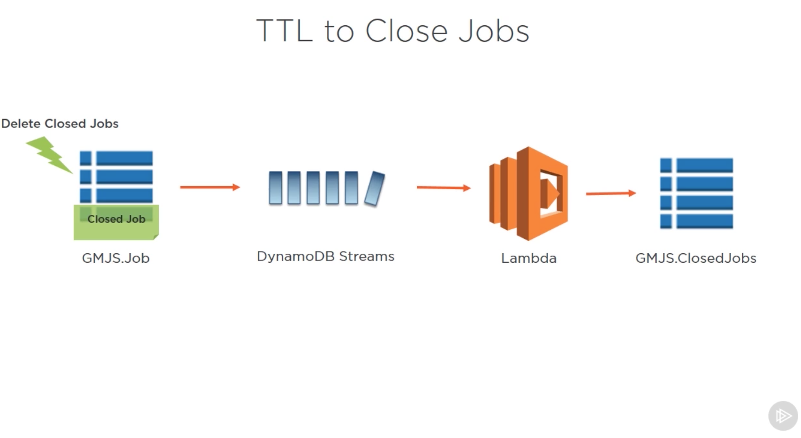

1. TTL is going to watch for expiration date
2. TTL will remove the item when it expires (doesn't consume any capacity)
3. When the item is removed a Dynamodb stream event will appear (event name will be removed)
4. This will then picked up by the Lambda function 
5. Lambda function will perform a put operation on a closed job table to create a item (moving the job to the closed jobs table)

**Note:** This approach will solve the problem with consuming a lot of RCUs and 10GB issue per partition key. It helps to clean up tables in order to increase the performance and to save consts, since we don't need to query so many items.

### Capabilities in DynamoDb - Auto-Scaling

DynamoDb provides a model where you need to think about RCU/WCU upfront. This can be difficult at the best of times. And this is the problem DynamoDb tries to solve with auto-scaling. 

* Helps automate capacity management for DynamoDb
* It works for RCU/WCU for:
    + Tables
    + Global Secondary Indexes
* By default Auto-Scaling will be turned on. 
* When turning on Auto-Scaling you need to define following options:
    + For each RCU/WCU you need to specify the percent autolization when the scaling will trigger. 
    + Min & Max. RCU/WCU boundaries and maximum capacity to provision
* Auto-Scaling is not immediate. Your application will still be throttled if there is a burst of usage. May take up to 10-15 minutes to trigger.
* Auto-Scaling doesn't really help with sudden burst. 
* Auto-Scaling solves sustained increase in usage. 

### Capabilities in DynamoDb - DAX

* DAX, also knows as DynaoDb accelerator is a fully managed in-memory cache
* It's designed to reduce response time from ms to microseconds
* It sits between your application and DynamoDb as a write-through-cache (means app talks directly to DAX and DAX will relay writes and reads which aren't cached through to DynamoDb  and cache result on the way back. )
* DAX strives for complete compactability with DynamoDb, which means there should be minimal code changes required to use the DAX API.
* As a benefit it will reduce the RCU/WCUs on DynamoDb by leveraging DAX

**Note:** Before using, it is worth understanding the changes in the consistency model for your application. [Read more here](https://docs.aws.amazon.com/amazondynamodb/latest/developerguide/DAX.consistency.html)

## Avoiding Common Pitfalls

If you need a checklist for your next use case, you can use this chapter. This is a compilation of authors own checklist.

### Data Modeling

The most important by far undertake before using DynamoDb. If the things listed below are important for your project,you can use DynamoDb.

* Keep in mind DynamoDb is a key-value store
    + With document database capabilities
    + It's not designed for complex queries or very bursty loads
    + It's designed for predictable access patterns
    + Single digit millisecond latency
    + Scales with your needs

[DynamoDb Design Patterns](https://www.youtube.com/watch?v=PDQ3jbDyTQ4&feature=youtu.be)

A large part of data modeling is understanding your data, so some questions to ask are: What are your access pattern to be like?

**Basic Data Modeling**
* Is it a predictable load? If yes is great, you can scale at fixed schedules. If not how often does it change and how will you handle throttling? Can we isolate unpredictable loads into own table?

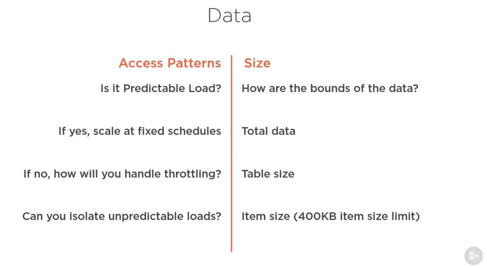

**Querying**
* What are your most run queries?
* Can you execute them without Scan operations? Leverage as much as possible sort keys
* Can the application handle eventually consistent queries? Forcing consistent queries can be terribly inefficient.
* What for adhoc queries do you expect. Can you isolate adhoc queries to non-production tables or perhaps just scale up when required 

**Writing Data**
* Keep in mind WCU is more expensive than RCU
    + 1 RCU gives you 4kb per second
    + 1 WCU gives you 1kb per second
    + Pricing: 1 WCU is around 5 times more expensive than 1 RCU
* Is the data static or volatile? Is the subset of the data modified
* Isolate volatile data to separate tables or use  UpdateItem API. Save WCUs by updating only changed data. You can use separate table or leverage the UpdateItem API that does partial data update
* Each operation is atomic. Do you need transactions? There is no cross-operation transaction available. Batch requests are also non-atomic, but each operation within the Batch is atomic. 

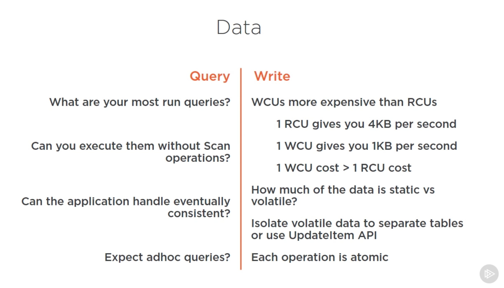

* Data Modeling is simply trying to predict real usage. The next best thing to do is monitor your real usage. Leverage Cloudwatch which provides metrics and alarms. 
* Avoid situations when you need to change RCU/WCU regularly it's a sign that your data model is not correct. 

**Note:** Accept that your first data model is a guess and can be wrong. Don't be afraid and remodel your data after it's live in production by adding Local Secondary Indexes and changing the key schemas. This is absolutely normal that a team realises that a selected a key schema isn't a good fit. Or they recognised a need for a Local Secondary Index. **Leveraging DynamoDb Streams and Lambda to remodel data as needed.** To remodel your data is a nice way to leverage DynamoDb triggers.

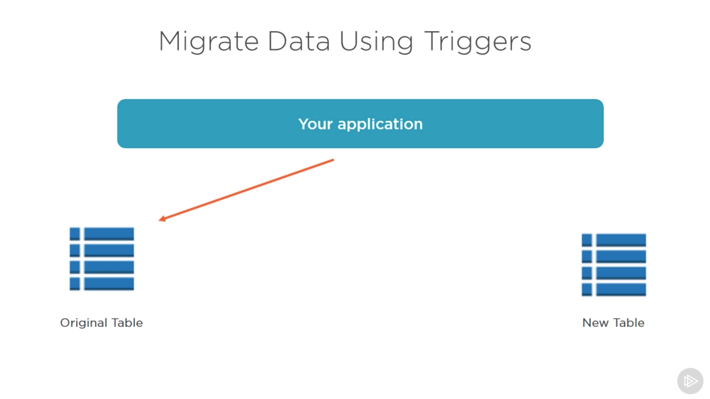

Your application points to the Original Table. If you need to remodel it you need first create a New Table. Then you need to enable DynamoDb streams and associated to a Lambda function. Cycle through each item in the table and update each item with a migration flag, which sends it to the DynamoDb Stream. Using the `UpdateItem` API ensures you that you don't lose any items while you are updating the items. An event appears in DynamoDb Stream this is picked up by the Lambda, it trims of the migration flag and pushes it into the New Table structure. As times goes on the New Table will be a replica of your Original Table, so all you need to do is to repoint your application to the New Table. 

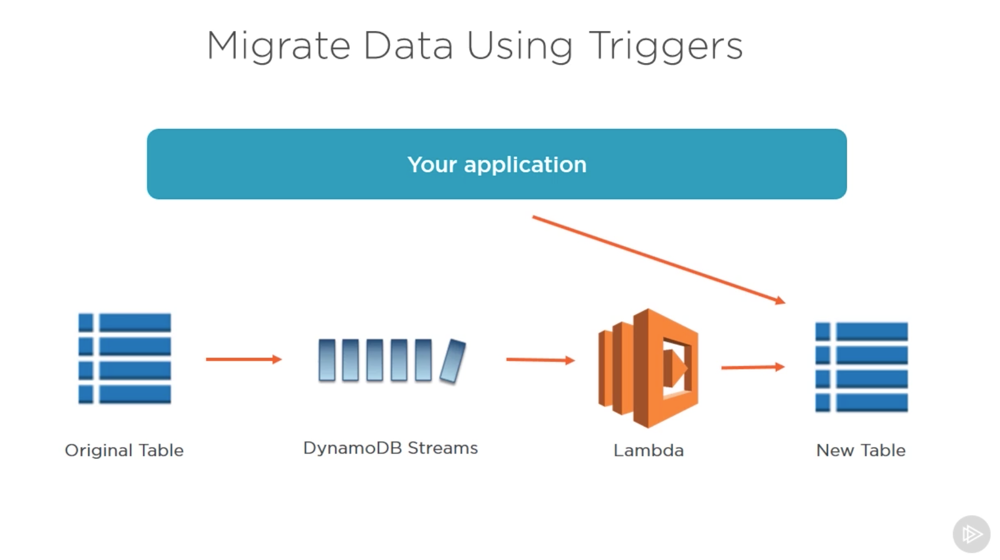

### Pricing

The pricing depends on the factors described below. Each factor can play a significant role for pricing.

* Provision Capacity: If you are writing to DynamoDb make sure your WCUs are optimized. For example if you updating a large JSON document which is static, consider separate it into another attribute using the `UpdateItem` or separate the table so you don't need to waste WCUs. 

* Index Data Storage: You are charged for the amount of data you store in DynamoDb. It's worth considering if you have large documents or files stored in your data or have no archiving plans for your data and simply grows over time. There are couple of solutions leverages S3 and DynamoDb to save on the storage costs. 

* Data Transfer: You will be charged for the data transfered in and out of the service. This is typically a non-issue if you transfering the data within a region for example if your backend is hosted in AWS. It's worth keeping in mind for scenarios where you use cross-region replication of the tables.

* DynamoDb Streams: There is no charge for enabling DynamoDb streams or the data store within, but you can be charged for a number of read request send to DynamoDb Streams. 

* DynamoDb Triggers: Lambda charges on the number of requests and the duration. You will not be charged for the number of times the Lambda reads the stream. 

**Note:** You can only increase/decrease RCU/WCUs 4 times a day. Partition data key limit is 10GB. The maximal item size is 400kb

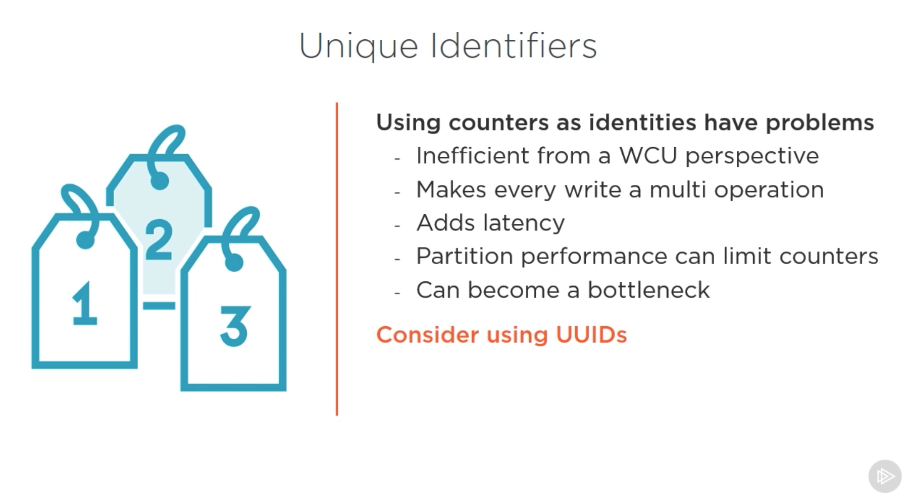


