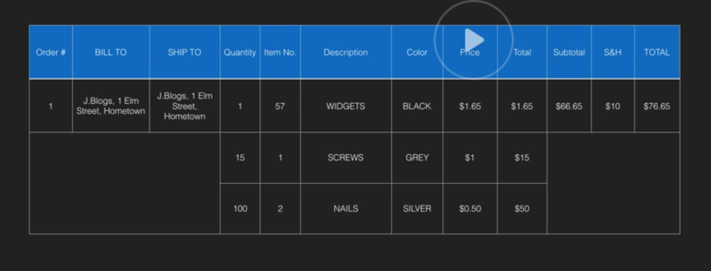
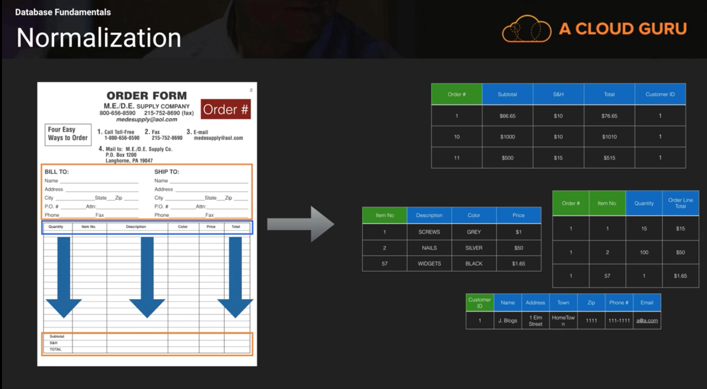
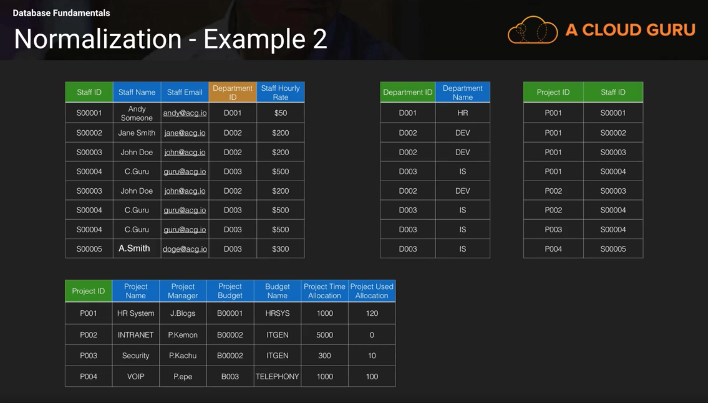
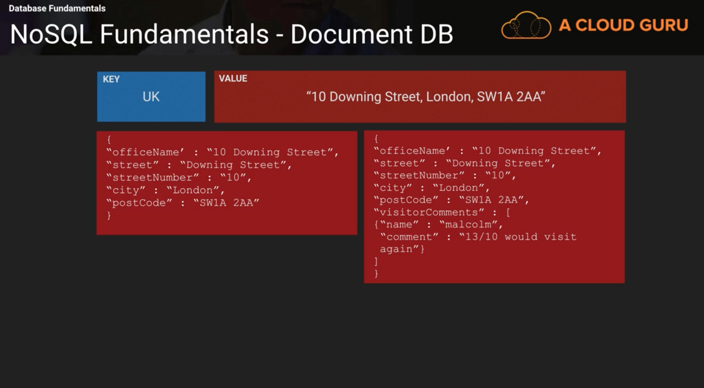
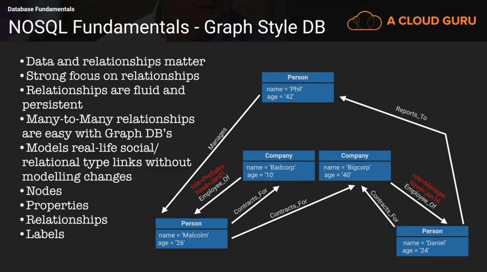
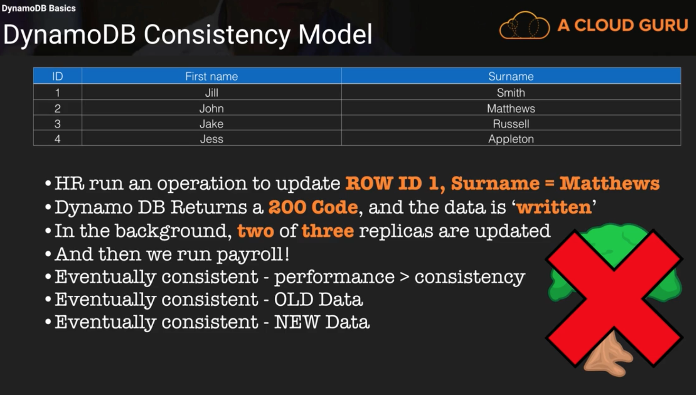
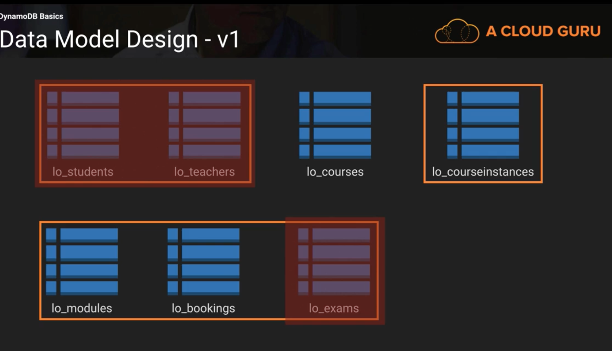
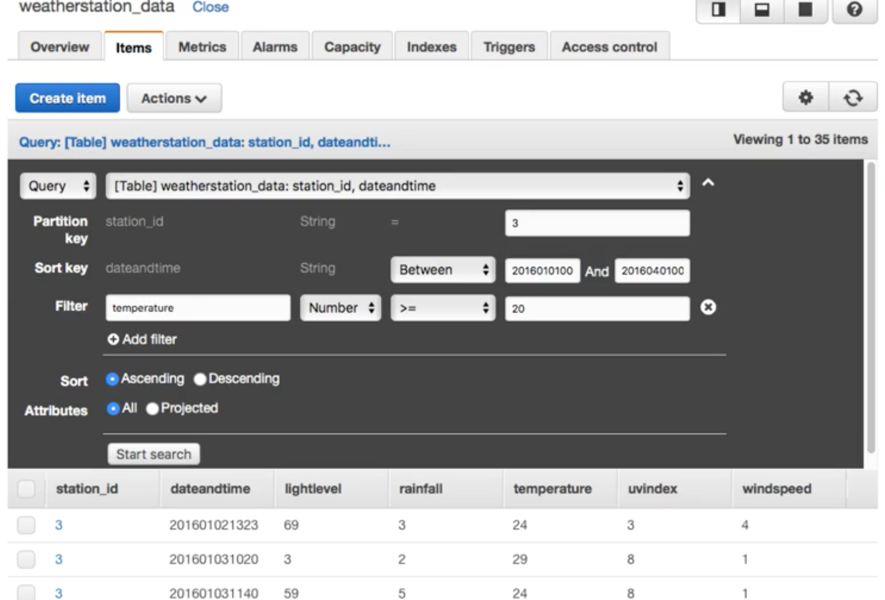

# Amazon DynamoDB - From Beginner to Pro

[Source](https://acloud.guru/course/aws-dynamodb/dashboard)

## Database Fundamentals

### What is a relational database?

At a very basic level it's a collection of components:
* We have a physical or virtual server (it has memory and locally attached network storage)
* Installed on a server there is an operating system (Linux, Windows etc.)
* Installed on that OS is a relational database system (Oracle, MySQL, MS SQL)
* Access to the database server is obtained via client application (e.g. MS Sequal Management Studio)
* The client is utilizing a library such as ODBC or API in some cases it provides an abstraction
* The special access to the databse you have with a special designed Language (SQL - Structured Query Language)
* Queries can be executed within the client or application code using SQL

### Relational Database - Tables

* Tables:  collection of collumns and rows
* Tables (if designed well) contain related and well-structured data
* Rows are the "records" (in DynamoDb they are called items) within a table, each "thing" has a row
* Columns are the "fields" - they store information for each record (called attributes in DynamoDb)

**Note:** In this example the "field" is part of the salary column 65.000

A core concept of relational database is the structure of the data in the table, the column names, restrictions on data and keys are defined when you create the table. And this is called a schema. = **SCHEMA**

### Relational Database - Keys

Keys are columns which have been designated special within a table. There are different types of keys:

* PRIMARY_KEYS, CANDIDATE_KEYS, FOREIGN_KEYS

* **Candidate Keys** - any column which can uniquely identify a row. In the example above Employee ID and National ID are the candidate keys. For a candiate key to be a candiate key a single value of that key needs to be used to substitute one and only one row. If I would provide national id number it would match zero or one row, not more than one, as the value for the raw in a given column has to be unique. 

* **Primary Keys** - ONE candidate key, selected to provide unique identification of every row in the table. In this case the options would be employee id or national id number. If you don't have a single column which uniquly identifies a single row you can choose two columns to be a composite key where both values together unique identify a row.

* **Foreign Key** - Uniquely identifies a row (primary key value) in another table. In the example above the Department column is a foreign key which maps another table where the primary key is department and is unique in that table. In the department table the database can store additional information such as address, phone number or amount of stuff. The foreign key doesn't need to be unique in the table that's in e.g. we could have 2 HR's or 100 IT's in the employee table. But in the department table there can be only 1 HR, 1 IT.  

### Sequal Database Overview

* Accepts, Runs and returns data from a SQL query
    1. SQL query is broken into logical blocks (Query Parser)
    2. SQL tree is built (logical tasks to be completed) (Query optimizer - selects the fastest)
    3. Builds an execution plan
    4. Executes that plan (Relational Engine - passes request to the storage engine)
    5. Requests data 
    6. Processes return data and returns a query result
* Read, Write and Cache Data
* Organize operations for efficiency

Managing of a RDBs is not always about throwing resources at the problem. How do RDBs scale? Scaling in the relational database world was always a challenge. There are couple of solutions to that problem

#### 1. Horizontal Scaling

You start with the database server it may have single quad-core CPU and some memory. You reach capacity and someone decided to grow the server by by throwing extra CPU or memory at the issue, but soon you are going to reach a hardware sealing. You can use AWS or any other cloud environments to to scaling, but even there there is a limit, beyond 32 core's 200GB of memory you'll struggle to find support in a mainstream cloud provider for larger instance service. 

You can also add a new server that is called (slave) that will provide you only 2x time higher reads, you can also get another slave and another slave, you only limitation that at some stage writes are going to be limited factor. And adding additional read slaves (replicate) is not going to resolve your performance issues.

#### 2. Database Sharding

Database segmentation, we could set up e.g. two database servers (db1, db2), but it could be 100s or 1000s of database servers depending on the data scale. We could then decide to home a particular table on a given database server, this has the advantage of simple administer but cross-table queries will carry out substantial performance penalties. 

Another option is through DB support row level partitioning, this is where we can define a logic which home row sets to certain service. We can home an even number rows to Db1 and other rows to another Db2. This logic can be based on row numbers, ranges and values in those rows or hash of certain fields. The advantage that we achieve is near-linear performance growth within a database servers. As we grow we split the rows over many different database servers and we can scale the performance across these servers assuming that the rows are access evenly. Also here is a performance penalty if you do queries across different tables. 

### Data Normalization

> Normalizaiton is a process which prepares data to be stored in a database. It helps establish tables and relationships between tables. it eliminates redundancy (Überflüssigkeit) and inconsistent dependancy. 

* Prepares data to be stored in a database (usually data is stored chaotically e.g. on drives)
* Helps establish tables and relationship between those tables
* Eliminates redundancy
* Eliminates inconsistent dependancy

Data normalization takes you for data chaos and it helps you to restructure that data so that it can be stored in a relational database system. The process transists through a number of states or forms. These are knows as: 1NF, 2NF, 3NF (NF = normal forms)

### Normalization Examples

The physical data is usually stored in a paper form. 

In the above example we have 1 row more than 1 quantity, item no., description, color, price, total. And this isn't going to work, so we need to use Normalization. And we start moving the data into 1NF.

#### 1NF - 1st Normal Form

What is 1NF? For data to be in 1NF it has to satisfy a number of criteria

* RULE 1: We have a primary key - each row can be identified uniquely. 
* RULE 2: No duplicate rows - no duplicate primary key values
* RULE 3: No attributes which contain more than one item of information 

Let's start representing the data in it's true form by flattening it.

**Step 1: The original form:** the primary key holds several rows which is againt the rules

**Step 2: Data flattening:** now it's clear that the order number doesn't uniquely identify a row

**Step 3: Composite Key:** there are two columns that identify the row uniquely (order # and item #)

**Step 4: Rule #3:** Ship to and Bill to are not atomic data types, they are actually a list of items, the street address, the town and the zip code. It's always best practice to split those out. 

Now we have a data structure which is in first normal form (1NF). It means:

* There are no duplicate rows
* Each row is identifible by the table by the primary key (here the composite)
* Each attribute contains a single atomic value (attributes are also called: columns, fields)

But there are some attributes with a `??` question marks in. In the next stage of normalization we need to pay special attention to this. They don't really fit in into the structure they actually represent the greater order.

#### 2NF - 2nd Normal Form

In order that data is in a 2NF two things needs to be true:

* RULE #1: The data should be already in 1NF (don't skip steps)
* RULE #2: Any attributes in a row needs to be on all primary key values (not just one). Any data needs to be dependent entirely on all primary keys in a row (not partly)

* **Quantity attribute:** depends on oder # and item no therefore - 2NF compliant
* **Desc, color, price:** they are directly linked to item and not item on this order so they have partial key dependancy - they aren't 2NF compliant
* **Order Line Total:** is just for a particular order for that item - 2NF compliant
* **Rest of the table:** The remaining items are entirely dependant on the order number, they are global values from order not specific one item on an order. So they have no place for the 2NF table as the other data.

So in order to make the data complient with the 2NF we need to split the table in multiple tables.

#### 3NF - 3rd Normal Form

For data to be in 3rd normal form there is ony 1 rule:

* RULE #1: No dependencies on non-key attributes. If there are any non-key attributes, depend on another non-key attribute then they shouldn't be in the table. So if any of these values don't depend on the order number, why the are in this table?

To fix this we need to migrate all non-key attributes in a table. There are few ways to do that, the 1st is to follow Normal form exactly and create own tables for billing and shipping

Here is the final result of normalization

### Why Normalization of Data?

Normalization is the process that was created decades ago when storage and compute was much more expensive than it is now. 

* COST  - no data duplicates = less = cheaper storage
* SPEED -  less data = faster processing of that data
* INTEGRITY - no data duplicates = integrity = less consistency errors
* FASTER MANIPULATION - update data once, and have it **cascade to all related records**

Normalization achieve significant operational performance

**Note:** Achieving 2nd normal form means separating any data which is not entirely dependent on all primary keys. As e.g. a table has only 1 primary key  and it's already in the first normal form it's automatically in second normal form. 1NF tables with a primary key are always in a second normal form 2NF

#### Normalization Example #2

### NoSQL Fundamentals - Introduction

In relational databaseses there are many vendors, but they features are relatively minor in difference due to a standard in relational databases. In NoSQL there isn't ONE single NoSQL 'architecture/view' of the world from a data modeling prespective. 

The main NoSQL approach can be split into two main groups:

* Those that are aggregate oriented: these products deal with block of data in groups that's an aggregate. This aggregate might be simple like a key vaue pair or large JSON document. 
* Those that aren't

#### Main differences RDBs vs. NoSQL

* A schema defines the structure of the tables, togethert with the data types and any restrictions. If we want to add a column/attribute to a 1 row, we need to adjust our schema and add this 1 row to every field/row. In schema-less (NoSQL) the attributes/columns can be different from row to row (items). Every row can have different fields (no enforced schema). The schema-less approach does bring highly avilability 24/7.
* No relationships or ones which are handled VERY differently. It's a key point to understand and the application needs to be developed to handle this. 
* No need for normalization
* No SQL
* DB model to fit your needs - not one size fits all
* Consistency Model - ACID vs. BASE
    + ACID (relational database - doesn't allow to scale horizontally): Is a set of properties and how the engine processes those. In computer science, ACID (Atomicity, Consistency, Isolation, Durability) is a set of properties of database transactions intended to guarantee validity even in the event of errors, power failures, etc. Atomicity is the process that describes how a relational database considers each transaction atomic. You won't be in a situation where you have a partial completion of a transaction. 
    + BASE (used by key-value, document databases - does allow to scale horizontally): The relational databases strongly follow the ACID (Atomicity, Consistency, Isolation, and Durability) properties while the NoSQL databases follow BASE (Basically Available, Soft State, Eventual consistency) principles. 
* Horizontal Scalability: Relational databases cannot scale well because they prefer consistency over performance, while BASE consistency model does scale horizontally very well.

### NoSQL Fundamentals Key - Value

* Store data as KEY and VALUE pairs
* The Key is unique (is the only value on which data retrieval operations can function on, except those that do full data scan, they are very inefficient)
* The VALUE contains the data 
* The VALUE is generally schema-less during the whole lifecycle of the data
* VALUE can contain attributes (they don't  need to be the same for every item/row)
* Attributes can be simple such as strings, numbers, booleans, lists, arrays, sets, nested structures
* Some databases are just limited to key values, others can group key value pairs into perceived tables (where the contents of the value block becomes the attributes for the key)
* Key values are limited where the search can only occur on a key, indexes can be used in some cases allowing location of items based on attributes but these carry costs!
* The data has no implicit, explicit relationships

**Note:** This ability to store attributes in a value component isn't standard and it blures the lines between key-value and document database types. The pure key value store, the value is a blob of data and the database can't perform any meaningful operations or any filtering on it. 

### NoSQL Fundamentals - Document Database

In the key value database we have a key and value that is a blog of data and is opaque. You can only retrieve the data by using the primary key or the composite key. So the data within a value is a basic atomic blob of data. But there is a difference in a Document Databases. The value in a document db is known as document and it stores a structured document encoding such as XML, JSON or BSON (binary version of JSON). In the document database the value will be encoded as a document and within that document there could be additional rich data 

Note: This rich structure is what separates document db stores from key value stores. In the example above you can see the rich structure that is also called a document.

* You work with document objects
* Your data model is document
* Document is the aggregate - scaling is based on documents it splits the documents across it's partitions on nodes
* **Remember:** Processing over document boundaries is going to be very inefficient (not for social networks, or locational aware applications with massive social components)
* Able to search and interact with the structure (unline with other key-value stores)
* Able to reference other documents (attachments... - basic system of relationship)

Some document databases: CouchDB, MongoDB, DynamoDB

### NoSQL Fundamentals - Column Family 

* Data Grouped and stored around columns, not rows
* Faster more efficient data access
* Improved compression as the value stored in columns are the same type
* Better parallel processing (columns can be partioned either individually or in groups - they can run on several nodes)

### NoSQL Fundamentals - Graph Style DB

* Data and relationships matter (a good fit for Graph Style Db)
* Strong focus on relationships
* Relationships are fluid and persistent (in a relational db world the relationships are derived from primary and foreign keys and these are calculated at query time via processing sequal engine - CPU and memory intensive)
* Many-to-Many relationships are easy with Graph Db (in relational database are only possible via using linking tables or lookup tables)
* Models real-life social/relationship type links without modeling changes

Graph Db have following core concepts:
* Nodes: 
    + are things or nouns (a word (other than a pronoun) used to identify any of a class of people, places, or things)
    + have a type
* Properties
    + key value pairs to represent meta data of objects
* Relationships
    + between nodes (person a works at place b -> they have a start and endnode)
* Labels
    + allows to group objects together

Graph Db don't have a concept of SQL, but many have a comparable language specifically suited to working with a Graph Db. One example is cypher (Neo4J Query Language) which comes with Neo4J (GraphDB)

## JSON 101

* JSON stands for "JavaScript Object Notation" - and it is a way to represent structured data for interchange between applications. 
* Often used within Web services, specifically those which use the REST API - why? It's lightweight. 
* Common format for data input/output for AWS commands.
* JSON is constructed of Name / Value pairs
* A value can be a simple type String, Number, Bool or an array 'list of things' or a JSON structure (object is knows as a JSON schema)
* A JSON string contains either an array of values or an object
* A JSON document is another name for a JSON string or schema, and complicated information can be conveyed via nested objects. Objects can contain objects & arrays, arrays can contain other arrays and/or objects (nested schemas)

## Working with DynamoDb

Basic security rules
* Activate MFA on the root account
* Create an individ IAM user (with specific rights - don't give admin rights 9k$)
* Activate MFA for this user
* Give this user access to billing information under my account > IAM User and Role Access to Billing Information

### DynamoDb Introduction

* A fully managed, NoSQL Datatabse
* Predictable and fully managed system
* No visible servers
* No practical storage limitations
* Fully resilient
* Performance scales in a constistent, logical, linear way
* Full integrated with AWS IAM - rich security model
* NoSQL database engine
* Shares characteristics with key/value and document store Db's
* DynamoDb is a collection of Tables in each region (resilience - Elastizität)
* Tables are the highest level structure
* Performance is controlled and managed on a table level
* DynamoDb uses performance directive that you as admin provide
* Unline SQL database, the Schema is not fixed at table level (only table keys)

### DynamoDb Consistency Models

* SSD Storage
* Consistent, reliable low latency reads and writes

In the backend every piece of data managed by the platform, DynamoDb replicates this data to 3 geographically separate locations. This done in order to save the data in case of if 2 locations will go down. 

Let's look at the case when you want to update some data. 

1. You write your data to the table, when you do this via an API connection to the DynamoDb endpoint
2. You receive a reponse back indicating that your write was successful. 

But what happens in the background? As already mentioned DynamoDb needs to store this data 3 times in order to meet it's defined service level. It's possible that the 200 response (success) will be returned if only two of the replicas have written the data. In the background DynamoDb then ensures that the 3rd replica silently receives the update in the background and full consistency then achieved. It usually happens within a second even under substantial transactional load.

**Note:** In a relational database model the consistency is prioritised above performance. You need to understand that DynamoDb workd differently (hint: you can force consistency too if you need it). DynamoDb is by default eventually consistent and preferences performance over consistency. If we want to be consistent we can force DynamoDb to do that and it goes and checks all replicas and the replica with the recent version will return that data to the requester (strongly consistent read is expensive)

**Note:** DynamoDb allocates as free tier 25 RCUs/WCUs, so you won't be charged if you within that limits. That you can use every of the month for the first 12 month of any new account. You won't be charged as long you don't go over 25 RCUs/WCUs. 

**Some AWS CLI commands:**

`aws dynamodb --region us-east-1 describe-table --table-name weatherstation_data --profile cloudguru` - shows table attributes
`aws dynamodb list-tables --profile cloudguru` - lists all tables
`aws dynamodb --region us-east-1 delete-table --table-name weatherstation_data --profile cloudguru` deleting a table

You can either use --profile --region etc. or specify in a file json to perform the configuration. But first you can generate a sceleton by using this command

`aws dynamodb create-table --generate-cli-skeleton --profile cloudguru`- it's going to generate a skeleton (json) that is needed to run this command. Now we can take take that json, edit to my requirements and use the json input command. 

If you want to specify a json to act as configuration you can use following command line:

`aws dynamodb create-table --cli-input-json {...}`

## Controlling Table Performance (Capacity)

Capacity is also knows as provisioned capacity and it provides directives to DynamoDb. 
* Defined a per table basis
* Separate READ and WRITE controls
* Changeble at ANY TIME - ASYNC operation (max. 4 times per day)
* Be deliberate and cautious when changing - it does things
* Be especially cautious of more than 3000 RCUs and 1000 WCUs (need special consideration)
* Try and limit use to long term requirements (don't use them for minute to minut changes - if you need change them 3-4 times per year there could be something wrong with your model)
* Four decreases per table per calender day
* Increate performance as often as you like on a per table basis

**Note:** Once you know the number of RCUs/WCUs that you need for one query you can multiple this by the number of each type of query you expect on that table in a second and that's your performance or in other AWS language capacity allocation for that table. At the high level you take the size of your reads/writes your application uses you divide by 1kb for writes or 4kb for reads and this gives you the raw units required for the operation. You then round that number up to the next highest full number and that will give you the RCU/WCU for that operation. 

You can update tables in 3 ways:

* Tab Table Preferences
* AWS CLI - UpdateTable
* API - UpdateTable

#### How to calculate the size of the items?

* The attribute VALUES of an item - encoded size
* The attribute Names of the item - encoded size
* Which attributes an item has

Knowing all of these items will allow you calculate a minimum/maximus size. It's critical to set up appropriate read and write capacity!

**Note:** If you want aggressivly optimize for performance, picking short attribute names can make a big difference. You can also use this [helper tool](https://github.com/tarasowski/serverless/blob/master/examples/dynamo_db_pluralsight/lib/helpers.js) to calculate the size of your data

## Data Model Design - v1

The first step is to understand the data you have to manage. The principles from the normalization part apply even to NoSQL too. You can start yourself by asking some questions. Understanding your data should be a common theme across all systems you design and manage. 

1. What data groups exist in the system.. how large they are?
    + For this example there will be students and teachers (see subjects and attributes from this [book](https://www.amazon.com/Database-Design-Mere-Mortals-Hands/dp/0201752840))
2. When the data will be accessed? 
    + Will be it linear over a day, week or month (databases preference unifor accesses from a time perspective)
    + If you have pick periods you need to use caching or other methods to mitigate the burstiness (be aware)
3. What access patterns will the data have?
    + Consider a stundent signup what tables and which data needs to be accessed when a signup occurs
4. How will the data grow over time? 
    + For each groups from point 1 (subjects) identify how the data will grow
5. Will all data in the time series have equal access?
    + Hot/cold data and ho it should be distributed
    + Will all the data accessed or only part of it?
    + Data with different access demands (such as old data for historical reporting) needs to be handled in a very specific way if the volumes are high enough
6. What operations will be run against the data?
    + Understand end to end query layout of the system in advance. This starts with business processes that need what data. 
    + Formally plan the flow of data and the modification of data before you write a single line of code or create a database table. 
7. What are the batch processing needs?
    + Look if the system needs any batch processing. Will data be loaded up in bulk for certain times for certain data groups, how intensive, how long will the process take etc.
8. Does the system have any real-time requirements?
    + Any events that occur in real-time, events that require immediate action. Conceptulize and plan it in advance. 

### Data Model - v1 Example - Learning Online

* Online Educational Provider - 80 Countries, 20,000 staff, 100 million students
* 25,000 courses available
* 100,000 Exams daily - Real, Mock, Classroom
* System manages students, teachers, exams, attendance, courses, facilities bookings and more...

Many times building a system just around a logical groupings is enough, performance requirements are low enough that you don't need to tweak it from a performance perspective. Adjustments maybe required from time to time. And that is something will evolve during this course. 

* One of the base and most obvious structure will have - STUDENTS (will form the core of learning online) with over 100mln of them the largest grouping of our system. For students will be storing a couple of data:
    + name
    + dob
    + sex
    + address
    + gov Id #
    + ID scan

The first decision we need to make when modeling data is how we group the data together? It's logical to group the data together on usage and type. That's why initally we are going to store all the data of the students in a table. 

* We have also teachers and the information will be almost identical with that from the students. 
    + name
    + dob
    + sex
    + address
    + gov Id #

**Note:** Teachers and Students are not in the same database table, there are couple of reasons for that such as query layout/requirements. But one of the main points is that the data from the teachers table will be less likely accessed as the data from the teachers table, by doing so we can do performance split across those two groups. With DynamoDb there are no penalty for having many smaller tables and it gives you certain advantages such as performance allocation, also indexes are defined on a per table basis. 

* We have another data type (group in our table) these are courses, will store 25,000 in total with details
    + name
    + desc
    + passmark
    + modules

* For each instance of a course running in a given year we need to store the course instance
    + year
    + capacity
    + students
    + modules

Note courses will be a reference table where you view the contents when you picking the course. Course instances might be used from a operational perspective by both students, teachers, and admins. It make sense the separate just in case we need to have different performance criterias or to have different indexes. 

* The system will also store booking for physical locations or online bookings
    + module
    + location
    + start date
    + end date
    + type
    + capacity

* We have a table for modules, modules is a descrete teaching unit for a specific language like algebra, basic english etc. 
    + desc
    + passmark
    + teacher

* We need to track the attendance of the students so we'll have an exams table. 
    + id
    + student
    + booking
    + ....

* And lastly we have another table for attendance, where a student tracks physically or logs in into the lesson
    + booking id
    + student id
    + ....

#### Picking the right keys

As the next step we need to pick the keys for each table. Interestingly in the example below the course author has picked a generated ID as a partition key, since we are working on a case of international school, there could be some overlaps between gov ID's from different countries. What if gov ID from US has an overlap from IDs from Angolia?

In the example course instances there is also a sort key. Since the staff wants to retrieve the instances of the courses based on course#year#instance. It can allows us to retrieve all course instances or limit it by a sort key. In this case since we are limited by partition and sort key, we can cancatinate the data togther and use it as generated key. Later we can use indexes but for now we can use this approach. 

**Note:** It's always best practice to tag tables for certain operations with a common starting block `lo_students`, `lo_teachers`, `lo_course`, `lo_modules` since in each region the tables competing for the names. 

One of the important points is the data growth over time. And we can assume that the following tables will be used often and will grow rapidly over time. Keep it mind as we move on

**Note:** Author is going to use counter table architecture. This should be avoided at any costs. 

## Working with Items (CRUD)

* **PutItem** command will either add an item into a table, or replaces an item entirely if one exists with the same keys. It can be configured not to overwrite existing items if you desire that behavior. But this command offers no way to update something either you put a new item or replace an item, if you want to update specific attributes use `UpdateItem`.

* **UpdateItem** command updates an existing item or adds a new item to the table if it doesn't exist. If you want to take an item that is currently exists and update that item, then you should use this command in one operation. Where if you use `PutItem` you need to read it from the table, analyse it, change or add existing attributes and than use `PutItem` to write that back to the table. Potentially it's half as efficient as `UpdateItem` command. Either adds or updates depending on the expression we use!

* **DeleteItem** can delete items and you only need to provide a key. If the table has a composite key you need to provide both keys. This is not optional! You don't have to check before you direct DynamoDb to delete it, but you need to understand that the `DelteItem` operation still consumes capacity. If you are running operations on items that are not in the database, DynamoDb will not error out it will just do the operation.

`--update-expression "SET windspeed=:windspead" --expression-attribute-values '{":windspead" : {"N": 100}}'` 

**Note:** In the command above we can set a variable for the update expression and colomn `:` before windspead makes it to a variable that we can assign later under expression attribute values.

* **GetItem** operation is the simpliest data retrieval operation. To use it you provide it with a value partition or composite key. If your table has both, you need to use both. It get's 1 item it returns all or a subset of attributes for that particular item. Otherwise it returns nothing, it doesn't error. It's default is eventually consistency. `GetItem` cannot be used against an index. 

* **Query** it offers significant enhancements over `GetItem`namely it allows as an input a partition key value or a partition key and composite key, or a *range of values*. Based on these values that the table is analysed either all or the subset of attributes will be returned for all the items that are matched. If no items get matched we still get a response but it's an empty one. The `Query` command can filter on non-key values, but the important thing to understand that any discarded values are still charged from a capacity point of view. Query can be used on local and global indexes. The key thing to understand about query is that you can specify a single partition key value and it can return all items that has a partition key which maybe many instances of items and many items with sort keys or you can a specify a single sort key to return a single item or a range of sort keys to return multiple items. **Important:** We can only use partition key for querying w/o sort key. You can also use `filter` to filter other attributes on an item. 

**Note:** use as a sort key date and time, so you can filter your partition keys based on the date that is specified as the sort key. Query operation gives the possiblity to do that. 

`aws dynamodb query --table-name weatherstation_data --key-condition-expression "station_id=:id" --filter-expression "temperature>:desiredtemp" --expression-attribute-values '{ ":id" : { "S": "1"},":desiredtemp" : {"N" : "25"}}' --profile loadmin --return-consumed-capacity TOTAL`

You can find more examples [here](https://github.com/ACloudGuru/DynamoDB-B2P/blob/master/04-retrieving-items/COMMANDS_USED.txt) or [here](https://media.acloud.guru/aws-dynamodb/resource/aaf58181-32d4-2a3f-1b84-b7da9a7175fa_3f8bf20f-2ef1-1f62-262f-d679a86934b1/aws-dynamodb-54cdac16-d108-4407-ac68-140434f240ae.txt?Expires=1524802430&Signature=Sr37GZnbN5XF+9Y0FgMKTip8BD46nxn6M8AhAEYnbej/rZAXre/s320R0DAqU9SAb3/SPzA+rpZo4iYBsmF50EJm+hGOfyWbI0fTkd5uIB0BctGoh0qB0+1E7vXUIihsjFASnZqoT8o3xy4kMm/EYfdPczsSpLDAJd38GXjC9oPCNKz8zUdacZQKh+0Cnafvzd6j6ZZ2tuM0AMMHvp2r24e2Rh5mHRw3u3TR1Bgv89HNoH3RiJEXuksA0np/Tau0NqGHBMt/8axPLLpaxL5CqBFW+smNYrMrqm8TGVjKbHGa98UhKHNOstgmQjjGQhlpi5Jxueh9tczmVu5A1/EzSQ==&Key-Pair-Id=APKAISLU6JPYU7SF6EUA)

**Note:** `Count` represents the number of items returned and `ScannedCount` represents a number of items read and those billed. Normally those are the same with `Query` and only differ when you use `filter`. Even when we filter the results down, we'll be charged for the `ScannedCount`. 

* **Scan** is the least ideal operation within DynamoDb. The input for this command is a table name. Unlike `GetItem` or `Query` you don't specify any of the keys. The command returns **all items and attributes** within a table. You can filter on any specific condition on an attribute, you are paying for the entire capacity, while you only receive a subset if you filter. If you want to imporove the performance while scanning huge tables, you can split them and run scan in parallel. But the power comes from filtering on non keys. So you can simply use scan to filter on attributes without creating additional indexes and other stuff. 

**Note:** If you are using scan assume that you have a problem. Try to avoid this command at any costs - only when you need to search on Non key / index attributes (only on occasional cases). Scans are expensive and shouldn't be used, you will always billed for full table scans.

