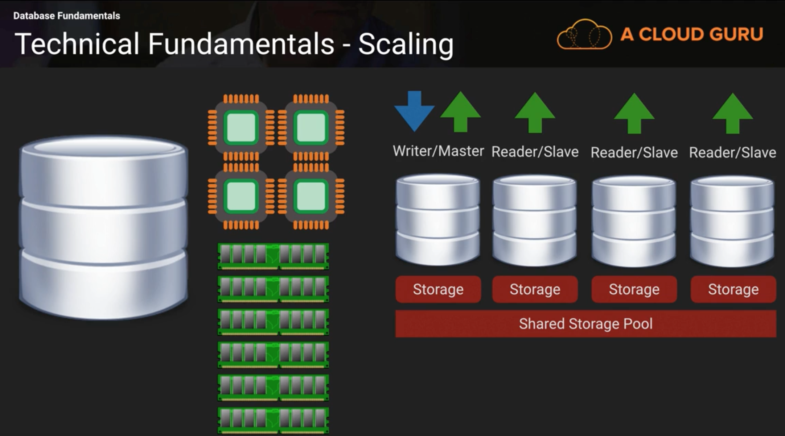
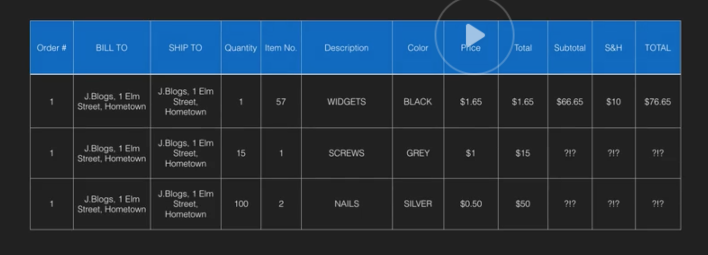
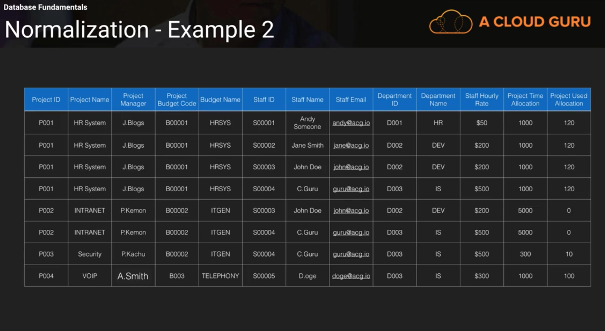

# Amazon DynamoDB - From Beginner to Pro

[Source](https://acloud.guru/course/aws-dynamodb/dashboard)

## Database Fundamentals

### What is a relational database?

At a very basic level it's a collection of components:
* We have a physical or virtual server (it has memory and locally attached network storage)
* Installed on a server there is an operating system (Linux, Windows etc.)
* Installed on that OS is a relational database system (Oracle, MySQL, MS SQL)
* Access to the database server is obtained via client application (e.g. MS Sequal Management Studio)
* The client is utilizing a library such as ODBC or API in some cases it provides an abstraction
* The special access to the databse you have with a special designed Language (SQL - Structured Query Language)
* Queries can be executed within the client or application code using SQL

### Relational Database - Tables

* Tables:  collection of collumns and rows
* Tables (if designed well) contain related and well-structured data
* Rows are the "records" (in DynamoDb they are called items) within a table, each "thing" has a row
* Columns are the "fields" - they store information for each record (called attributes in DynamoDb)

**Note:** In this example the "field" is part of the salary column 65.000

A core concept of relational database is the structure of the data in the table, the column names, restrictions on data and keys are defined when you create the table. And this is called a schema. = **SCHEMA**

### Relational Database - Keys

Keys are columns which have been designated special within a table. There are different types of keys:

* PRIMARY_KEYS, CANDIDATE_KEYS, FOREIGN_KEYS

* **Candidate Keys** - any column which can uniquely identify a row. In the example above Employee ID and National ID are the candidate keys. For a candiate key to be a candiate key a single value of that key needs to be used to substitute one and only one row. If I would provide national id number it would match zero or one row, not more than one, as the value for the raw in a given column has to be unique. 

* **Primary Keys** - ONE candidate key, selected to provide unique identification of every row in the table. In this case the options would be employee id or national id number. If you don't have a single column which uniquly identifies a single row you can choose two columns to be a composite key where both values together unique identify a row.

* **Foreign Key** - Uniquely identifies a row (primary key value) in another table. In the example above the Department column is a foreign key which maps another table where the primary key is department and is unique in that table. In the department table the database can store additional information such as address, phone number or amount of stuff. The foreign key doesn't need to be unique in the table that's in e.g. we could have 2 HR's or 100 IT's in the employee table. But in the department table there can be only 1 HR, 1 IT.  

### Sequal Database Overview

* Accepts, Runs and returns data from a SQL query
    1. SQL query is broken into logical blocks (Query Parser)
    2. SQL tree is built (logical tasks to be completed) (Query optimizer - selects the fastest)
    3. Builds an execution plan
    4. Executes that plan (Relational Engine - passes request to the storage engine)
    5. Requests data 
    6. Processes return data and returns a query result
* Read, Write and Cache Data
* Organize operations for efficiency

Managing of a RDBs is not always about throwing resources at the problem. How do RDBs scale? Scaling in the relational database world was always a challenge. There are couple of solutions to that problem

#### 1. Horizontal Scaling

You start with the database server it may have single quad-core CPU and some memory. You reach capacity and someone decided to grow the server by by throwing extra CPU or memory at the issue, but soon you are going to reach a hardware sealing. You can use AWS or any other cloud environments to to scaling, but even there there is a limit, beyond 32 core's 200GB of memory you'll struggle to find support in a mainstream cloud provider for larger instance service. 

You can also add a new server that is called (slave) that will provide you only 2x time higher reads, you can also get another slave and another slave, you only limitation that at some stage writes are going to be limited factor. And adding additional read slaves (replicate) is not going to resolve your performance issues.

#### 2. Database Sharding

Database segmentation, we could set up e.g. two database servers (db1, db2), but it could be 100s or 1000s of database servers depending on the data scale. We could then decide to home a particular table on a given database server, this has the advantage of simple administer but cross-table queries will carry out substantial performance penalties. 

Another option is through DB support row level partitioning, this is where we can define a logic which home row sets to certain service. We can home an even number rows to Db1 and other rows to another Db2. This logic can be based on row numbers, ranges and values in those rows or hash of certain fields. The advantage that we achieve is near-linear performance growth within a database servers. As we grow we split the rows over many different database servers and we can scale the performance across these servers assuming that the rows are access evenly. Also here is a performance penalty if you do queries across different tables. 

### Data Normalization

> Normalizaiton is a process which prepares data to be stored in a database. It helps establish tables and relationships between tables. it eliminates redundancy (Überflüssigkeit) and inconsistent dependancy. 

* Prepares data to be stored in a database (usually data is stored chaotically e.g. on drives)
* Helps establish tables and relationship between those tables
* Eliminates redundancy
* Eliminates inconsistent dependancy

Data normalization takes you for data chaos and it helps you to restructure that data so that it can be stored in a relational database system. The process transists through a number of states or forms. These are knows as: 1NF, 2NF, 3NF (NF = normal forms)

### Normalization Examples

The physical data is usually stored in a paper form. 

In the above example we have 1 row more than 1 quantity, item no., description, color, price, total. And this isn't going to work, so we need to use Normalization. And we start moving the data into 1NF.

#### 1NF - 1st Normal Form

What is 1NF? For data to be in 1NF it has to satisfy a number of criteria

* RULE 1: We have a primary key - each row can be identified uniquely. 
* RULE 2: No duplicate rows - no duplicate primary key values
* RULE 3: No attributes which contain more than one item of information 

Let's start representing the data in it's true form by flattening it.

**Step 1: The original form:** the primary key holds several rows which is againt the rules

**Step 2: Data flattening:** now it's clear that the order number doesn't uniquely identify a row

**Step 3: Composite Key:** there are two columns that identify the row uniquely (order # and item #)

**Step 4: Rule #3:** Ship to and Bill to are not atomic data types, they are actually a list of items, the street address, the town and the zip code. It's always best practice to split those out. 

Now we have a data structure which is in first normal form (1NF). It means:

* There are no duplicate rows
* Each row is identifible by the table by the primary key (here the composite)
* Each attribute contains a single atomic value (attributes are also called: columns, fields)

But there are some attributes with a `??` question marks in. In the next stage of normalization we need to pay special attention to this. They don't really fit in into the structure they actually represent the greater order.

#### 2NF - 2nd Normal Form

In order that data is in a 2NF two things needs to be true:

* RULE #1: The data should be already in 1NF (don't skip steps)
* RULE #2: Any attributes in a row needs to be on all primary key values (not just one). Any data needs to be dependent entirely on all primary keys in a row (not partly)

* **Quantity attribute:** depends on oder # and item no therefore - 2NF compliant
* **Desc, color, price:** they are directly linked to item and not item on this order so they have partial key dependancy - they aren't 2NF compliant
* **Order Line Total:** is just for a particular order for that item - 2NF compliant
* **Rest of the table:** The remaining items are entirely dependant on the order number, they are global values from order not specific one item on an order. So they have no place for the 2NF table as the other data.

So in order to make the data complient with the 2NF we need to split the table in multiple tables.

#### 3NF - 3rd Normal Form

For data to be in 3rd normal form there is ony 1 rule:

* RULE #1: No dependencies on non-key attributes. If there are any non-key attributes, depend on another non-key attribute then they shouldn't be in the table. So if any of these values don't depend on the order number, why the are in this table?

To fix this we need to migrate all non-key attributes in a table. There are few ways to do that, the 1st is to follow Normal form exactly and create own tables for billing and shipping

Here is the final result of normalization

### Why Normalization of Data?

Normalization is the process that was created decades ago when storage and compute was much more expensive than it is now. 

* COST  - no data duplicates = less = cheaper storage
* SPEED -  less data = faster processing of that data
* INTEGRITY - no data duplicates = integrity = less consistency errors
* FASTER MANIPULATION - update data once, and have it **cascade to all related records**

Normalization achieve significant operational performance

**Note:** Achieving 2nd normal form means separating any data which is not entirely dependent on all primary keys. As e.g. a table has only 1 primary key  and it's already in the first normal form it's automatically in second normal form. 1NF tables with a primary key are always in a second normal form 2NF

#### Normalization Example #2

