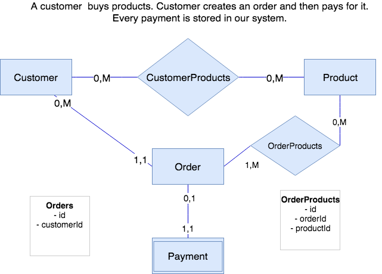
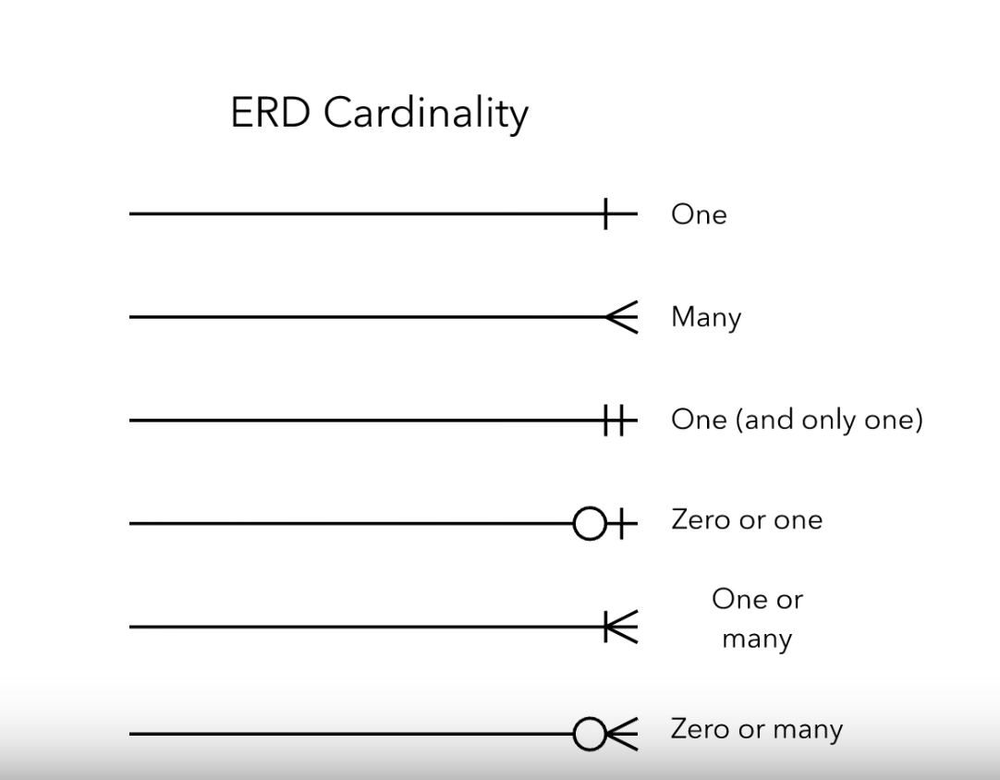

# Quick Summary of RDM Session w/ Alex

1. You should always start creating a database with a description of a system. 
2. Take a look at the description and highlights all nouns. The nouns can be divided into:
    + Tables: represent primary entities in the system: people, physical objects, events, transactions
    + Attributes: are properties associated with a primary entity. They will become columns
    + Examples: they help you to understand datatypes of certain attributes and they help you to understand relationship between different entities

3. Once your nouns are highlighted, identify the tables. Focus on core functionality of the system first (you don't have to model everything from the beginning)
4. When you have the tables figure out the relationships between the tables (verbs). This step might lead to new intermediate tables (aggregate/junction) tables.
    + What is the minimum amount of e.g. orders a customer can have?
    + What is the maximum amount of e.g. orders a customer can have? [Part 1](https://www.youtube.com/watch?v=QpdhBUYk7Kk), [Part 2](https://www.youtube.com/watch?v=-CuY5ADwn24)
5. Add the columns to the tables

**Note:** If you create a system for a university, you should talk about students. If you create a system for a company, start with employees.

**Note:** Creating a database model is an iterative process. Don't try to model everything at once. Start with the core entities of your system. You can add more details later. [Source](https://www.vertabelo.com/blog/technical-articles/how-to-create-a-database-model-from-scratch)

* If you are registering a customer, does this customer needs to have an address? No (we add 0). Does this customer can have multiple addresses, Yes (we add M) -> 0,M
* Does the address needs to have a customer? Yes. (we add 1) Can an address have multiple customers? (we add M) Yes -> 1,M

**Note:** If both entities have both X,M and X,M you can use as a pattern an aggregation table (bridge table). In the examples above it's `CustomerAddresses`. 

0 = is not required (minimum)
1 = is required
M = multiple (maximum)

---

---

---

**Note:** You design your relational data model in order to put constrains (limits) in terms of security, data type and business logic.

## What types of diagrams can we use to show data model?

- IDEF1x
- IDEF0
- ER diagrams (Entity Relationship (ER) Diagram)

### Entity Relationship Diagram 

It's a type of flowchart that illustrates how "entities" objects, people, or concepts relate to each other within a system. They are used to design and debug relational databases. There are several components and features of an ER diagram:

* Entity: A definable thing—such as a person, object, concept or event—that can have data stored about it. Think of entities as nouns. Examples: a customer, student, car or product. Typically shown as a rectangle. 

* Entity categories: Entities are categorized as strong, weak or associative. A strong entity can be defined solely by its own attributes, while a weak entity cannot. An associative entity associates entities (or elements) within an entity set. 

 

* Relationship: How entities act upon each other or are associated with each other. Think of relationships as verbs. For example, the named student might register for a course. The two entities would be the student and the course. Relationships are typically shown as diamonds or labels directly on the connecting lines.

¡[Rel 1](https://d2slcw3kip6qmk.cloudfront.net/marketing/pages/chart/seo/ERD/discovery/erd-symbols-09.svg)

* Attribute: A property or characteristic of an entity. Often shown as an oval or circle.

* Cardinality: Defines the numerical attributes of the relationship between two entities or entity sets. The three main cardinal relationships are one-to-one, one-to-many, and many-many. A one-to-one example would be one student associated with one mailing address. A one-to-many example (or many-to-one, depending on the relationship direction): One student registers for multiple courses, but all those courses have a single line back to that one student. Many-to-many example: Students as a group are associated with multiple faculty members, and faculty members in turn are associated with multiple students.

You can find here different ERD symbols and notations [Source](https://www.lucidchart.com/pages/er-diagrams)

You have weak and strong entities
strong entities = can exist by themselves without other stuff (customer and products table)
weak entities =  (order cannot exit without a customer, payments)
in NoSQL for document type the weak objects can be stored inside a strong objects

- Homework build your own database relations diagram for Claudia CRM
- Find patterns like 0,M and 0,M aggregation table
- marker nouns, marker verbs and draw a line if everything is all right, create the relationships
- there is another type of relationship like paid/free customer (do it as my homework)

Next session is on tuesday!
