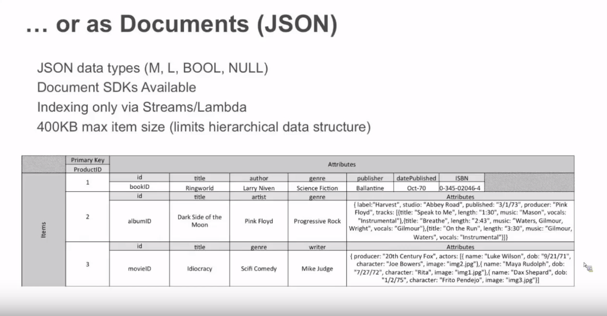
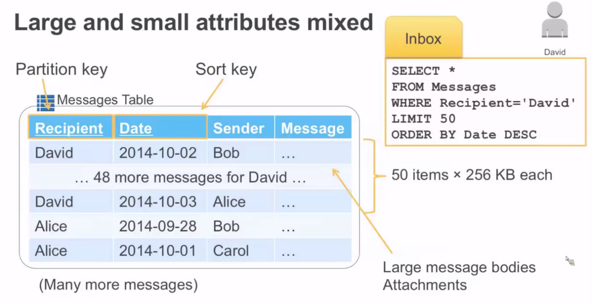
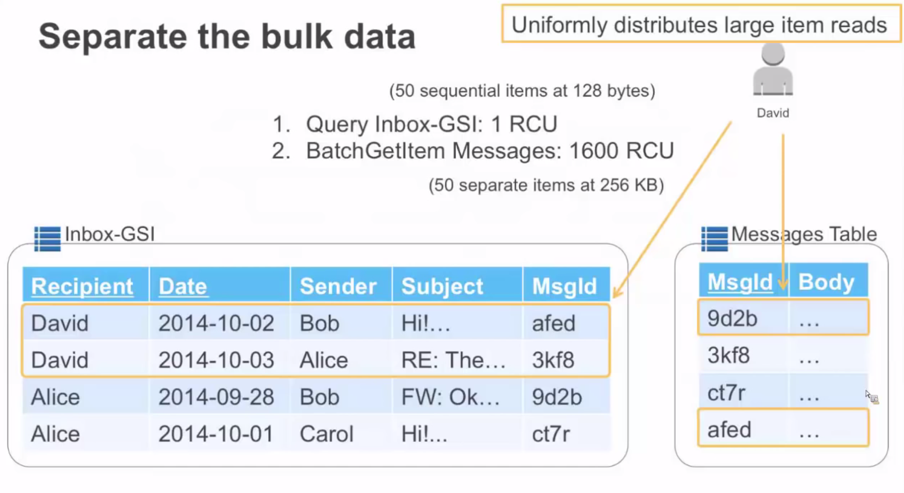
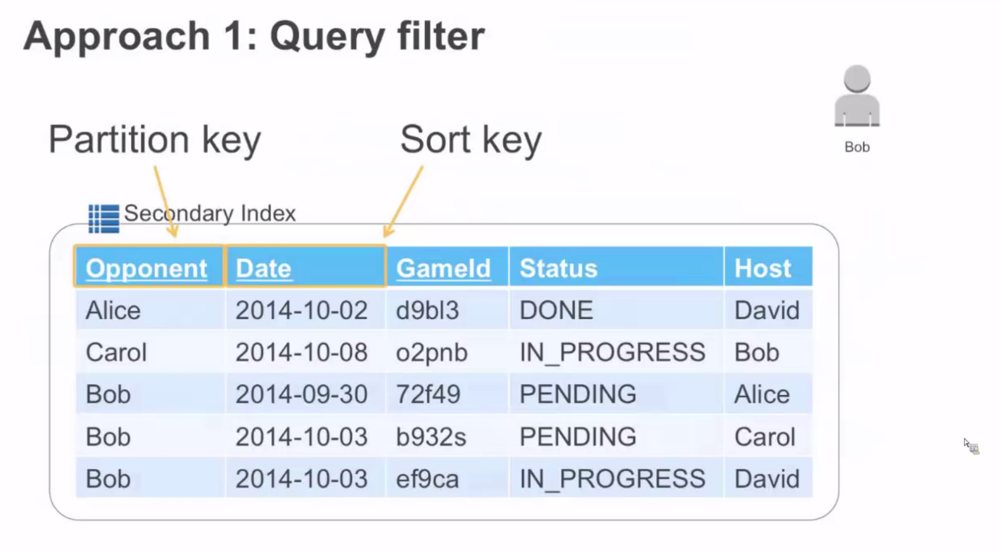
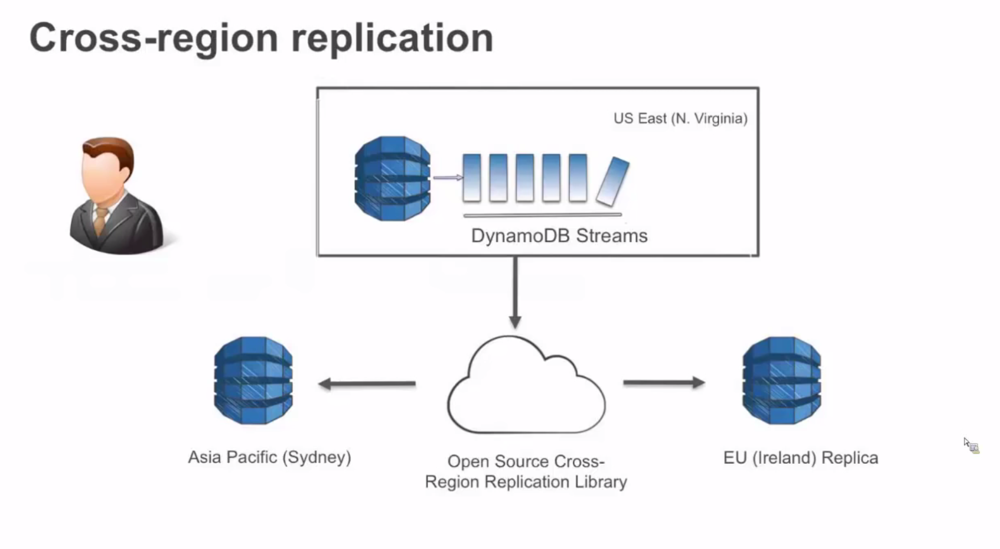

# NoSQL Design Patterns - Summary

[An Introduction to NoSQL Patterns](https://dzone.com/articles/introduction-nosql-patterns)

The all have some common characteristics
* Key value store
* Run on large number of commodity machines
* Data are replicated an partitioning among these machines
* They relax the data consistency requirements ([CAP theorem](http://www.julianbrowne.com/article/brewers-cap-theorem))

## API Model

* The underlayign data model can be considered as a large Hashtable (key/value store)
* The basic form of API access is:
    + get(key) - extract the value given a key
    + put(key) - create or update the value given it's key
    + delete(key) - remove the key and its associated value

## Machines Layout

The underlying infrastructure is composed of large number (hundreds of thousands) of cheap, commoditized, unreliable machines connected through a network. Each machine is a physical node (PN). Each PN has the same set of software configuration but may have varying hardware capacity in terms of CPU, memory and disk storage. Whitin each PN there will be a variable number of virual nodes (NV) running according to the available hardware capacity of the PN


## Data Distribution

The overall hashtable is distributed across many VNs, we need to way to map each key to the corresponding VN. In order to do so, we use partitions.

Data is distributed across many virual nodes. In order to be fault-tolerant virual nodes can be assigned in a random manner to physical nodes. Also we need to make sure that a physical node doesn't contain replicas of the same key ranges.

## Client Consistency

Once we have multiple copies of the same data, we need to worry about how to sync them such as that the client has a consistent view of data.

There is a number of client consistency models
* strict consistency: this provides the semantics as if there is only one copy of data. Any update is observed instaneously
* read your write consistency
* session consistency
* monotonic read consistency
* eventuall consistency: this provides the weakness form of guarantee. The client can see an inconsistent view as the update is in progress. 

# Data Model Design

[Data Model Design](https://docs.mongodb.com/manual/core/data-model-design/)

The key considiration for the structure of your documents is the decision to embed or to use references 

### Denormalized Data Models (Embedded Data Models)

* You can embed related data in a single structure or document. These schemas are generally known as "denormalization" models.


Embedded data models allows applications to store related pieces of information in the same database record. As a result, applications may need to issue fewer queries and updates to complete common operations.

Use embedded data models when:
* If you have "contains" relationships between entities. (one to one relationships with embedded documents)
* you have one-to-many relationsships between entities. In these relationships the many o child documents always appear with or are viewed in the context of the one or parent document

Embedded document provide better performance for read operations, also they make possible to update related data in a single atomic write operation. But it can also lead later to problems where documents grow after creation. Also you have to be aware of the limits of each single document in the database. In DynamoDb these are 400kb per item.

### Normalized Data Models

Normalized data models describe relationships using references between documents.


In general use normalized data models:
* When embedding would result in duplication of data but would not provide sufficient read performance advantages to outweight the implications of the duplication
* to represent more complex many to many relationships
* to model large hierarchical data sets

**References provides more flexibility than embedding. However, the client-side applications must issue follow-up queries to resolve the references. In order words normalized data models can require more round trip s to the server. 

Here is an example how it would work in relational database


Here is an example how you can do it as a document model

```js
{
    first_name: “Paul”,
    surname: “Miller”,
    city: “London”,
    location: [45.123,47.232],
    cars: [
       { model: “Bentley”,
        year: 1973,
        value: 100000, ….},
       { model: “Rolls Royce”,
        year: 1965,
        value: 330000, ….},
    ]
    }
``` 

Here is an another example relational database vs. document database


* An aggregated document can be accessed with a single call to the database, rather than having to JOIN multiple tables to respond to a query. 
* As documents are self-contained, distributing the database across multiple nodes (a process called sharding) becomes simpler and makes it possible to achieve massive horizontal scalability on commodity hardware. 

### Data Model Design and Patterns

[Data Model Examples and Patterns](https://docs.mongodb.com/manual/applications/data-models/)

#### Model One-to-Many Relationships with Document References

```js
{
   _id: "oreilly",
   name: "O'Reilly Media",
   founded: 1980,
   location: "CA"
}

{
   _id: 123456789,
   title: "MongoDB: The Definitive Guide",
   author: [ "Kristina Chodorow", "Mike Dirolf" ],
   published_date: ISODate("2010-09-24"),
   pages: 216,
   language: "English",
   publisher_id: "oreilly"
}

{
   _id: 234567890,
   title: "50 Tips and Tricks for MongoDB Developer",
   author: "Kristina Chodorow",
   published_date: ISODate("2011-05-06"),
   pages: 68,
   language: "English",
   publisher_id: "oreilly"
}
``` 

## General Notes on NoSQL Data Modeling

[Source](https://highlyscalable.wordpress.com/2012/03/01/nosql-data-modeling-techniques/)

NoSQL data modeling often starts from the application-specific queries as opposed to relational modeling:

* Relational modeling is typically driven by the structure of available data. The main design theme is  “What answers do I have?”

* NoSQL data modeling is typically driven by application-specific access patterns, i.e. the types of queries to be supported. The main design theme is “What questions do I have?”  

## The basic principles of NoSQL data modeling.

### Denormalization

Denormalization can be defined as the copying of the same data into multiple documents or tables in order to simplify query processing or to fit the user's data into a particular data model. Denormalization allow one to store data in a query-friendly structure to simplify query processing.

### Aggregates

* Key-value stores typically do not place constraints on values. It is also possible to vary a number of records for one business entity by using composite key. For example, a user account can be modeled as a set of entries with composite keys like `UserID_name`, `UserID_email`, `UserID_messages` and so on. 

* Document databases are inherently schema-less, although some of them allow to validate incoming data using a user-defined schema (mostly on the application layer -> MongoDb)

Soft schema allows one to form classes of entities with complex internal structures (nested entities) and to vary the structure of particular entities. This feature provides two major facilities:

* Minimization of one-to-many relationships by means of nested entities, and, consequently reducing of joins
* Masking of "technical" differences between business entities and modeling of heterogeneous business entities **using one collection of documents or one table.**

The figure below depicts modeling of a product entity for an ecommmerce business domain. Initially, we can say that all products have an ID, Price and Description. Next we discover that different types of products have different attributes like Author for Book or Length for Jeans. Some of these attributes have one-to-many or many-to-many nature like Tracks in Music Albums. Next, it's possible that some entitties cannot be modeled using fixed types at all. For example jeans attributes are not consistent across brands.  It is possible to overcome all these issues in a relational normalized data model, but solutions are far from elegant. Soft schema allows one to use a single Aggregate (product) that can model all types of products and their attributes:


**Note:** Embedding with denormalization can greatly impact updates both in performance and consistency, so special attention should be paid to update flows. 

### Application Side-Joins

Joins are rarely supported in NoSQL Solutions. Joins are often handled at the design time as opposed to relational data models where joins are handled at query execution time. Query time joins are always mean a performance penalty, but in many cases once can avoid joins using Denormalization and Aggregates, i.e. embedding nested entities. **In many cases joins are inevitable and should be handled by an application** The major use cases:

* Many to many relationships are often modeled by links and require application joins
* Aggregates are often inapplicable when entity internals are the subject of frequent changes. It is usually better to keep a record that something happened and join the records at query time as opposed to changing a value. For example, a messaging system can be modeled as a User entity that contains nested Message entities. But if messages are often appended, it may be better to extract Messages as independent entities and join them to the User at query time: 


### Atomic Aggregates

Many, although not all, NoSQL solutions have limited transaction support. It's common to model data using an Aggregates technique to guarantee some of the ACID properties. One of the reasons why powerful transactional machinery is an inevitable part of the relational databases is that normalized data typically require multi-place updates. On the other hand, Aggregates allow one to store a single business entity as one document, row or key-value pair and update it atomically:


### Enumerable Keys

Perhaps the greates benefit of an unordered Key-Value data model is that entries can be partitioned across multiple servers by just hashing the key. Sorting make things more complex, but sometimes an application is able to take some advantages of ordered keys even if storage doesn#t offer such as feature. Let's consider modeling of email messages as an example:

* Some NoSQL stores provide atomic counters that allow one to generate squential ID's. In this case one can store messages using `UserID_messageID` as a composite key. If the last message id known it's possible to traverse previous messages. It is also possible to traverse preceding and succeeding messages for any gives message ID.
* Messages can be grouped into buckets e.g. daily bucket. This allows one to traverse the mailbox backward or forward starting from any specific date or the current date. 

**Note:** Data access patterns are patterns that can be used to access data efficiently.

### Index Tables

The idea is to create and maintain a special table with keys that follow the access pattern. For example, there is a master table that stores user accounts that can be accessed by user ID. A query that retrieves all users by a specific city can be supported by means of an additional table where city is key.


**Note:** An index table can be updated for each update of the master table or in batch mode. Either way, it results in an additional performance penalty and become a consistency issue. Index tables can be considered as analog of the materialized view. 

### Composite Key Index

Composite key is a very generic technique, but it's extremely beneficial when a store with ordered keys is used. Composite key in conjunction with secondary sorting allows one to build a kind of multidimensional index. For example, let’s take a set of records where each record is a user statistic. If we are going to aggregate these statistics by a region the user came from, we can use keys in a format (State:City:UserID) that allow us to iterate over records for a particular state or city if that store supports the selection of key ranges by a partial key match (as BigTable-style systems do):

```sql
SELECT Values WHERE state="CA:*"
SELECT Values WHERE city="CA:San Francisco*"
``` 


**Note:** A list stores objects in ordered sequence. A dictionary stores objects in an unordered collection. 

### Aggregation with Composite Key

Composite keys may be used not only for indexing, but for different types of grouping. Let's consider an example, there is a huge array of log records with information about the users and their visits from different sites (click stream). The goal is to count the number of unique users for each site. This is similar to the following SQL query:

```sql
SELECT count(distinct(user_id)) FROM clicks GROUP BY site
``` 
We can model this situation using composite keys with a UserID prefix:


### Inverted Search – Direct Aggregation

[Read more](https://highlyscalable.wordpress.com/2012/03/01/nosql-data-modeling-techniques/)


## Rules for Relations in NoSQL

[Source - NoSQL for Mere Mortals](https://github.com/tarasowski/serverless/blob/master/dynamodb/009_nosql-for-mere-mortals.md)

### One-to-Many

* One-to-Many Relations in Document Databases One-to-many relations are the simplest of the three relations. This relation occurs when an instance of an entity has one or more related instances of another entity. The following are some examples: • One order can have many order items. • One apartment building can have many apartments. • One organization can have many departments. • One product can have many parts.

* In the case of a one-to-many relation, both entities are modeled using a document embedded within another document.

```js
{    customer_id: 76123,    name: 'Acme Data Modeling Services',    person_or_business: 'business',    address : [                      { street: '276 North Amber St',                         city: 'Vancouver',                         state: 'WA',                         zip: 99076} ,                      { street: '89 Morton St',                         city: 'Salem',…
``` 

* The basic pattern is that the one entity in a one-to-many relation is the primary document, and the many entities are represented…

### Many-to-Many Relations

* Many-to-Many Relations in Document Databases A many-to-many relation occurs when instances of two entities can both be related to multiple instances of another entity. The following are some examples: • Doctors can have many patients and patients can have many doctors. • Operating system user groups can have many users and users can be in many operating system user groups. • Students can be enrolled in many courses…

* Many-to-many relations are modeled using two collections—one for each type of entity. Each collection maintains a list of identifiers that reference related entities. For example, a document with course data would include an array of student IDs, and a student document would include a list of course IDs, as in the following:

* The pattern minimizes duplicate data by referencing related documents with identifiers…

* Care must be taken when updating many-to-many relationships so that both entities…


### Hierarchies in NoSQL

* Modeling Hierarchies in Document Databases Hierarchies describe instances of entities in some kind of parent-child or part-subpart relation. The product_category attribute introduced earlier is an example where a hierarchy could help represent relations between different product categories (see Figure…

More Information here: [MongoDb Tutorial](https://docs.mongodb.com/manual/tutorial/model-tree-structures/)


* One-to-many, many-to-many, and hierarchies are common patterns in document databases. The patterns described here are useful in many situations, but you should always evaluate the utility of a pattern with reference to the kinds of queries you will execute and the expected changes that will occur over the lives of the documents. Patterns should support the way you will query and maintain documents by making those operations faster or less complicated than other options.

* You will have to balance benefits of faster query response with the cost of slower inserts and updates when indexes are in place.

## Design Pattern for DynamoDb

[Source - AWS Presentation](https://github.com/tarasowski/serverless/blob/master/dynamodb/007_dynamodb-data-models.md)

* Space: access is evently spread over the key-space
* Time: requests arrive evenly spaced in time

## Data Modeling

* Use table or GSI with alternative partition key
* Use `GetItem` or `BatchGetItem` API
* Example: Given an SSN or licence number, get attributes

### 1:1 Relationship

* If we want to maintain a relationship 1:1 or key-values. This is how we can do that in DynamoDb. Users by licence and you can look up your attributes by the social security number (SSN)


### 1:N Relationships

* Use a table or GSI with partition and sort key. Use Query API. Example given a device, find all readings between epoch X, Y


* We want data structures in NoSQL that can be gathered and built into the application tier by doing a simple table select. If I have to start doing multiple selects and maintaining relational structure in the application tier, I'm defeating purpose of NoSQL. In NoSQL we want to put the data that it's already mapped to the way how our query looks like (our apps needs it)

### N:M Relationships

* Use a table and GSI with partition key and sort key elements switched (it's just only about flipping the partition and sort key)
* Use Query API
* Example: Given a user, find all games. Or given a game, find all users. 


## Hierarchical Data (Tiered relational data structures)

A lot of what we see in application development is a hierarchical data. If we look at the application layer object, they have properties and properties can be base types, properties might be sets of those base types, but those properties might also be complex types,which have their own properties. 

In order to represent hiararchial data you use the sort key to define the hierarchy. We have the productID and the type, which is going to be our sort key and the type is actually, defines a hierarchical structure, which we can load our product catalog. We use here the sort key in order to maintain the hierarchy. And we can query it easily by using a conditional expression `begins with` on the sort key.


### or as Document (JSON)

Another way to do it with JSON documents. In this particular example, I will structure the table. You can use here filter expressions to navigate, you'll get a lot of flexibility. It's up to developer to put a hierarchy on the table or JSON. The only one problem with JSON is that you are limited to hierarchical structure of 400KB.



**Note:** You can do here a combination of the data. There is no reason only to use JSON, you can use both JSON and primary + sort key. 

### Time series tables

* Don't mix hot and cold data; archive cold data to Amazon S3

* DynamoDb doesn't want you to grow the tables infinetely, as we start to grow in size we will start to partition the table and it's also expensive to store data.

* What we would like to do is to migrate cold data to another table and don't store it with the high velocity table. We speak about cold data = data that is e.g. 3 days old. 

* We would like to see you to roll the tables over, at some period of time the workflow says I create a new table and I make that hot table and my existing hot table becomes cold table and we deprovision that table (remove WCU/RCUs)

* And at some point the data is so cold that we archive it, store it to s3 or drop it entirely. 

**Note:** By offloading cold data you are going to save a lot of money, since you don't pay for it as for the hot data. It's lifecycle you are managing your data in a lifecycle. 


* Use a table per time period
* Pre-create weekly, monthly tables
* Provision required throughput for current table
* Writes go to the current table
* Turn off or reduce througput for older tables

**Note:** Only when dealing with time series table

### Messaging App

* Large items
* Filters vs. indexes
* M:N Modeling - inbox and outbox



**Note:** In the example above we'll have problems since the data is too big and will be loaded all the time because of the attachments. We'll pay a lot of RCUs since each email is on avaerage 256kb big. Since we don't need to read all the data at once, we can create a reference from one table to another.



The example above will even support the MVC data, the model contains that the view needs and the controller interacts with the data, while the view switches, when I change from summary to the detail view, and this is ok for the application to make a roundtrip and get that data.

 

In the example above we have 2 GSI that give us the inbox and outbox view and we don't have to have the heavy RCU hit, we save a lot of money. We get the big data away from the small data and only read the data that you need. 

* Reduce one-to-many item sizes
* Configure secondary index projections
* Use GSIs to model M:N relationship between sender and recepient

**Note:** Important when: Querying many large items at once

### Multiplayer Online Gaming

In this particular example we have a partition key that's a gameId, games have status.


---


---

In this example you pay for the read capacity and then filter out the results.


But there is a much better way to do it, when we create a composite key where status and date are combined together. You can call it compoud query.


---


#### Sparse Indexes

* There are some attributes that not every has. So I can define a sparse index with much less read capacity on this GSI. And I can actually `Scan` that GSI to get all the users that have awards. It's a good way to get results you need without spending a lot of money.


### DynamoDb Streams

* Think of that as a change log
* Stream updates to a table
* Asynchronous
* Exactly once
* Strictly ordered
    + Per item
* Highly durable
    + Scale with Table
* 24 hours lifetime
* Sub-second latency

**Note:** You can use Streams to do backups and replication of tables. 


---


# Best Practices for DynamoDB 

[Source - AWS Documentation](https://docs.aws.amazon.com/amazondynamodb/latest/developerguide/best-practices.html)


