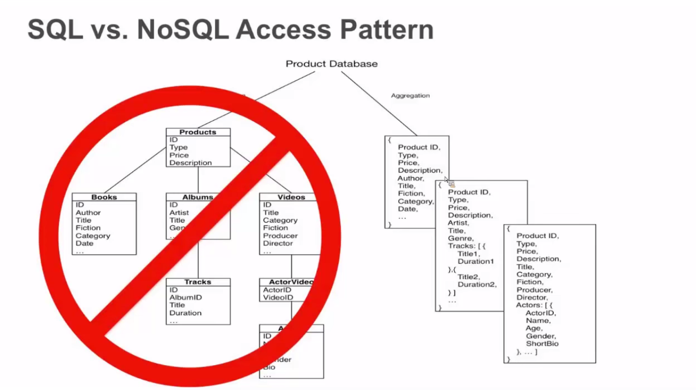
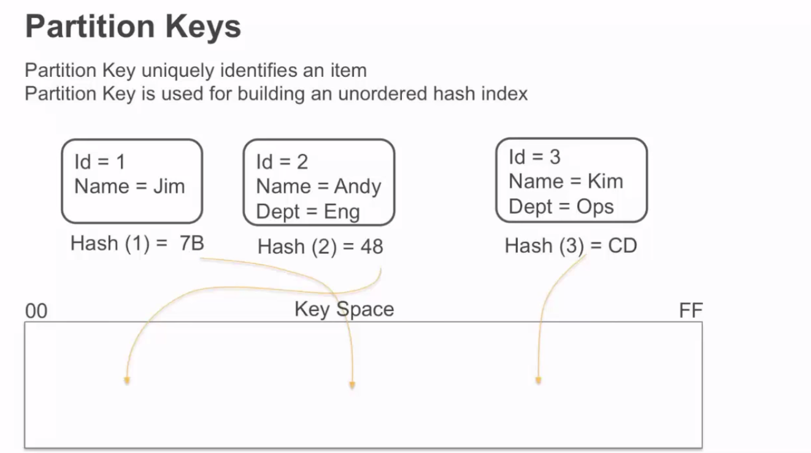
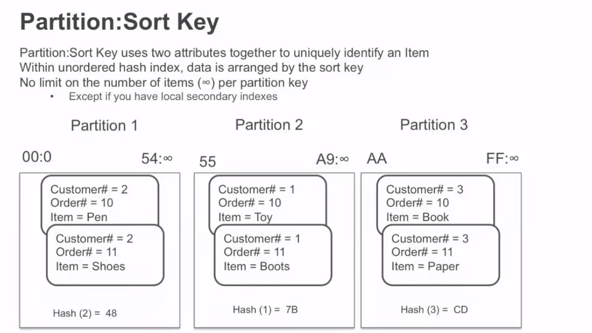
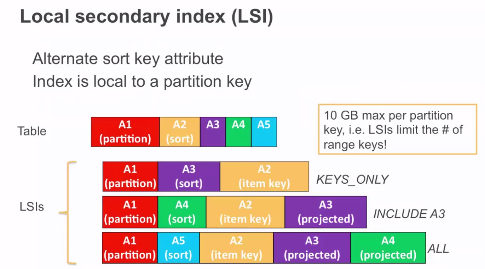
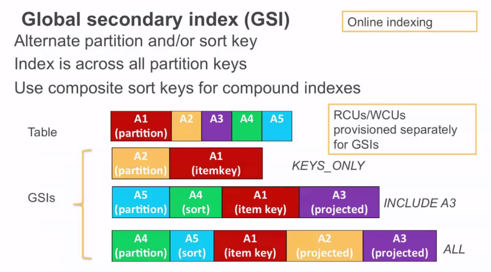
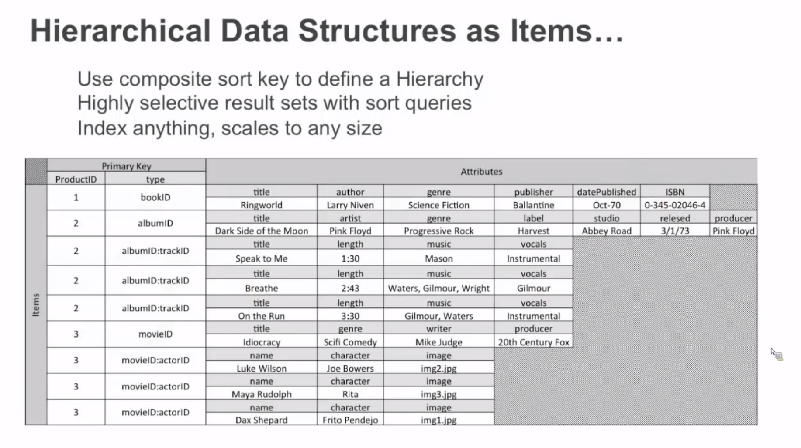

# DynamoDb Data Models

## Design Patterns and Best Practices

[Source - Youtube Video](https://www.youtube.com/watch?v=xV-As-sYKyg)
[Presentation - Slides](https://www.slideshare.net/AmazonWebServices/deep-dive-on-amazon-dynamodb-76982688)

### What is a Datbase?

* "A place to put stuff my app needs" - Average Developer

* Database is the foundation of your application is how do you design and structure the data. It's going really to dictate how that application is going to scale and the costs of scaling.

* RDBMS: good for deduplication of data and multiple clients can query the database. Storage was expensive.

* NoSQL: Now storage is cheap and CPU is the most-expensive resource. And the explosion of data leading us to delivery at scale and distributed data processing systems. 

* Understanding how to use a tool will lead to a higher productivity. People are trying to use NoSQL as they did with RDBMS. This is the problem why NoSQL doesn't work in many cases.

### Why NoSQL

* SQL:
    * Optimized for storage
    * Ad hoc queries (agnostic how the app accesses the data)
    * Scale vertically
    * Good for OLAP
* NoSQL:
    * Denormalized/hierarchical
    * Instantiated views (the results of the queries that I would execute against my SQL servers)
    * Scale horizontally (distributed across cheap devices)
    * Built for OLTP ot acale

* In SQL if you need to aggregate different data from different tables you need to do join operations. Join operations are very heavy in terms of CPU usage, so it becomes very fast resource-consuming.

* In NoSQL we would aggreage the hierarchical data structure, we would create documents that represent products. **And we would put all these documents into the same collection** These documents are items that would then be read by the application and switched based on the properties that exists or don't exist in the application. This allows us then to create `select` statement so to speak against a single table as opposed to have `joining` the data from the storage. This makes NoSQL very efficient. But you need to design NoSQL differently if you want to optimize for scale.

* In DynamoDb we have tables, items, attributes. There are no restrictuion of attributes that can be assigned to an item. And no requirements except the keys (partition key) + you can an optional key (sort key)

* Wit a sort key we can model 1:N relationships by creation a partition and sort key. Enables rich query capabilities. 

* In a partition only table the partition key uniquely identifies an item, you can think of it as a primary key. In partition sort table, the partition and the sort key values together uniquely identify the item. 

> One way to look at this is the partition key creates a bucket and the sort key defines the records that can fill that bucket and these are used for aggregations. We can model 1:N relationships directly on the table by creating this partition and sort key structure. What it allows us to then is to identify the bucket within the equality query agains the partition key and then we can use a range query or rich query against the sort key to return a set of items. The usefulness of this is to that we structure data this way, we actually write the items to the storage array in an ordered structure that can be read using a sequential read. This provides a very high performance when you query the database. We can use set of rich queries: begins, equals, contains, begins with, you can use a compound sort key to create a nested sorted structure within the table.

**Note:** Sequential read is a disk access pattern whereby large contiguous blocks of data are read from adjacent locations on the surface of a device. The term is used primarily within the context of benchmarking and the speed is usually measured in MBps.

### Partition Keys

* We use the partition key to order the items through the key space. Again we do that, we take those values, apply hash algorith to the value of the attribute that you specify as the partition key and our hash algorithm will reorder those items across randomly through the key space. The reason we do this because you scale the capacity, you increate the capacity of your table or you increase the size of your table, we will start to partition or split a key space across multiple physical devices. When we do that we can increase the throughput of the table to ability of multiple processes to service your queries so hereby allowing the system to scale.

**Note:** NoSQL scales through partitioning (distribution of key spaces across multiple physical devices)

**Partition key key space example**

**Note:** Keyspace - It is equivalent to a database in RDBMS , which is a collection of tables, also called column families in Cassandra. Keyspace : Its a container for your data. A keyspace is the equivalent to a SQL database. It is the top level container for database objects. 

## Partition Sort Key

* Partition Sort key uses two attributes together to uniquely identify an Item 
* Within unordered hash index, data is arranged by the sort key
* No limit on the number of items per partition key
    + Except if you have local secondary indexes

## Data Replication

* Partitions are three-way replicated automatically by DynamoDb. If you issue a write to DynamoDb, it will automatically spread through 3 nodes, 3 AZs within a region. AZs within AWS are like a datacenters but they are more than 1 physical data center they are connected via fibher cabel with a low single digital ms second latency that is suited for data replication and we automatically spread the data across those 3 AZs for you. 

* When you write to DynamoDb, you will get acknowledged the write when to nodes in those three acknowledge and commit. When you read from DynamoDb you will read from two nodes. We will give you the data that has the most current timestamp. 

## Indexes

* Index is local to a partition key (alternate sort key attribute)

* Indexes like in any database, a way to reorder the data and can be queried very quickly. And it can give highly selective result set using the index (querying the indexes) as opposed to filter result sets on the table. 

* **Local secondary index:** these are co-located on the storage per partition along with the primary table data, this allows us actually to maintain these indexes as consistent indexes, meaning the write to the index will occur inline with the write to the table. The write wouldn't be confirmed as long as the index is not updates as the table. LSI is distributed along the same partition set, it's co-located on the same storage partition!! It uses a different sort key, we do that if we don't want to filter the result set, because we have then to read a lot of data, so we can sort or aggregate on a different dimension or different attribute of the item. Covered query concept can be applied here!!!
    
    

**Note:** In the LSI we have the same partition key across all indexes but different sort keys

* **Global secondary index:** They are very flexible, you can think of them as addtional tables or derivative tables. These use separate partition keys, separate sort key. Why we do this, because we want to aggregate on completely different dimension. I'm not just sorting on a different dimension, I'm aggregating on a different dimension. Maybe I have a parts table, and I want to look at parts by manufacturer or parts by line number or parts by machine number. I would then provide a secondary index that aggregates as a partition key that might be a manufacturer id or machine id or line id.  Alternate partition and/or sort key, Index is across all partition keys, use composite sort keys for compound indexes. **GSI are unlimited in size.** They are maintained synchronously, meaning they are eventually consistent and the read/write capacity for GSI are provisined separatly. They are more flexible, because they allow different partition keys to be defined. 

### How do GSI updates work?

1. Client requests to update a Table
2. The primar request would be acknowledged
3. As soon as two nodes come back and say we got it 
4. Asynchronous update that occurs (ms, not seconds)

**Note:** GSI must have enough write capacity, if it doesn't it will throttle the table

 

### LSI or GSI

* LSI (needs to be defined when the table has been created) can be modeled as a GSI
* If data size in an item collection > 10GB, use GSI
* If eventual consistency is okay for your scenario, use GSI (more flexible and can be defined after the table has been created)

### Scaling

There are two dimension in DynamoDb on scaling:

* Throughput: Provision any amount of throughput to a table (some soft limits on your table, but you can request any capacity you need from the support)
* Size: Add any number of items to a table 
    + Max item size is 400Kb
    + LSIs limit the number of range keys due to 10GB limit
* Scaling is achieved via partitioning

* Throughput: Provisioned at the table level
    + WCUs are measured in 1KB per second
    + RCUs are measured in 4KB per second

### What causes throttling?

* If sustained throughput goes beyond provisioned througput per partition

    + Non-uniform workloads
        - Hot keys/hot partitions
        - Very large bursts
    + Mixing hot data with cold data
        - Use a table per time period
    + From the example before:
        - Table created with 5000 RCUs, 500 WCUs
        - RCUs per partition 1666,67 (per bucket / per key space)
        - WCUs per partition 166,67
        - If sustained throughput > (1666 RCUs or 166 WCUs) per key or partition, dynamoDb may throttle requests

**Note:** Throttling means you cannot access the table, you are not going to get your read/write.

> To get the most out of DynamoDb throughput, create tables where the hash key elements has a large number of distinct values (verschiedene,and values are requested fairly uniformly, as randomly as possible. 

#### Design Pattern
* Space: access is evently spread over the key-space
* Time: requests arrive evenly spaced in time

## Data Modeling

* Use table or GSI with alternative partition key
* Use `GetItem` or `BatchGetItem` API
* Example: Given an SSN or licence number, get attributes

### 1:1 Relationship

* If we want to maintain a relationship 1:1 or key-values. This is how we can do that in DynamoDb. Users by licence and you can look up your attributes by the social security number (SSN)

### 1:N Relationships

* Use a table or GSI with partition and sort key. Use Query API. Example given a device, find all readings between epoch X, Y

* We want data structures in NoSQL that can be gathered and built into the application tier by doing a simple table select. If I have to start doing multiple selects and maintaining relational structure in the application tier, I'm defeating purpose of NoSQL. In NoSQL we want to put the data that it's already mapped to the way how our query looks like (our apps needs it)

### N:M Relationships

* Use a table and GSI with partition key and sort key elements switched (it's just only about flipping the partition and sort key)
* Use Query API
* Example: Given a user, find all games. Or given a game, find all users. 

## Hierarchical Data (Tiered relational data structures)

A lot of what we see in application development is a hierarchical data. If we look at the application layer object, they have properties and properties can be base types, properties might be sets of those base types, but those properties might also be complex types,which have their own properties. 

In order to represent hiararchial data you use the sort key to define the hierarchy. We have the productID and the type, which is going to be our sort key and the type is actually, defines a hierarchical structure, which we can load our product catalog. We use here the sort key in order to maintain the hierarchy. And we can query it easily by using a conditional expression `begins with` on the sort key.

### or as Document (JSON)

Another way to do it with JSON documents. In this particular example, I will structure the table. You can use here filter expressions to navigate, you'll get a lot of flexibility. It's up to developer to put a hierarchy on the table or JSON. The only one problem with JSON is that you are limited to hierarchical structure of 400KB.

**Note:** You can do here a combination of the data. There is no reason only to use JSON, you can use both JSON and primary + sort key. 

### Time series tables

* Don't mix hot and cold data; archive cold data to Amazon S3

* DynamoDb doesn't want you to grow the tables infinetely, as we start to grow in size we will start to partition the table and it's also expensive to store data.

* What we would like to do is to migrate cold data to another table and don't store it with the high velocity table. We speak about cold data = data that is e.g. 3 days old. 

* We would like to see you to roll the tables over, at some period of time the workflow says I create a new table and I make that hot table and my existing hot table becomes cold table and we deprovision that table (remove WCU/RCUs)

* And at some point the data is so cold that we archive it, store it to s3 or drop it entirely. 

**Note:** By offloading cold data you are going to save a lot of money, since you don't pay for it as for the hot data. It's lifecycle you are managing your data in a lifecycle. 

* Use a table per time period
* Pre-create weekly, monthly tables
* Provision required throughput for current table
* Writes go to the current table
* Turn off or reduce througput for older tables

**Note:** Only when dealing with time series table

### Messaging App

* Large items
* Filters vs. indexes
* M:N Modeling - inbox and outbox

**Note:** In the example above we'll have problems since the data is too big and will be loaded all the time because of the attachments. We'll pay a lot of RCUs since each email is on avaerage 256kb big. Since we don't need to read all the data at once, we can create a reference from one table to another.

The example above will even support the MVC data, the model contains that the view needs and the controller interacts with the data, while the view switches, when I change from summary to the detail view, and this is ok for the application to make a roundtrip and get that data.

 

In the example above we have 2 GSI that give us the inbox and outbox view and we don't have to have the heavy RCU hit, we save a lot of money. We get the big data away from the small data and only read the data that you need. 

* Reduce one-to-many item sizes
* Configure secondary index projections
* Use GSIs to model M:N relationship between sender and recepient

**Note:** Important when: Querying many large items at once

### Multiplayer Online Gaming

In this particular example we have a partition key that's a gameId, games have status.

---

---

In this example you pay for the read capacity and then filter out the results.

But there is a much better way to do it, when we create a composite key where status and date are combined together. You can call it compoud query.

---

#### Sparse Indexes

* There are some attributes that not every has. So I can define a sparse index with much less read capacity on this GSI. And I can actually `Scan` that GSI to get all the users that have awards. It's a good way to get results you need without spending a lot of money.

### DynamoDb Streams

* Think of that as a change log
* Stream updates to a table
* Asynchronous
* Exactly once
* Strictly ordered
    + Per item
* Highly durable
    + Scale with Table
* 24 hours lifetime
* Sub-second latency

**Note:** You can use Streams to do backups and replication of tables. 

---

# Best Practices for DynamoDB 

[Source - AWS Documentation](https://docs.aws.amazon.com/amazondynamodb/latest/developerguide/best-practices.html)

