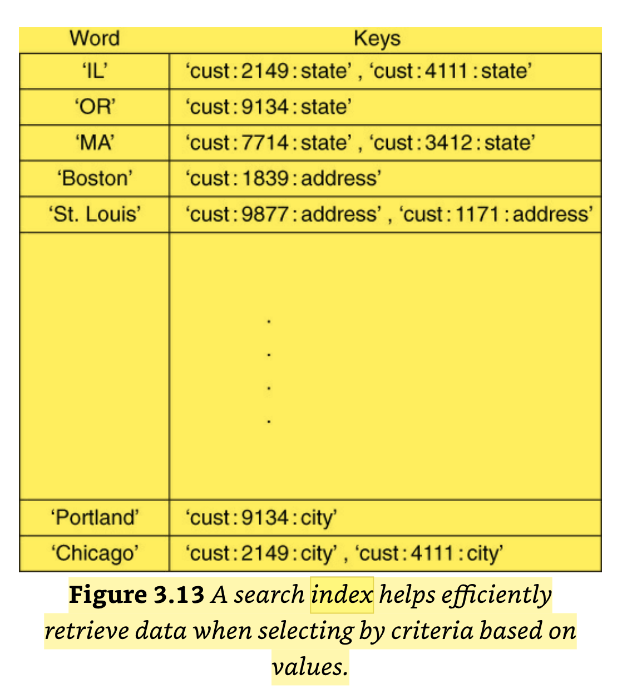
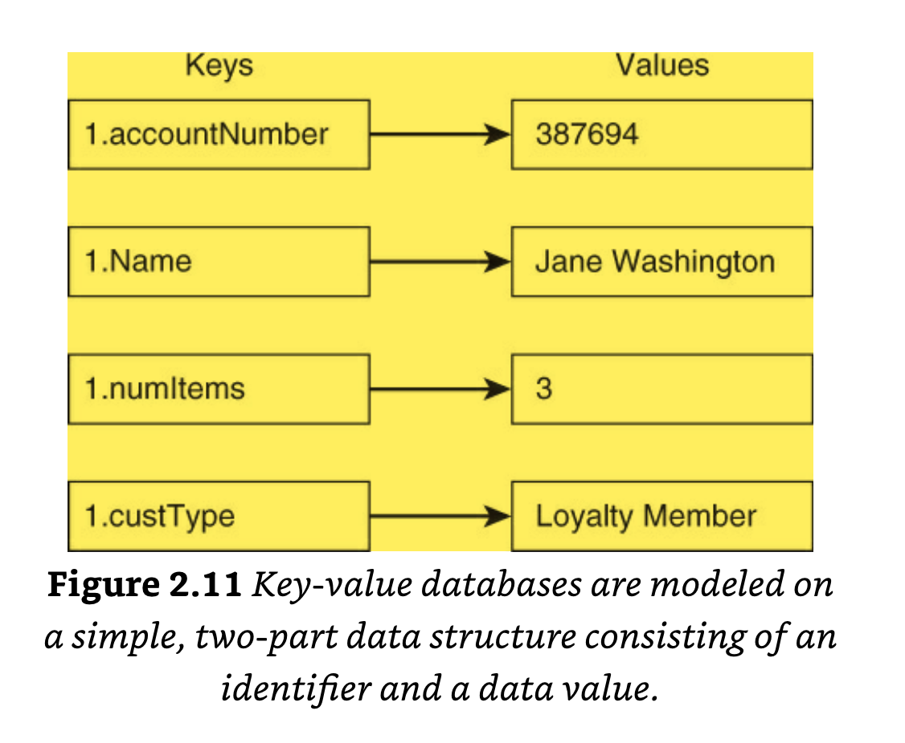

# NoSQL for Mere Mortals 1st Edition - Highlights

[Source - Buy this book, it's amazing](https://www.amazon.com/NoSQL-Mere-Mortals-Dan-Sullivan/dp/0134023218)

* Indexes are data sets that contain location information about blocks of data saved by the database

* Rather than scan the full table for the data, you can use database indexes, which are like indexes at the end of a book, to quickly find the location of a particular piece of data.



* Indexes point to the location on disk or flash memory that contains the record holding information about the entity referenced in the index.

* A schema is a collection of tables, views, indexes, and other structures that are all related to a set of data.

* Constraints are generally based on business rules about the entities and operations the data is representing.

* Views are collections of related columns from one or more tables as well as values calculated for data in columns.

* NULL, a special data value used to indicate the column has no value specified.

* Relational database management systems provide storage management, memory management, a data dictionary, and a query language.

* Scaling out: Adding servers as needed is called scaling out.

* **There is, however, another aspect of relational databases that is less flexible. Database designers expect to know at the start of a project all the tables and columns that will be needed to support an application.**

* NoSQL databases do not require a fixed table structure. For example, in a document database, a program could dynamically add new attributes as needed without having to have a database designer alter the database design.

* Distributed systems: When systems run on multiple servers, instead of on just one computer, they are known as distributed systems

* Databases are designed to do two things: store data and retrieve data.

* Database transaction is an operation made up of multiple steps and that all steps must complete for the transaction to complete. If any one of the multiple steps fails, then the entire transaction fails.


* [Source](https://vladmihalcea.com/a-beginners-guide-to-acid-and-database-transactions/)

* The term consistency with respect to database transactions refers to maintaining a single, logically coherent view of data. When you transfer $100 from your savings account to your checking account, the bank’s software may subtract $100 from your savings account in one step and add $100 to your checking account in another.
    * For example, if two database servers each have copies of data about products stored in a warehouse, it is said they are consistent if they have the same data.

* NoSQL databases often implement eventual consistency; that is, there might be a period of time where copies of data have different values, but eventually all copies will have the same value. This raises the possibility of a user querying the database and getting different results from different servers in a cluster.

* A quorum is the number of servers that must respond to a read or write operation for the operation to be considered complete.

* Durability is the property of maintaining a correct copy of data for long periods of time. A write operation is considered complete when a minimum number of replicas have been written to persistent storage.

* Assume you are working the five-server cluster described previously. If data is replicated across three servers and you set the write threshold to 3, then all three copies would be written to persistent storage before the write completes.

* Airline tags for checked bags are analogous to keys used to store data in a key-value database.

* For example, data about the first customer in the system would use keys 1.accountNumber, 1.name, 1.address, 1.numItems, and 1.custType


* Use a key-naming convention that includes the entity type. For example, you could use the prefix cust for customer and wrhs for warehouse. You can append the sequentially generated numbers to these prefixes to create unique keys.
    * Key examples: cust1.accountNumber • cust1.name • cust1.address • cust1.numItems • cust1.custType • cust2.accountNumber

* A namespace is a collection of identifiers. Keys must be unique within a namespace. (is similar to table in DynamoDb it's just a prefix at a key)


* Some key-value databases provide for different namespaces within a database. This book refers to these data structures as buckets

* Values are data stored along with keys. Like luggage, values in a key-value database can store many different things. Values can be as simple as a string, such as a name, or a number, such as the number of items in a customer’s shopping cart. You can store more complex values, such as images or binary objects, too.

* Key-value databases typically do not enforce checks on data types of values. Because key-value databases allow virtually any data type in values, **it is important for software developers to implement checks in their programs.**



* Figure 2.13 The key-naming convention outlined above maps to patterns seen in relational database tables.


* Document databases, also called document-oriented databases, use a key-value approach to storing data but with important differences from key-value databases. A document database stores values as documents. In this case, documents are semistructured entities, typically in a standard format such as JavaScript Object Notation (JSON)

* Instead of storing each attribute of an entity with a separate key, document databases store multiple attributes in a single document.

* Because key-value databases have few restrictions on the type of data stored as a value, you could store a JSON document as a value. The only way to retrieve such a document is by its key, however. **Document databases provide application programming interfaces (APIs) or query languages that enable you to retrieve documents based on attribute values.**

* Embedding documents or lists of values in a document eliminates the need for joining documents the way you join tables in a relational database.

* A column is a basic unit of storage in a column family database. A column is a name and a value. A set of columns makes up a row. Rows can have the same columns, or they can have different columns,

* Column family databases are typically denormalized, or structured so that all relevant information about an object is in a single, possibly very wide, row.

* An associative array is a data structure, like an array, but is not restricted to using integers as indexes or limiting values to the same type. Associative arrays go by a number of different names, including dictionary, map, hash map, hash table, and symbol table.

```js
const student = []
student['age'] = 19
student['location'] = "Germany"
```

* The first time a piece of data is retrieved from a disk, for example, as the result of a SQL query in a relational database, it is stored in the cache along with a set of unique keys.

 

* Caches are associative arrays used by application programs to improve data access performance.

* An in-memory cache is an associative array. The values retrieved from the relational database could be stored in the cache by creating a key for each value stored.

* The namespace can be called a bucket, a database, or some other term indicating a collection of key-value pairs

* Reading and writing data to RAM is much faster than writing to a disk. Of course, RAM is not persistent storage, so if you lose power on your database server, you will lose the contents of RAM.

* Scalability is the capability to add or remove servers from a cluster of servers as needed to accommodate the load on the system.

* The master is a server in the cluster that accepts write and read requests. It is responsible for maintaining the master record of all writes and replicating, or copying, updated data to all other servers in the cluster. These other servers only respond to read requests. As Figure 3.7 shows, master-slave architectures have a simple hierarchical structure.


* Disadvantage of the master-slave replication model is that if the master fails, the cluster cannot accept writes. The master server is known as a single point of failure.

* Masterless replication model in which all nodes accept reads and writes.

* Each time there is a write operation to one of the servers, it replicates that change to the three other servers holding its replica.

* Primary keys should not be changed, so you could not simply change the key to ‘SMITH_K_IL.’ That would violate the principle that primary keys are immutable.

* You can construct meaningful names that entail information about entity types, entity identifiers, and entity attributes. For example: Cust:12387:firstName could be a key to store the first name of the customer with customerID 12387.
    * Entity Name + ':' + Entity Identifier +':' + Entity   Attribute The delimiter does not have to be a ':' but it is a common practice.

* Figure 3.13 A search index helps efficiently retrieve data when selecting by criteria based on values.


* Keys should have some logical structure to make code readable and extensible, but they should also be designed with storage efficiency in mind. 

* Anticipating all possible entities’ types can be difficult, so coming up with unambiguous name components isn’t always possible. Try to use at least three or four letters to distinguish an entity type or attribute. 'Cst' or 'cust' are better than 'c' for a customer abbreviation.

**Note:** The entity type is the fundamental building block for describing the structure of data with the Entity Data Model (EDM). In a conceptual model, an entity type represents the structure of top-level concepts, such as customers or orders. An entity type is a template for entity type instances.

* For example, consider a key pattern that consists of an entity or object type (for example, 'customer'), a unique identifier for that entity or object type (for example, '198277'), an attribute name (for example, 'fname'), and common delimiter (for example, ':').

* Consider using values that indicate ranges when you want to retrieve groups of values. For example, you might want to include a six-digit date in a key if you want to retrieve all customers who made a purchase on a particular date. In this case, 'cust061514' could be used as a prefix instead of 'cust' to indicate customers who bought products on June 15, 2014. The customer ID would be stored as a value associated with each key.
    * cust061514:1:custId • cust061514:2:custId


