# NoSQL for Mere Mortals 1st Edition - Highlights

[Source - Buy this book, it's amazing](https://www.amazon.com/NoSQL-Mere-Mortals-Dan-Sullivan/dp/0134023218)

* Indexes are data sets that contain location information about blocks of data saved by the database

* Rather than scan the full table for the data, you can use database indexes, which are like indexes at the end of a book, to quickly find the location of a particular piece of data.


* Indexes point to the location on disk or flash memory that contains the record holding information about the entity referenced in the index.

* A schema is a collection of tables, views, indexes, and other structures that are all related to a set of data.

* Constraints are generally based on business rules about the entities and operations the data is representing.

* Views are collections of related columns from one or more tables as well as values calculated for data in columns.

* NULL, a special data value used to indicate the column has no value specified.

* Relational database management systems provide storage management, memory management, a data dictionary, and a query language.

* Scaling out: Adding servers as needed is called scaling out.

* **There is, however, another aspect of relational databases that is less flexible. Database designers expect to know at the start of a project all the tables and columns that will be needed to support an application.**

* NoSQL databases do not require a fixed table structure. For example, in a document database, a program could dynamically add new attributes as needed without having to have a database designer alter the database design.

* Distributed systems: When systems run on multiple servers, instead of on just one computer, they are known as distributed systems

* Databases are designed to do two things: store data and retrieve data.

* Database transaction is an operation made up of multiple steps and that all steps must complete for the transaction to complete. If any one of the multiple steps fails, then the entire transaction fails.


* [Source](https://vladmihalcea.com/a-beginners-guide-to-acid-and-database-transactions/)

* The term consistency with respect to database transactions refers to maintaining a single, logically coherent view of data. When you transfer $100 from your savings account to your checking account, the bank’s software may subtract $100 from your savings account in one step and add $100 to your checking account in another.
    * For example, if two database servers each have copies of data about products stored in a warehouse, it is said they are consistent if they have the same data.

* NoSQL databases often implement eventual consistency; that is, there might be a period of time where copies of data have different values, but eventually all copies will have the same value. This raises the possibility of a user querying the database and getting different results from different servers in a cluster.

* A quorum is the number of servers that must respond to a read or write operation for the operation to be considered complete.

* Durability is the property of maintaining a correct copy of data for long periods of time. A write operation is considered complete when a minimum number of replicas have been written to persistent storage.

* Assume you are working the five-server cluster described previously. If data is replicated across three servers and you set the write threshold to 3, then all three copies would be written to persistent storage before the write completes.

* Airline tags for checked bags are analogous to keys used to store data in a key-value database.

* For example, data about the first customer in the system would use keys 1.accountNumber, 1.name, 1.address, 1.numItems, and 1.custType


* Use a key-naming convention that includes the entity type. For example, you could use the prefix cust for customer and wrhs for warehouse. You can append the sequentially generated numbers to these prefixes to create unique keys.
    * Key examples: cust1.accountNumber • cust1.name • cust1.address • cust1.numItems • cust1.custType • cust2.accountNumber

* A namespace is a collection of identifiers. Keys must be unique within a namespace. (is similar to table in DynamoDb it's just a prefix at a key)


* Some key-value databases provide for different namespaces within a database. This book refers to these data structures as buckets

* Values are data stored along with keys. Like luggage, values in a key-value database can store many different things. Values can be as simple as a string, such as a name, or a number, such as the number of items in a customer’s shopping cart. You can store more complex values, such as images or binary objects, too.

* Key-value databases typically do not enforce checks on data types of values. Because key-value databases allow virtually any data type in values, **it is important for software developers to implement checks in their programs.**


* Figure 2.13 The key-naming convention outlined above maps to patterns seen in relational database tables.

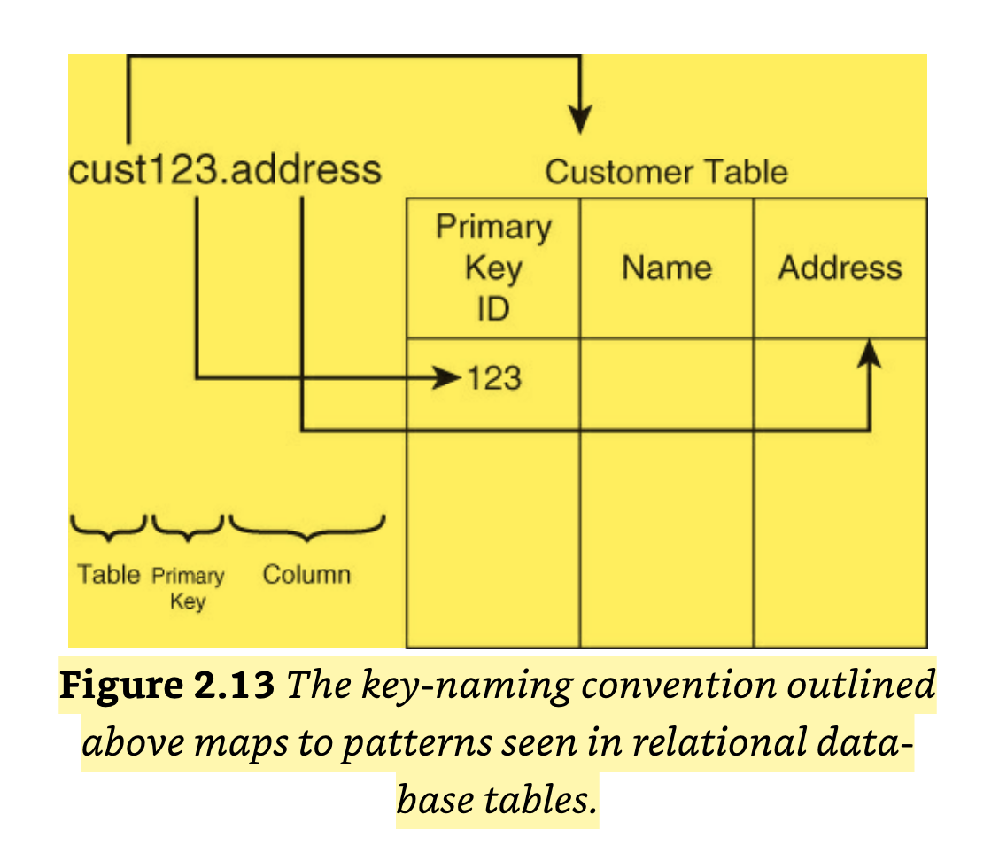

* Document databases, also called document-oriented databases, use a key-value approach to storing data but with important differences from key-value databases. A document database stores values as documents. In this case, documents are semistructured entities, typically in a standard format such as JavaScript Object Notation (JSON)

* Instead of storing each attribute of an entity with a separate key, document databases store multiple attributes in a single document.

* Because key-value databases have few restrictions on the type of data stored as a value, you could store a JSON document as a value. The only way to retrieve such a document is by its key, however. **Document databases provide application programming interfaces (APIs) or query languages that enable you to retrieve documents based on attribute values.**

* Embedding documents or lists of values in a document eliminates the need for joining documents the way you join tables in a relational database.

* A column is a basic unit of storage in a column family database. A column is a name and a value. A set of columns makes up a row. Rows can have the same columns, or they can have different columns,

* Column family databases are typically denormalized, or structured so that all relevant information about an object is in a single, possibly very wide, row.

* An associative array is a data structure, like an array, but is not restricted to using integers as indexes or limiting values to the same type. Associative arrays go by a number of different names, including dictionary, map, hash map, hash table, and symbol table.

```js
const student = []
student['age'] = 19
student['location'] = "Germany"
```

* The first time a piece of data is retrieved from a disk, for example, as the result of a SQL query in a relational database, it is stored in the cache along with a set of unique keys.

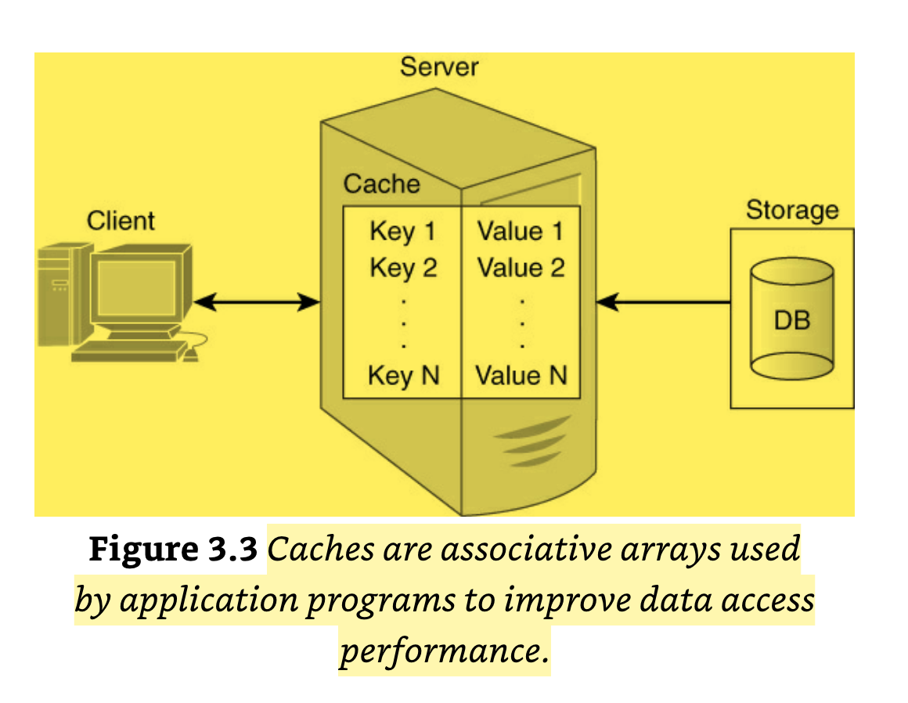 

* Caches are associative arrays used by application programs to improve data access performance.

* An in-memory cache is an associative array. The values retrieved from the relational database could be stored in the cache by creating a key for each value stored.

* The namespace can be called a bucket, a database, or some other term indicating a collection of key-value pairs

* Reading and writing data to RAM is much faster than writing to a disk. Of course, RAM is not persistent storage, so if you lose power on your database server, you will lose the contents of RAM.

* Scalability is the capability to add or remove servers from a cluster of servers as needed to accommodate the load on the system.

* The master is a server in the cluster that accepts write and read requests. It is responsible for maintaining the master record of all writes and replicating, or copying, updated data to all other servers in the cluster. These other servers only respond to read requests. As Figure 3.7 shows, master-slave architectures have a simple hierarchical structure.

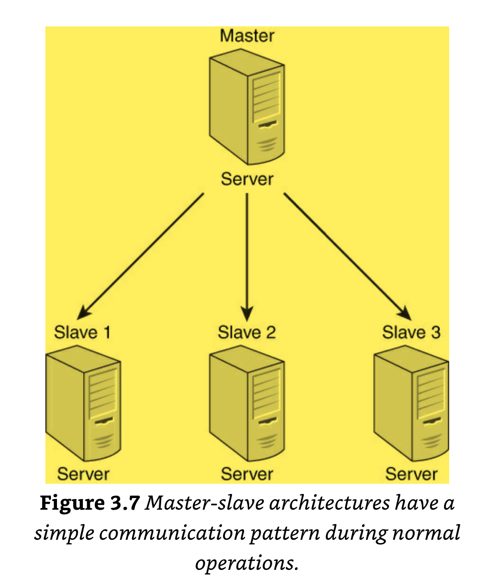

* Disadvantage of the master-slave replication model is that if the master fails, the cluster cannot accept writes. The master server is known as a single point of failure.

* Masterless replication model in which all nodes accept reads and writes.

* Each time there is a write operation to one of the servers, it replicates that change to the three other servers holding its replica.

* Primary keys should not be changed, so you could not simply change the key to ‘SMITH_K_IL.’ That would violate the principle that primary keys are immutable.

* You can construct meaningful names that entail information about entity types, entity identifiers, and entity attributes. For example: Cust:12387:firstName could be a key to store the first name of the customer with customerID 12387.
    * Entity Name + ':' + Entity Identifier +':' + Entity   Attribute The delimiter does not have to be a ':' but it is a common practice.

* Figure 3.13 A search index helps efficiently retrieve data when selecting by criteria based on values.


* Keys should have some logical structure to make code readable and extensible, but they should also be designed with storage efficiency in mind. 

* Anticipating all possible entities’ types can be difficult, so coming up with unambiguous name components isn’t always possible. Try to use at least three or four letters to distinguish an entity type or attribute. 'Cst' or 'cust' are better than 'c' for a customer abbreviation.

**Note:** The entity type is the fundamental building block for describing the structure of data with the Entity Data Model (EDM). In a conceptual model, an entity type represents the structure of top-level concepts, such as customers or orders. An entity type is a template for entity type instances.

* For example, consider a key pattern that consists of an entity or object type (for example, 'customer'), a unique identifier for that entity or object type (for example, '198277'), an attribute name (for example, 'fname'), and common delimiter (for example, ':').

* Consider using values that indicate ranges when you want to retrieve groups of values. For example, you might want to include a six-digit date in a key if you want to retrieve all customers who made a purchase on a particular date. In this case, 'cust061514' could be used as a prefix instead of 'cust' to indicate customers who bought products on June 15, 2014. The customer ID would be stored as a value associated with each key.
    * cust061514:1:custId • cust061514:2:custId

* Keys should have some logical structure to make code readable and extensible, but they should also be designed with storage efficiency in mind.

* Anticipating all possible entities’ types can be difficult, so coming up with unambiguous name components isn’t always possible. Try to use at least three or four letters to distinguish an entity type or attribute. 'Cst' or 'cust' are better than 'c' for a customer abbreviation.

* If your key-value database offers ordered key values or allows for secondary indexes, you might find those are more efficient options for retrieving ranges of values than using a function like the one above.

* Partitioning is the process of grouping sets of key-value pairs and assigning those groups to different nodes in a cluster. Hashing is a common method of partitioning that evenly distributes keys and values across all nodes. Another method that is sometimes used is called range partitioning. Range partitioning works by grouping contiguous values and sending them to the same node in a cluster

* Fetching a value from the key-value database can take a long time, at least compared with primitive operations. The reason is that retrieving a value can require reading from a disk. This means that the read operation must wait for the read/write heads to get into position.

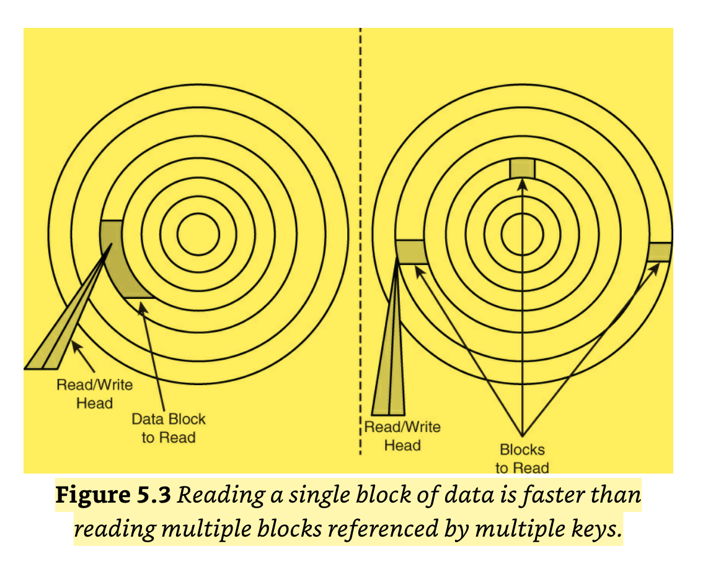

* Another approach is to store commonly used attribute values together. In the case of a customer management database, you could store a list with both the customer’s name and address together, for example: Click here to view code image cstMgtNS[cust: 198277:nameAddr] = '{ 'Jane Anderson' ,   '39 NE River St. Portland, OR 97222'} This is a more complex value structure than using several different keys but has significant advantages in some cases. By storing a customer name and address together, you might reduce the number of disk seeks that must be performed to read all the needed data (see Figure 5.3)

* Figure 5.3 Reading a single block of data is faster than reading multiple blocks referenced by multiple keys.

* Duplicating data is also a common way to improve the performance of relational database queries. Known as denormalization, duplicating data can reduce the number of joins required to perform a query and substantially improve application performance.


* Figure 5.4 Data is read in blocks. Blocks may store a large number of small-sized values or few large-sized values. The former can lead to better performance if frequently used attributes are available in the cache.

* If you find yourself needing to frequently design large value structures, you might want to consider using a document database rather than a key-value database.

* Several design patterns that may prove useful when using key-value databases to develop your applications. These include • Time to Live (TTL) keys • Emulating tables • Aggregates • Atomic aggregates • Enumerable keys • Indexes Design patterns can be useful as described or can require some modification to fit your needs. Think of design patterns as guides to solving common problems, not dogmatic solutions handed down by a cadre of design elders that must be followed precisely.
    * Time to live 
    * Emulating tables
    * Aggregates
    * Atomic aggregates
    * Enumerable keys

* Inverted indexes are sets of key-value pairs that allow for looking up keys or values by other attribute values of the same entity.

* It is important to remember that these patterns are like templates: They are starting points for solving a problem, but you should feel free to modify and adjust as needed to meet your requirements.

* Data structures allow for storing multiple attributes together

* Some key-value database implementations provide additional features such as search and secondary indexes. Take advantage of these when possible. They are likely to be more efficient and require less code than a “do-it-yourself” version of the same functionality.

## The process of data modeling / design of NoSQL:

* After reviewing preliminary designs of the user interface, they determined that name and account number appear frequently together, so it made sense to keep them together in a single list of values. The default currency is also frequently required, so it is included in the list of values along with customer name and account number. Because this app is designed to track the status of shipments, there is little need for administrative information, such as billing address, so it is not stored in the key-value database.

* The app designers decided to use the following naming convention for keys: entity type:account number. Given the list of data types the tracker manages, the designers decided the database should support four entity types: • Customer information, abbreviated ‘cust’ • Dashboard configuration options, abbreviated ‘dshb’ • Alerts and notification specifications, abbreviated ‘alrt’ • User interface configurations, abbreviated ‘ui’ The next step in the design process is determining attributes for each entity.
    + `TrackerNS['dash:4719364'] =   {'shpComp','shpState','shpDate','shpDelivDate'}`

* Now that the designers have defined the entity types, key-naming conventions, and structure of values, developers can write supporting code to set and retrieve keys and their values.

* Developers often turn to document databases when they need the flexibility of NoSQL databases but need to manage more complex data structures than those readily supported by key-value databases.

* HTML combines formatting and content in a single document. In much the same way, documents in document databases combine structure and content. 

* JSON objects are constructed using several simple syntax rules:
    + Documents consist of name-value pairs separated by commas.
    + Values can be numbers, strings, Booleans (true or false), arrays, objects, or the NULL value.

* To summarize, a document is a set of key-value pairs. Keys are represented as strings of characters. Values may be basic data types (such as numbers, strings, and Booleans) or structures (such as arrays and objects). Documents contain both structure information and data. The name in a name-value pair indicates an attribute and the value in a name-value pair is the data assigned to that attribute.

* Collections are sets of documents. Because collections do not impose a consistent structure on documents in the collection, it is possible to store different types of documents in a single collection. You could, for example, store customer, web clickstream data, and server log data in the same collection. In practice, this is not advisable.

* **In general, collections should store documents about the same type of entity.**

* If you find yourself using a 'doc_type' field and frequently filtering your collection to select a single document type, carefully review your documents. You might have a mix of entity types.

* Filtering collections is often slower than working directly with multiple collections, each of which contains a single document type.

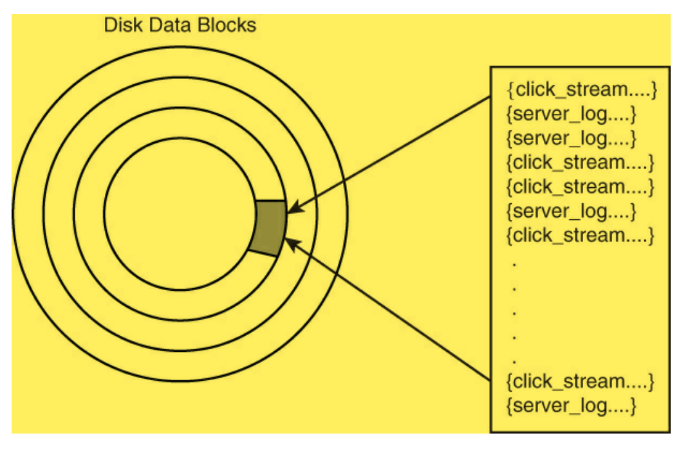

* Mixing document types can lead to multiple document types in a disk data block. This can lead to inefficiencies because data is read from disk but not used by the application that filters documents based on type.

* Consider the overhead of writing indexes as new documents are added to the collection.

* If your code at the highest levels consists of if statements conditionally checking document types that branch to separate functions to manipulate separate document types, it is a good indication you probably have mixed document types that should go in separate collections.

* High-level branching in functions manipulating documents can indicate a need to create separate collections. Branching at lower levels is common when some documents have optional attributes.

## Data modeling and design of NoSQL example

* How should you go about deciding how to organize this data into one or more document collections? Start with how the data will be used. Your client might tell you that she needs to be able to answer the following queries: • What is the average number of products bought by each customer? • What is the range of number of products purchased by customers (that is, the lowest number to the highest number of products purchased)? • What are the top 20 most popular products by customer state? • What is the average value of sales by customer state (that is, Standard price to customer – Cost of product from supplier)? • How many of each type of product were sold in the last 30 days? All the queries use data from all product types, and only the last query subtotals the number of products sold by type. This is a good indication that all the products should be in a single document collection (see Figure 6.5). Unlike the example of the collection with clickstream and server log data, the product document types are frequently used together to respond to queries and calculate derived values.

* Relational databases are often used to support a broad range of query types. NoSQL databases complement relational databases by providing functionality optimized for particular aspects of application support. Rather than start with data and try to figure out how to organize your collections, it can help to start with queries to understand how your data will be used. This can help inform your decisions about how to structure collections and documents.

* A schema is a specification that describes the structure of an object, such as a table.

* Data modelers have to define tables in a relational database before developers can execute code to add, remove, or update rows in the table. Document databases do not require this formal definition step. Instead, developers can create collections and documents in collections by simply inserting them into the database (see Figure 6.6). Figure 6.6 Relational databases require an explicitly defined schema, but document databases do not.

* This freedom from the need to predefine the database structure is captured in the term often used to describe document databases: schemaless.

* Polymorphic schema is another term that describes document databases. Polymorphic is derived from Latin and literally means “many shapes.” This makes it an apt description for a document database that supports multiple types of documents in a single collection.

* The database is the container for collections and containers are for documents. The logical relationship between these three data structures is shown in Figure 6.7.


* In many cases, it is more efficient to perform bulk inserts instead of a series of individual inserts.

* You should be especially careful when deleting documents that may be referenced in other documents.

* Relational databases can be designed to prevent this type of problem, but document databases depend on application code to manage this type of data integrity.

* Documents are organized into related sets called collections. Collections are analogous to a relational table, and documents are analogous to rows in a relational table.

* Documents and collections are the basic data structures of a document database.

* A document is a set of ordered key-value pairs. A key value is a data structure that consists of two parts called, not surprisingly, the key and the value.

* For those who may have skipped the section of this book on key-value databases, a key is a unique identifier used to look up a value.

* Because a document is a set, it has one instance of each member. Members are key-value pairs. For example, the following is a set with three members: 'foo': 'a', 'bar': 'b', and 'baz': 'c':

* Documents are ordered sets of key-value pairs. Keys are used to reference particular values. Values can be either basic or structured data types.

* A collection is a group of documents. The documents within a collection are usually related to the same subject entity, such as employees, products, logged events, or customer profiles. It is possible to store unrelated documents in a collection, but this is not advised.

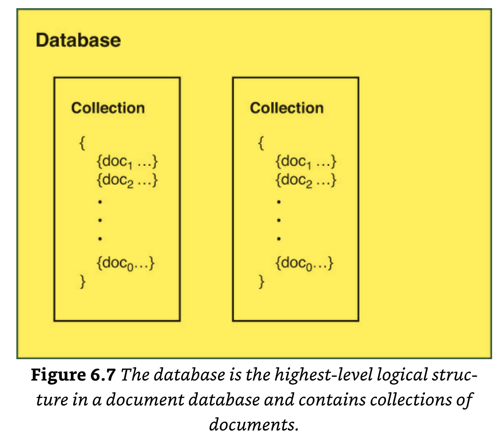

* Indexes map attributes, such as key terms, to related information, such as page numbers. Using an index is faster than scanning an entire book for key terms.

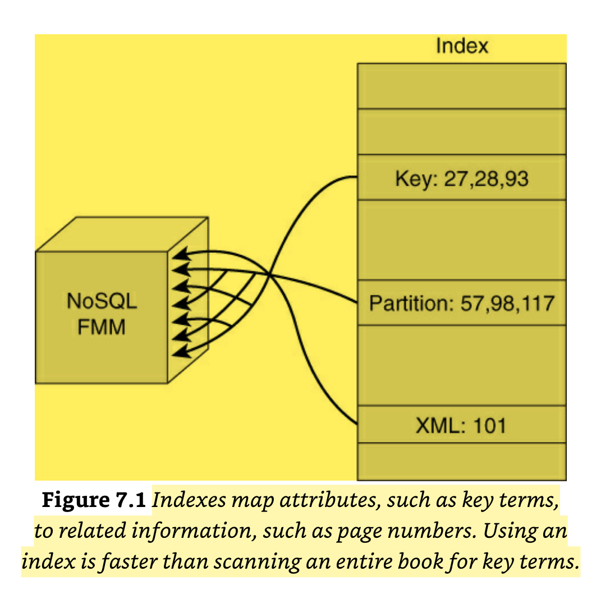

* One of the advantages of document databases is that they allow developers to store related data in more flexible ways than typically done in relational databases. If you were to model employees and the projects they work on in a relational database, you would probably create two tables: one for employee information and one for project information (see Figure 7.2).

* An embedded document enables document database users to store related data in a single document. This allows the document database to avoid a process called joining in which data from one table, called the foreign key, is used to look up data in another table.

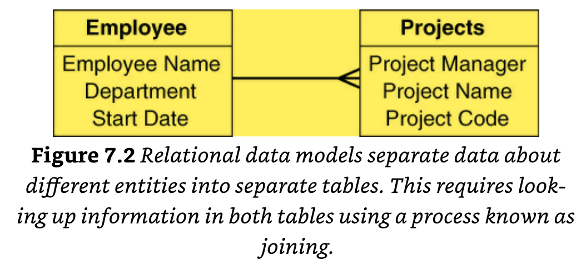
---

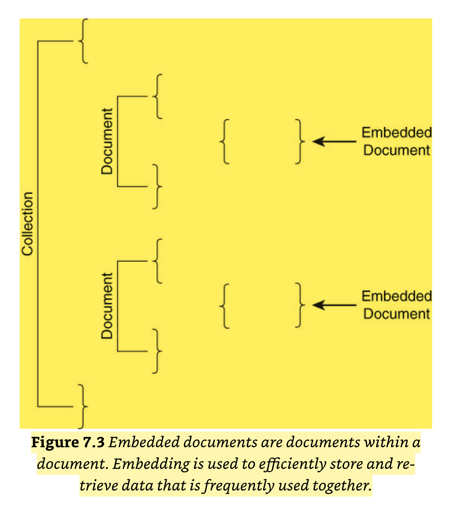

* **Schemaless**: Document databases do not require data modelers to formally specify the structure of documents. A formal structure specification is known as a schema. Relational databases do require schemas. They typically include specifications for • Tables • Columns • Primary keys • Foreign keys • Constraints

* Constraints are rules that describe what kind of data or relation between data is allowed. You could indicate in a schema that a column must always have a value and can never be empty.

* If the database management system does not enforce rules about data, what will? The answer is your application code.

* Some of your application code should be dedicated to verifying rules about the structure of data.

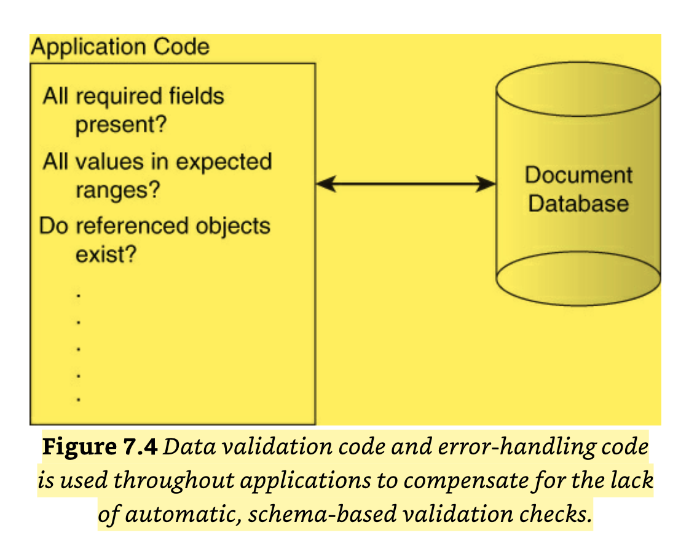

* Figure 7.4 Data validation code and error-handling code is used throughout applications to compensate for the lack of automatic, schema-based validation checks.

* A document database is polymorphic because the documents that exist in collections can have many different forms

* When people use the term partitioning when discussing document databases, they are probably referring to splitting a document database and distributing different parts of the database to different servers.

* Vertical partitioning is a  technique for improving database performance by separating columns of a relational table into multiple separate tables (see Figure 7.7).

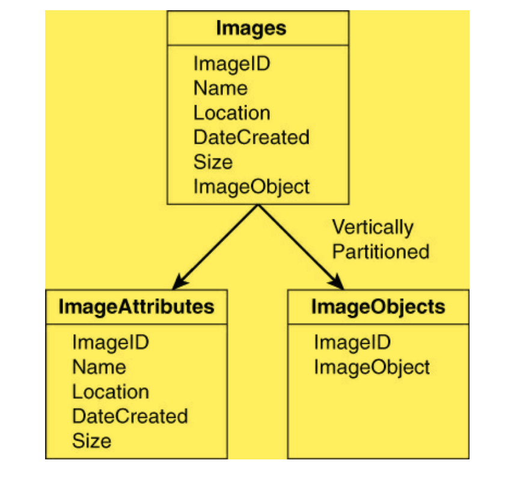

* By separating the image table into a table of image attributes and the image object, the database can more efficiently retrieve data for the application (see Figure 7.8).


* Figure 7.8 Separating columns into separate tables can improve the efficiency of reads because data that is not needed (for example, an image object) is not retrieved along with data that is likely needed

* Horizontal partitioning is the process of dividing a database by documents in a document database or by rows in a relational database. These parts of the database, known as shards, are stored on separate servers. (Horizontal partitioning of a document database is often referred to as sharding.) A single shard may be stored on multiple servers when a database is configured to replicate data. If data is replicated or not, a server within a document database cluster will have only one shard per server (see Figure 7.9). Figure 7.9 Horizontal sharding splits a database by document or row and distributes sections of the database, known as shards, to different servers. When a cluster implements replication, a single shard will be available on multiple servers.

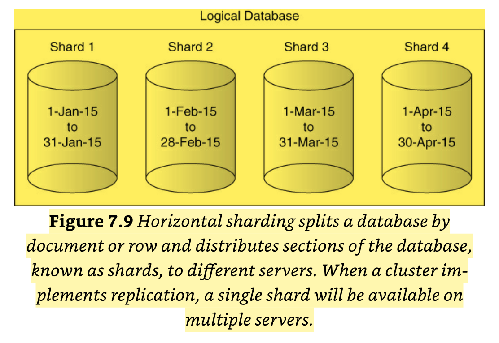

* Sharding offers a number of advantages when implementing large document databases. A large number of users or other heavy loads on a single server can tax the available CPU, memory, and bandwidth. One way to address this is to deploy a larger server with more CPU cores, more memory, and more bandwidth. This solution, referred to as vertical scaling, can require significantly more money and time than sharding. Additional servers can be added to a cluster as demand for a document database grows. Existing servers are not replaced but continue to be used.

* A shard key is one or more keys or fields that exist in all documents in a collection that is used to separate documents. A shard key could be virtually any atomic field in a document: • Unique document ID • Name • Date, such as creation date • Category or type • Geographical region

* The shard key specifies the values to use when grouping documents into different shards. The partitioning algorithm uses the shard key as input and determines the appropriate shard for that key (see Figure 7.10).


* A hash partition uses a hash function to determine where to place a document. Hash functions are designed to generate values evenly across the range of values of the hash function. If, for example, you have an eight-server cluster, and your hash function generated values between 1 and 8, you should have roughly equal numbers of documents placed on all eight servers.


> If you were to sit down right now and start designing a document database, you would probably start with a list of queries you would like to run against your database. (At least that is one good way to start.) If you were designing a relational database, you would probably start by thinking about the entities you have to model and their relationship to each other.

* Database normalization is the process of organizing data into tables in such a way as to reduce the potential for data anomalies. An anomaly is an inconsistency in the data.

* Normalization reduces the amount of redundant data in the database. Rather than repeat customer names and addresses with each order, those attributes would be placed in their own tables.

* Normalization is sometimes used to describe the way you design documents. When designers use multiple collections to store related data, it is considered normalized. Normalized documents imply that you will have references to other documents so you can look up additional information.

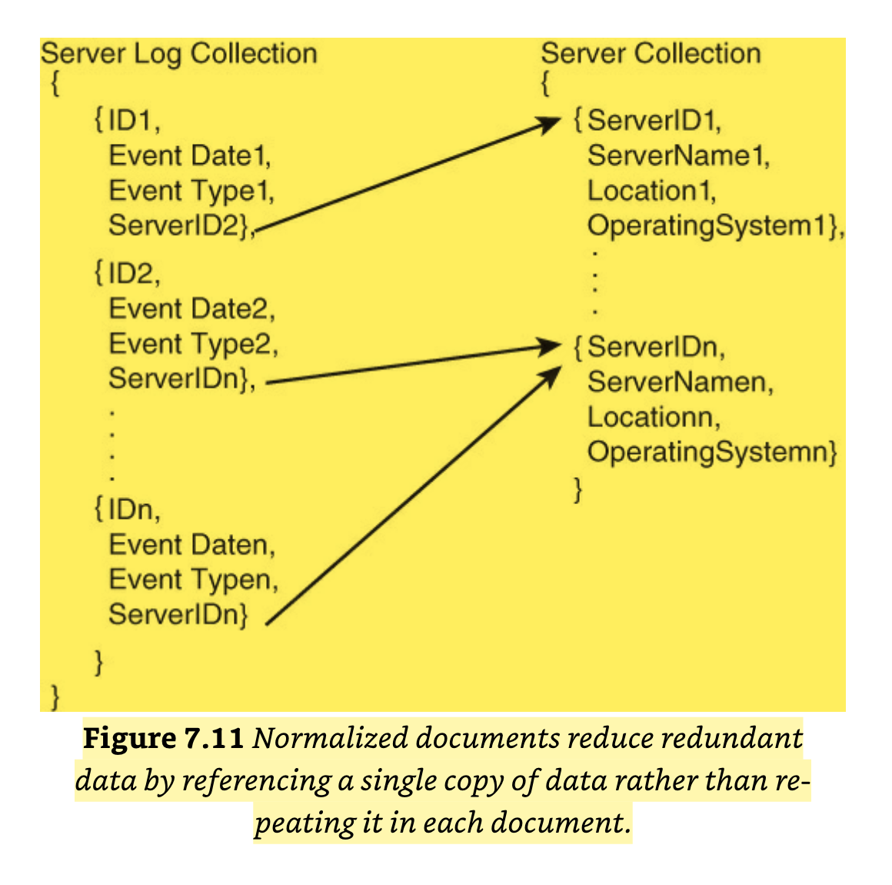

* Figure 7.11 Normalized documents reduce redundant data by referencing a single copy of data rather than repeating it in each document.

* Designing databases entails trade-offs. You could design a highly normalized database with no redundant data but suffer poor performance. When that happens, many designers turn to denormalization.

* Denormalization undoes normalization—specifically, it introduces redundant data. You might wonder, why introduce redundant data? It can cause data anomalies like that in Table 7.1. It obviously requires more storage to keep redundant copies of data. The reason to risk data anomalies and use additional storage is that denormalization can significantly improve performance. YOU DON'T NEED TO JOIN DATA.

* When data is denormalized, there is no need to read data from multiple tables and perform joins on the data from the multiple collections. Instead, data is retrieved from a single collection or document. This can be much faster than retrieving from multiple collections, especially when indexes are available.

* The query processor is an important part of a database management system. It takes as input queries and data about the documents and collections in the database and produces a sequence of operations that retrieve the selected data.

* Document database modelers depend more on heuristics, or rules of thumb, when designing databases. The rules are not formal, logical rules like normalization rules. You cannot, for example, tell by looking at a description of a document database model whether or not it will perform efficiently. You must consider how users will query the database, how much inserting will be done, and how often and in what ways documents will be updated.

* Indexes can significantly improve query response times, but this must be balanced against the extra time that is needed to update indexes when documents are inserted or updated.

* Redundant data is considered a bad, or at least undesirable, thing in the theory of relational database design. Redundant data is the root of anomalies, such as two current addresses when only one is allowed.

* As Albert Einstein observed, “In theory, theory and practice are the same. In practice, they are not.”

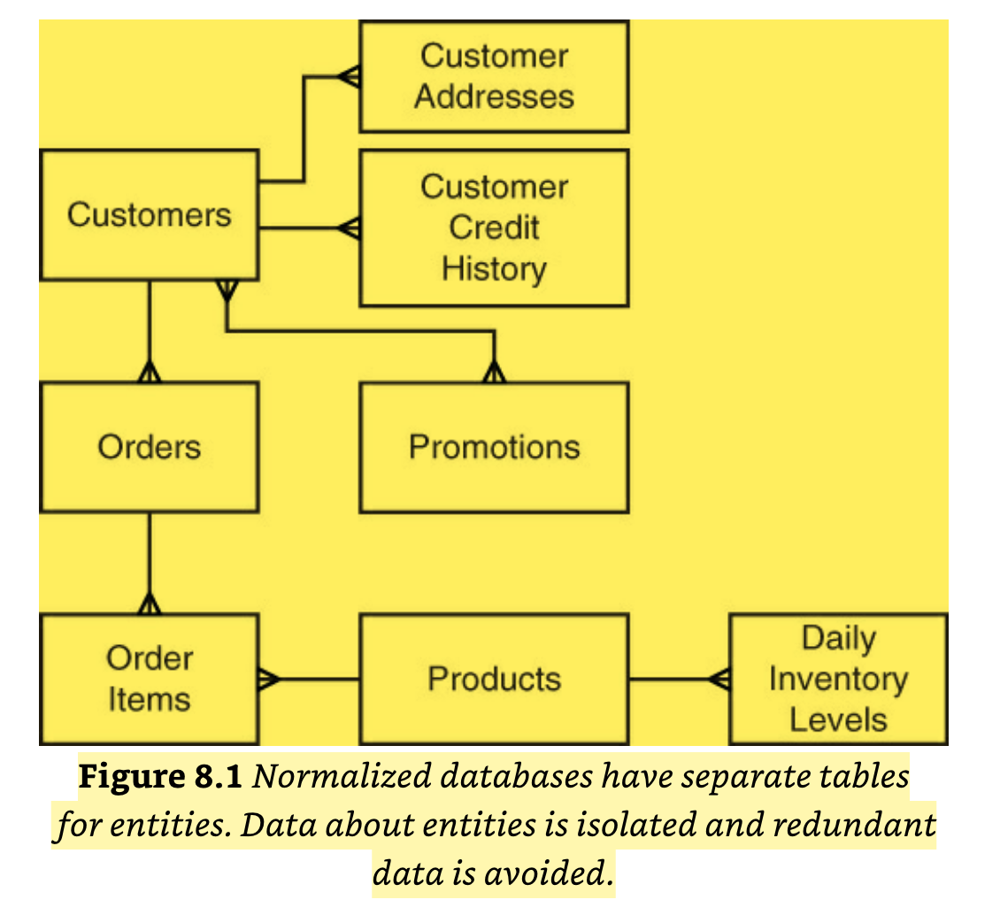

* Figure 8.1 Normalized databases have separate tables for entities. Data about entities is isolated and redundant data is avoided. Figure 8.1 depicts a simple normalized model of customers, orders, and products. Even this simple model requires eight tables to capture a basic set of data about the entities.

* Document database designers, however, often try to store related data together in the same document.

* Looping through rows of tables and looking for matches is one—rather inefficient—way of performing joins. The performance of this join could be improved. For example, indexes could be used to more quickly find all orders placed within the last year.

* For example, if there are redundant copies of customer addresses in the database, an application developer could implement a customer address update function that updates all copies of an address. She would always use that function to update an address to avoid introducing a data anomaly. As you can see, developers will write more code to avoid anomalies in a document database, but will have less need for database tuning and query optimization in the future.


* So how do document data modelers and application developers get better performance? They minimize the need for joins. This process is known as denormalization. The basic idea is that data models should store data that is used together in a single data structure, such as a table in a relational database or a document in a document database.

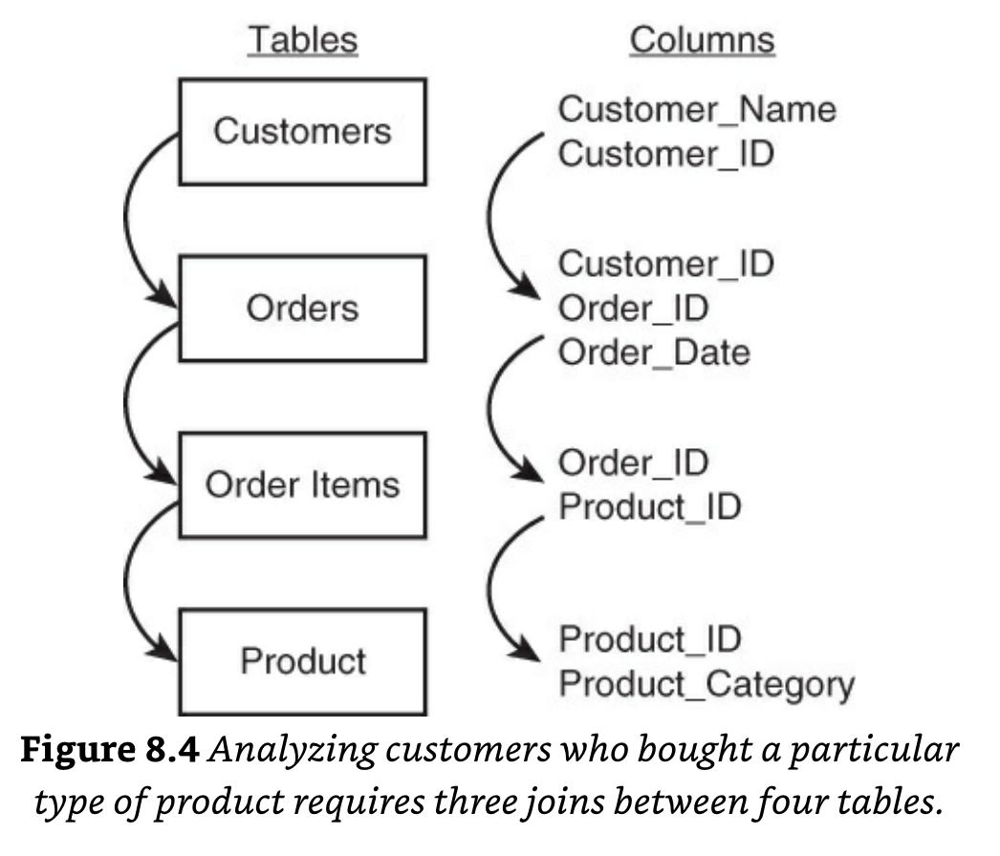

* Denormalization, like all good things, can be used in excess. The goal is to keep data that is frequently used together in the document. This allows the document database to minimize the number of times it must read from persistent storage, a relatively slow process even when using solid state devices (SSDs). At the same time, you do not want to allow extraneous information to creep into your denormalized collection (see Figure 8.5). Figure 8.5 Large documents can lead to fewer documents retrieved when a block of data is read from persistent storage. This can increase the total number of data block reads to retrieve a collection or subset of collections.


> Never say never when designing NoSQL models. There are best practices, guidelines, and design patterns that will help you build scalable and maintainable applications. None of them should be followed dogmatically, especially in the presence of evidence that breaking those best practices, guidelines, or design patterns will give your application better performance, more functionality, or greater maintainability.

* If your application requirements are such that storing related information in two or more collections is an optimal design choice, then make that choice. You can implement joins in your application code.

* Documents that are likely to change size are known as mutable documents.

* When designing a document database, consider not just how frequently a document will change, but also how the size of the document may change.

* Read-heavy applications should have indexes on virtually all fields used to help filter results. For example, if it was common for users to query documents from a particular sales region or with order items in a certain product category, then the sales region and product category fields should be indexed.

* Write-heavy applications are those with relatively high percentages of write operations relative to read operations.

* Data modelers tend to try to minimize the number of indexes in write-heavy applications. Essential indexes, such as those created for fields storing the identifiers of related documents, should be in place. As with other design choices.

* Figure 8.10 When both write-heavy and read-heavy applications must be supported, a two-database solution may be the best option.

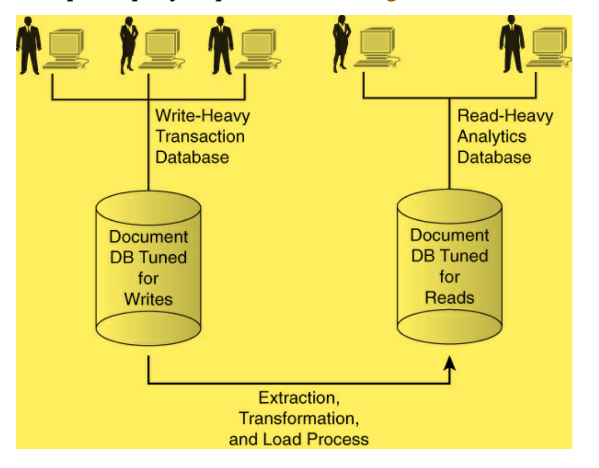

* Identifying the right set of indexes for your application can take some experimentation. Start with the queries you expect to support and implement indexes to reduce the time needed to execute the most important and the most frequently executed. If you find the need for both read-heavy and write-heavy applications, consider a two-database solution with one database tuned for each type.

## Rules for Relations in NoSQL

### One-to-Many

* One-to-Many Relations in Document Databases One-to-many relations are the simplest of the three relations. This relation occurs when an instance of an entity has one or more related instances of another entity. The following are some examples: • One order can have many order items. • One apartment building can have many apartments. • One organization can have many departments. • One product can have many parts.

* In the case of a one-to-many relation, both entities are modeled using a document embedded within another document.

```js
{    customer_id: 76123,    name: 'Acme Data Modeling Services',    person_or_business: 'business',    address : [                      { street: '276 North Amber St',                         city: 'Vancouver',                         state: 'WA',                         zip: 99076} ,                      { street: '89 Morton St',                         city: 'Salem',…
``` 

* The basic pattern is that the one entity in a one-to-many relation is the primary document, and the many entities are represented…

### Many-to-Many Relations

* Many-to-Many Relations in Document Databases A many-to-many relation occurs when instances of two entities can both be related to multiple instances of another entity. The following are some examples: • Doctors can have many patients and patients can have many doctors. • Operating system user groups can have many users and users can be in many operating system user groups. • Students can be enrolled in many courses…

* Many-to-many relations are modeled using two collections—one for each type of entity. Each collection maintains a list of identifiers that reference related entities. For example, a document with course data would include an array of student IDs, and a student document would include a list of course IDs, as in the following:

* The pattern minimizes duplicate data by referencing related documents with identifiers…

* Care must be taken when updating many-to-many relationships so that both entities…


### Hierarchies in NoSQL

* Modeling Hierarchies in Document Databases Hierarchies describe instances of entities in some kind of parent-child or part-subpart relation. The product_category attribute introduced earlier is an example where a hierarchy could help represent relations between different product categories (see Figure…

More Information here: [MongoDb Tutorial](https://docs.mongodb.com/manual/tutorial/model-tree-structures/)


* One-to-many, many-to-many, and hierarchies are common patterns in document databases. The patterns described here are useful in many situations, but you should always evaluate the utility of a pattern with reference to the kinds of queries you will execute and the expected changes that will occur over the lives of the documents. Patterns should support the way you will query and maintain documents by making those operations faster or less complicated than other options.

* You will have to balance benefits of faster query response with the cost of slower inserts and updates when indexes are in place.

### When you create a new database, things to think about:

* The analysts review sample reports that managers have asked for and realize that the perishable foods fields are routinely reported along with the common fields in the manifest. They decide to embed the perishable foods within the manifest document.

* Because the MSDS information is infrequently used, they decide to store it in a separate collection.

* The analysts anticipate a mix of read and write operations with approximately 60%–65% reads and 35%–40% writes. They would like to maximize the speed of both reads and writes, so they carefully weigh the set of indexes to create.

* The analysts know that if you frequently filter documents by type, it can be an indicator that they should use separate collections for each type.

* They soon realize they are the exception to that rule because they do not know all the types they may have. The number of types can grow quite large, and managing a large number of collections is less preferable to managing types within a single collection.

* In relational database design, the structure and relations of entities drives design—not so in NoSQL database design. Of course, you will model entities and relations, but performance is more important than preserving the relational model.

* Key-value databases are well suited to applications that have frequent small reads and writes along with simple data models. The values stored in key-value databases may be simple scalar values, such as integers or Booleans, but they may be structured data types, such as lists and JSON structures.

* Key-value databases are used in a wide range of applications, such as the following: • Caching data from relational databases to improve performance • Tracking transient attributes in a web application, such as a shopping cart • Storing configuration and user data information for mobile applications • Storing large objects, such as images and audio files

* In addition to key-value databases you install and run on the premises, there are a number of cloud-based choices as well. Amazon Web Services offers SimpleDB and DynamoDB, whereas Microsoft Azure’s Table service provides for key-value storage.

* Document databases are designed for flexibility. If an application requires the ability to store varying attributes along with large amounts of data, then document databases are a good option.

* Column family databases are designed for large volumes of data, read and write performance, and high availability. Google introduced BigTable to address the needs of its services. Facebook developed Cassandra to back its Inbox Search service.

* Use Cases and Criteria for Selecting Graph Databases Problem domains that lend themselves to representations as networks of connected entities are well suited for graph databases. One way to assess the usefulness of a graph database is to determine if instances of entities have relations to other instances of entities.

* In some use cases, performance is more important than ensuring immediate consistency or supporting ACID transactions. In these cases, NoSQL databases may be the better solution. Choosing a database is a process of choosing the right tool for the job.

* Just as there is no best programming language, there is no best database management system. There are database systems better suited to some problems than others, and the job of developers and designers is to find the best database for the requirements at hand.

* Consistency level refers to the consistency between copies of data on different replicas. In the strictest sense, data is consistent only if all replicas have the same data.

* With respect to distributed databases, partitioning refers to splitting documents, tables, or graphs and distributing them to different servers.


* 


